# AD Infrastructure Failover Lab — Part 2: NPS, Certificate Services & AAA (SSH and WPA2-Enterprise Wi-Fi)

*NPS on both DCs → switch admin SSH via RADIUS → WPA2-Enterprise Wi-Fi via RADIUS → both failure modes proven by actually taking a DC down*

This picks up where [Part 1](../01_DNS_DHCP_Failover_and_Redundancy/README.md) left off: DC01 and DC02 are healthy, AD replication is clean, and DHCP/DNS both survive a single-DC outage. This lab adds centralized authentication on top of that foundation — switch admin SSH access authenticated against AD via RADIUS, and WPA2-Enterprise Wi-Fi doing the same — using Network Policy Server (NPS) running on both domain controllers so either one can answer.

**In one sentence:** I built NPS on both DCs, configured the switch and the Aironet access point to authenticate against both, tracked down two real RADIUS configuration bugs along the way, hardened the switch's SSH host key, and proved every failure mode — switch RADIUS down, AP RADIUS down, and both the authorized and denied paths through the policy — by actually testing them rather than trusting the configuration.

A Root CA (`NOC-LAB-ROOT-CA`) was already deployed on DC01 ahead of this lab to issue the NPS server certificate PEAP relies on.

## Addressing additions

| Device | Address | Notes |
|---|---|---|
| Switch RADIUS source (Vlan10 SVI) | 192.168.10.1 | `ip radius source-interface Vlan10` |
| Aironet 1815 Mobility Express | 192.168.10.4 | Management address |
| NPS1 (DC01) | 192.168.20.2 | Priority 1 RADIUS server |
| NPS2 (DC02) | 192.168.30.2 | Priority 2 RADIUS server |

RADIUS clients and network policies don't replicate between DC01 and DC02 automatically, so everything below — every RADIUS client, every policy — was built manually on both and confirmed identical before testing failover.

## Part A — Switch SSH AAA

**AD group and RADIUS client setup.** Confirmed group membership for the test account in `NOC-Network_Admins`, then added the switch as a RADIUS client — friendly name `SW-3560CX`, address `192.168.10.1` — identically on DC01 and DC02, same shared secret on both, matching the switch's own `radius server` key.

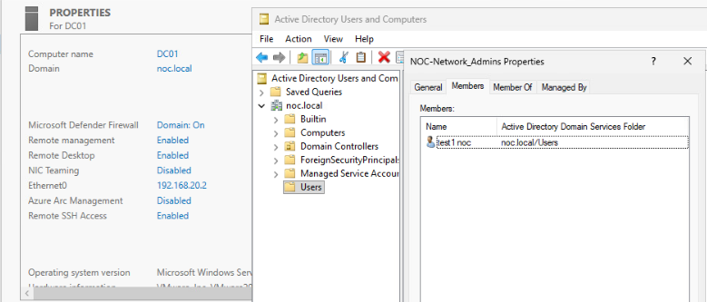

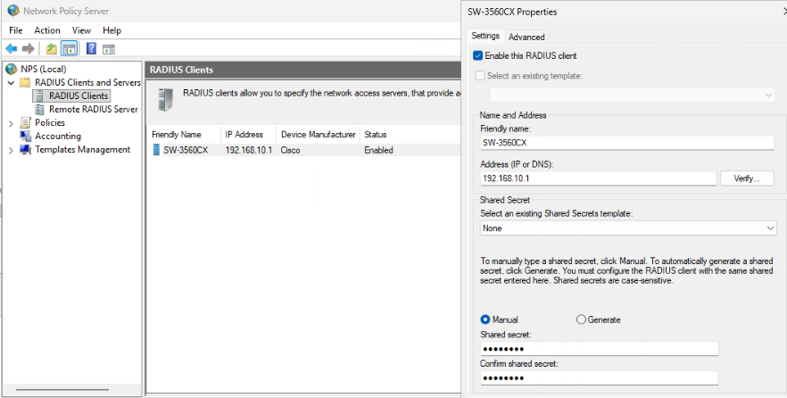

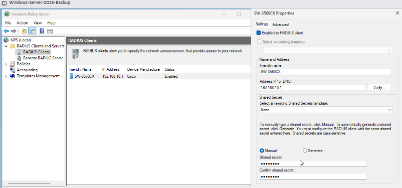

**Building the switch-administrator policy.** The `01-NOC-Switch-Administrators` network policy conditions on Windows Group plus Client Friendly Name, so only this specific switch's requests for accounts in this specific group ever match it.

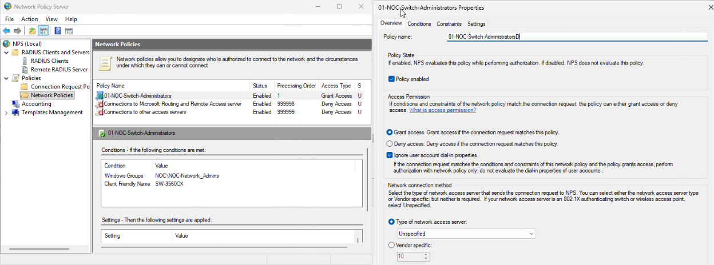

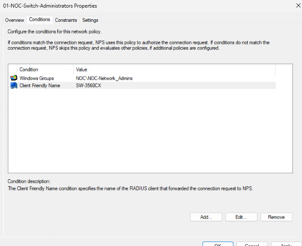

For a device shell login like this one, the policy needs **Service-Type = Login** with no Framed-Protocol attribute — Cisco IOS reads Framed-Protocol as an instruction to start PPP on the VTY line, which isn't what an SSH admin session is.

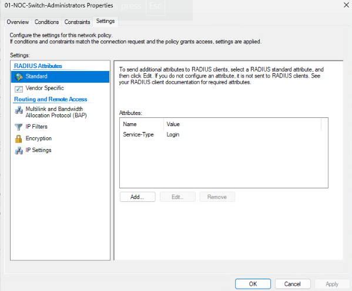

Privilege level comes through as a Cisco AV-Pair — `shell:priv-lvl=15`, with a colon. I confirmed the exact syntax by running `debug radius` on the switch during a test login and watching the attribute parse cleanly and apply.

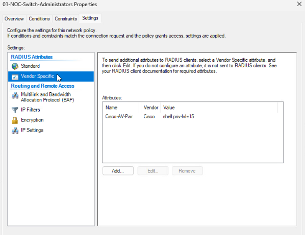

**Switch-side AAA configuration.** `aaa new-model`, both `radius server` entries (NPS-DC01 and NPS-DC02) in a server group, `ip radius source-interface Vlan10`, and separate method lists for console (local-only) versus VTY (RADIUS with local fallback):

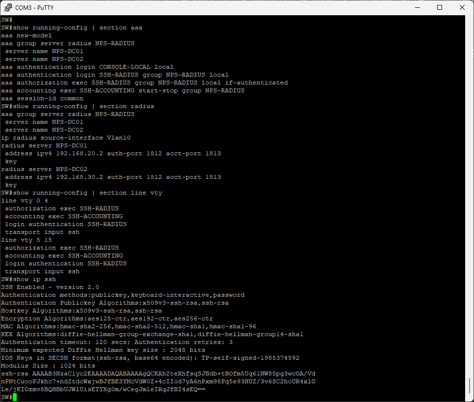

`show aaa servers` gave a clean baseline against both RADIUS servers before any test traffic:

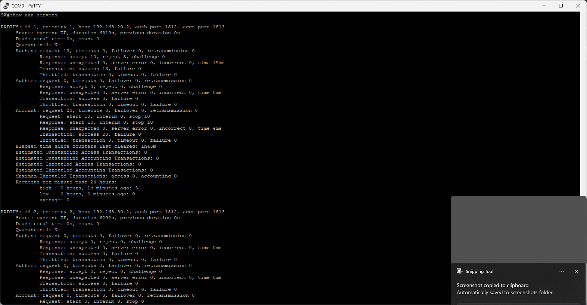

Alongside the AAA config, I generated a 2048-bit RSA host key for SSH:

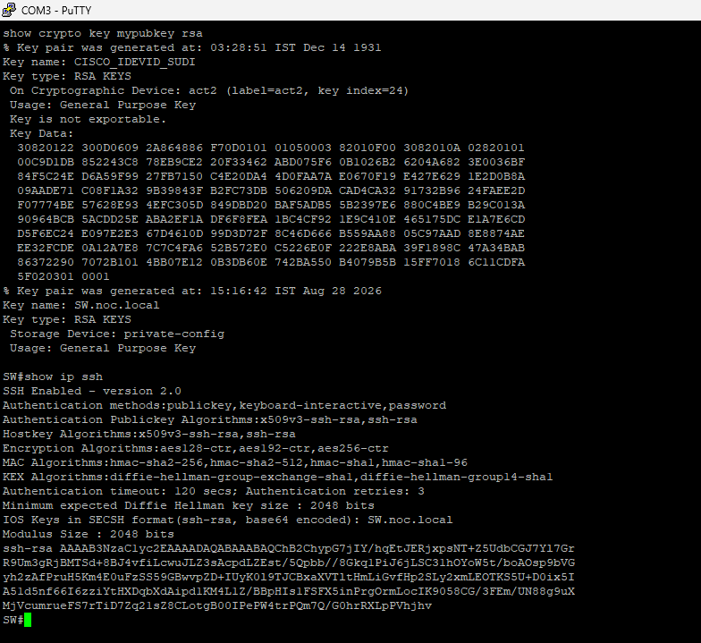

**Testing both directions.** With the policy and switch config in place, I ran both the path that should work and the path that shouldn't.

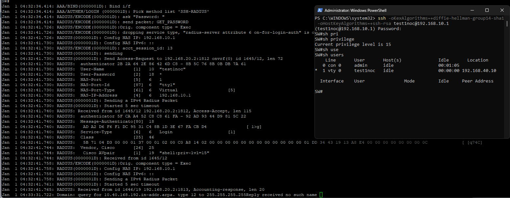

SSH as the AD test account succeeded, `show privilege` returned 15 with no `enable` needed, and `show users` showed the AD username rather than the local `admin` account — the actual proof RADIUS granted access rather than local fallback catching a rejected login.

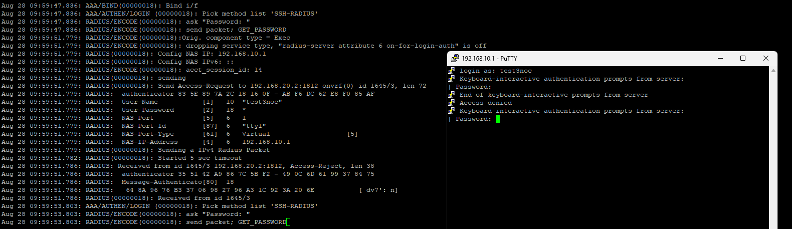

Then the negative case: an incorrect credential attempt against the same policy, with the switch's own RADIUS debug showing a real `Access-Reject` from the server and a clean `Access denied` at the password prompt. That pair — one granted, one denied — is what actually demonstrates the policy is doing its job in both directions.

**Failover — proven, not just configured.** Confirmed NPS running on DC01 as a baseline, then stopped it.

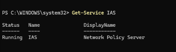

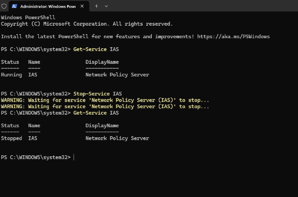

This is the strongest single piece of evidence in this lab: switch debug output shows three real RADIUS retransmit timeouts to `192.168.20.2`, then literally `Fail-over to (192.168.30.2:1812,1813)`, then an `Access-Accept` from DC02 carrying the correct `Service-Type=Login` and `shell:priv-lvl=15` attributes.

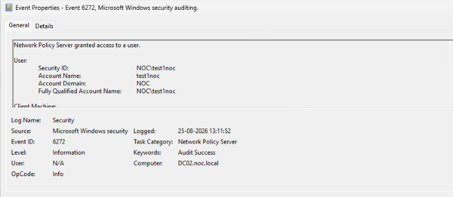

That's independently corroborated by DC02's own Security log — Event ID `6272`, "Network Policy Server granted access to a user," for the same account, at the same time. Restored DC01's NPS service and set it to Automatic startup afterward.

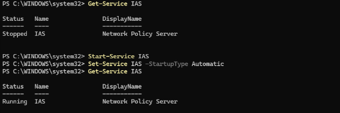

## Part B — WPA2-Enterprise Wi-Fi

**AP RADIUS client and console setup.** Added the AP (`AP-MOBILITY-EXPRESS`, `192.168.10.4`) as a RADIUS client on DC02, then ran it through the Mobility Express console wizard — management IP, SSID `NOC-STAFF`, WPA2-Enterprise, RADIUS server address.

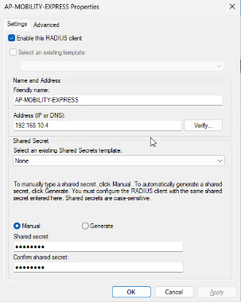

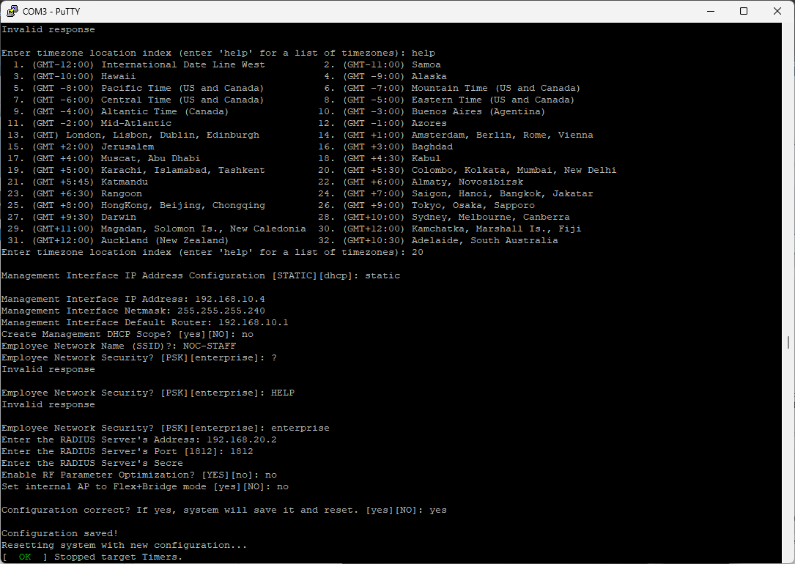

The switch trunk to the AP came up on Gi0/6 exactly as planned — native VLAN 10, allowed VLANs 10 and 40:

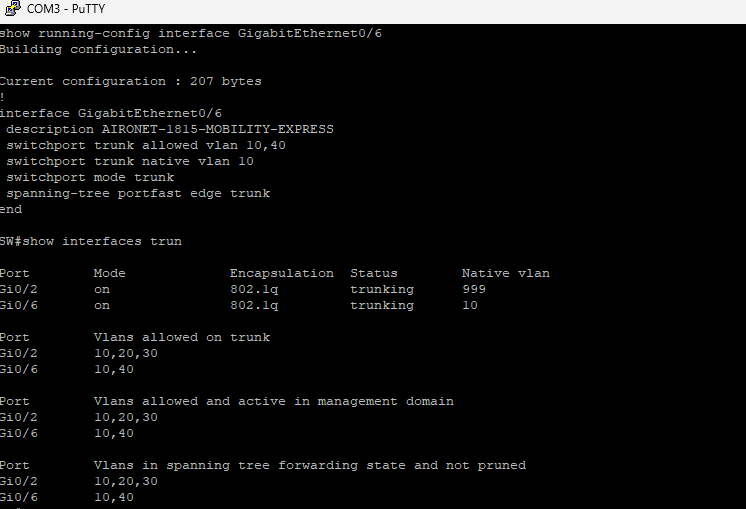

**Certificate chain.** The custom `NOC-NPS-SERVER` template issued certificates to both DC01 and DC02, with Server Authentication and Client Authentication EKUs both present — Server Authentication is what PEAP actually relies on to identify the NPS server and protect the tunnel, and having Client Authentication in the same template leaves it ready to issue client certificates too if this environment adds EAP-TLS later.

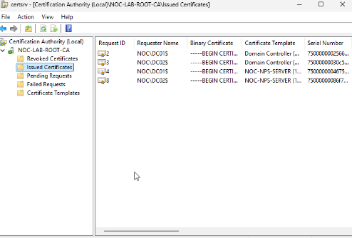

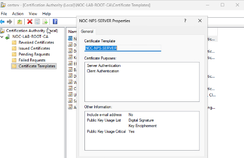

**Wireless policy.** Built via the NPS 802.1X wizard: connection type Secure Wireless, PEAP with the DC01 certificate, MSCHAPv2 inner method, conditioned on NAS Port Type = Wireless and the `NOC-WiFi-802.1x` group.

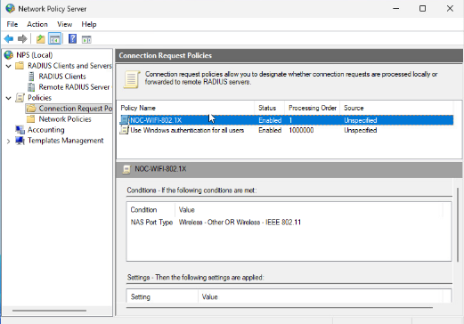

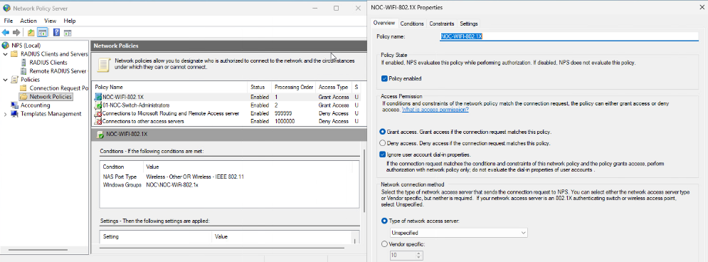

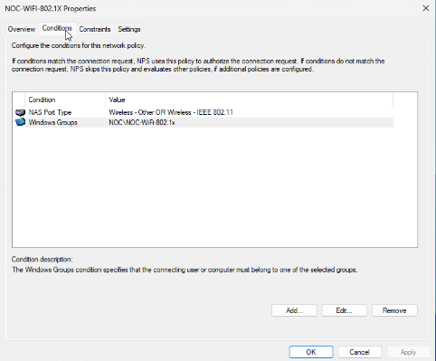

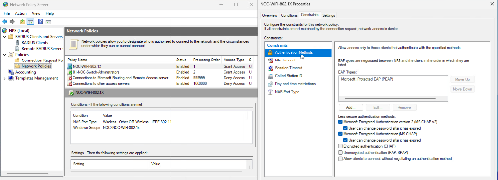

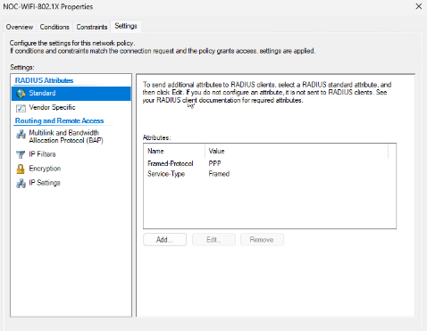

Here `Service-Type = Framed` is the right value for network-layer client access, which is what a Wi-Fi connection is. The wizard also carries a `Framed-Protocol = PPP` attribute alongside it; 802.1X authenticators don't use that attribute (RFC 3580 §3.6), so it sits there unused rather than affecting anything.

Network placement is handled separately, on the AP itself: the `NOC-STAFF` WLAN's **VLAN & Firewall** tab maps the SSID to VLAN40, so an authenticated client lands on the client network rather than the AP's management interface.

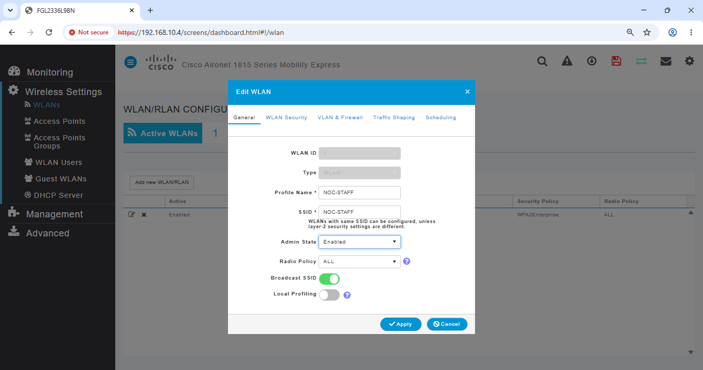

**AP-side RADIUS redundancy.** The AP itself is configured with both DC01 and DC02 as RADIUS authentication (1812) and accounting (1813) servers, so the failover setup isn't just an NPS-side concern — the AP is genuinely told about both:

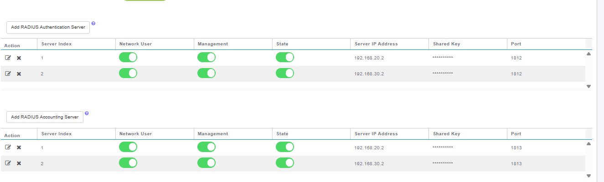

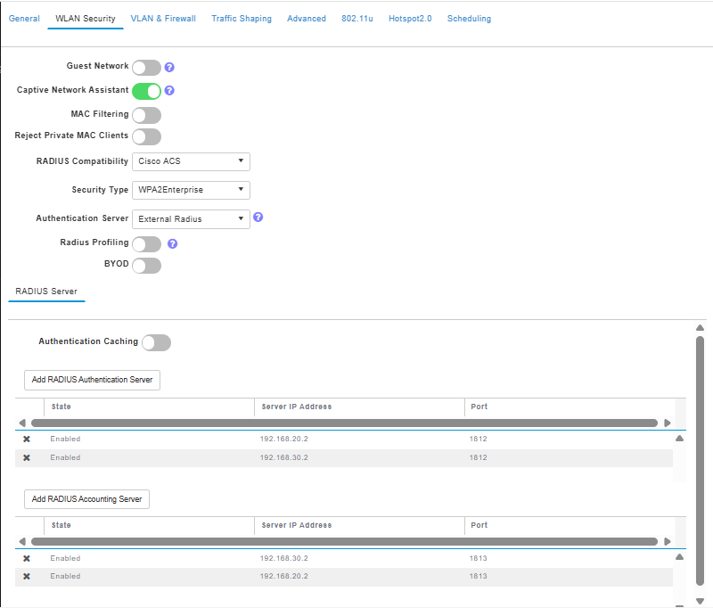

**Client connection walkthrough.** A client authenticating to `NOC-STAFF` with domain credentials, trusting the PEAP server certificate issued to `DC01.noc.local` by `NOC-LAB-ROOT-CA`, and showing up in the AP's live client list:

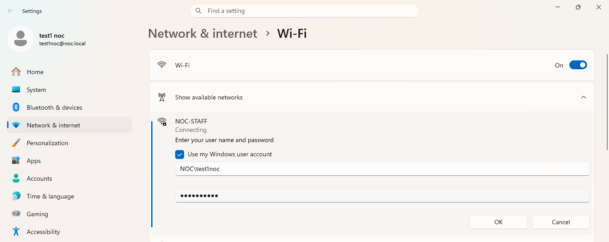

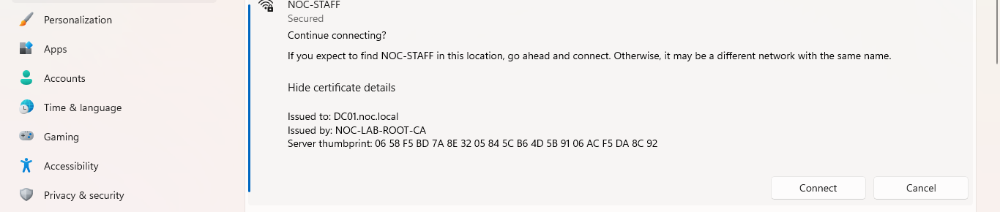

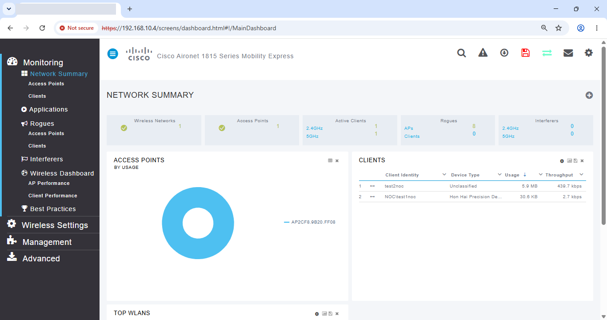

Client-side and AP-side together confirm the same result: a successful connection lands on VLAN40.

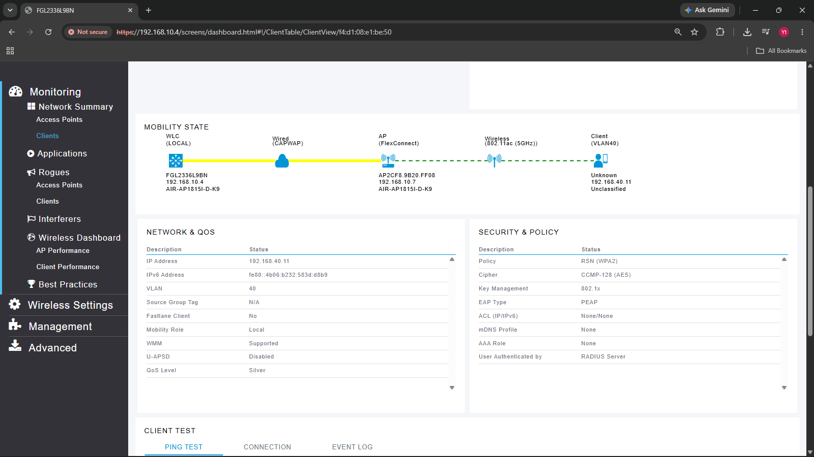

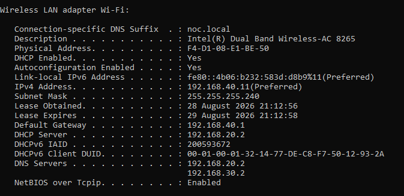

The AP's own Mobility State view shows the client tagged `Client (VLAN40)`, authenticated via PEAP against the RADIUS server; the client's own `ipconfig /all` shows a `192.168.40.11` address, correct gateway, and both DCs as DNS servers — the same evidence pattern from two independent vantage points used throughout this lab.

**Testing both directions here too.** `test2noc`, a member of `NOC-WiFi-802.1x`, connected and was granted — Event ID `6272` on DC01.

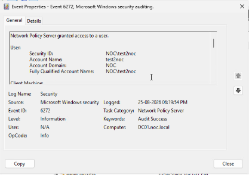

`test1noc`, a member of the switch-admin group but not the Wi-Fi group, was correctly denied — Event ID `6273`.

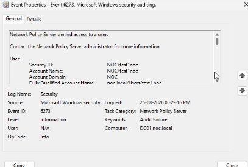

That denial confirms the group scoping is actually gating access between the switch-admin and Wi-Fi populations, not just granting access to whichever account happens to be tested.

**Wireless failover — proven the same way as SSH.** Stopped NPS on DC01, then authenticated a client to `NOC-STAFF` again.

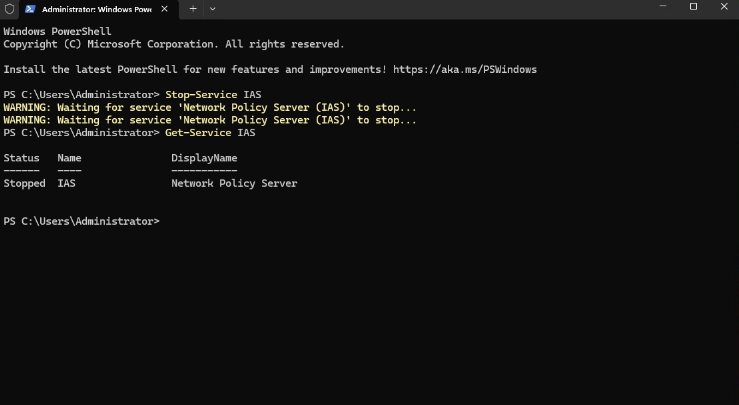

DC02's own Security log shows Event ID `6272`, with `Authentication Server: DC02.noc.local`, PEAP, EAP-MSCHAPv2, granted to `test2noc`.

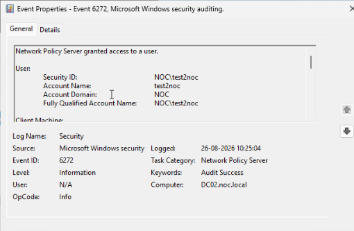

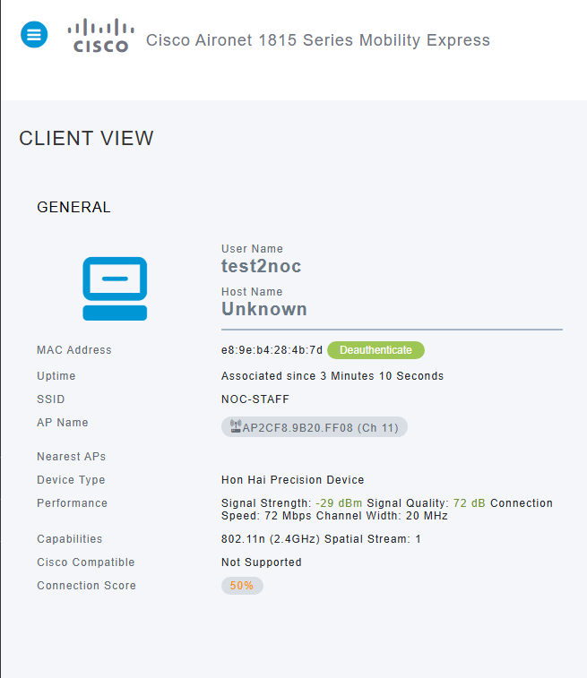

The AP's own client view confirms the same session live. Same evidence standard as Part A: an actual outage, and independent server-side corroboration that the surviving DC handled it.

## Validation Matrix

| Test | Expected Result | Actual Result | Status |
|---|---|---|---|
| Switch RADIUS client parity, DC01 and DC02 | Identical client config on both | Confirmed | PASS |
| Switch-admin policy — authorized account | AD account in `NOC-Network_Admins` gets privilege 15 via SSH | Confirmed, `show users` shows AD account | PASS |
| Switch-admin policy — unauthorized/incorrect credential | RADIUS denies access | Confirmed, real `Access-Reject` from NPS | PASS |
| Switch SSH host key | 2048-bit RSA minimum | Confirmed at 2048-bit | PASS |
| Switch RADIUS failover | DC02 answers when DC01's NPS is down | Confirmed via switch debug (Fail-over line, Access-Accept) and DC02 Event 6272 | PASS |
| Wireless policy — authorized account | Member of `NOC-WiFi-802.1x` granted | Confirmed, Event 6272 | PASS |
| Wireless policy — unauthorized account | Non-member denied | Confirmed, Event 6273 | PASS |
| Wireless client VLAN placement | Client lands on VLAN40 | Confirmed both client-side (`ipconfig`) and AP-side (Client View) | PASS |
| Wireless RADIUS failover | DC02 answers when DC01's NPS is down | Confirmed via DC02 Event 6272, `Authentication Server: DC02.noc.local` | PASS |

## What I Learned

The two RADIUS attribute details in Part A — Service-Type for a shell login, and the exact syntax of a Cisco AV-Pair — both come down to the same thing: NPS generates a perfectly valid Access-Accept regardless of whether the attributes inside it are what the receiving device actually needs. Neither issue shows up as an NPS-side error; both only become visible from the device's own logs, which is what makes `debug radius` on the switch the actual diagnostic tool, not the NPS console.

Authentication and network placement are two genuinely separate concerns on the wireless side, handled by two different systems that don't know about each other — NPS decides whether to grant access, and the AP's own WLAN interface mapping decides which VLAN a granted client lands on. Proving both matters: checking the client's actual address is what closes the loop, not just whether it connected.

A positive test proves a working path exists. Pairing it with a negative test — on both the switch and the Wi-Fi side — is what actually demonstrates the group scoping is doing something, rather than assuming a policy's conditions are correct because nothing's obviously broken.

## Interview Questions

**Q: A switch RADIUS login succeeds but immediately drops the SSH session afterward. What would you check first?**
A: I'd check the NPS network policy's Standard RADIUS attributes for Service-Type. If it's left at the default "Framed" — often paired with a Framed-Protocol=PPP attribute — Cisco IOS interprets that as an instruction to start a PPP session on the VTY line, which is invalid for an interactive shell login and drops the connection right after granting access. The fix is setting Service-Type explicitly to "Login" for any policy governing device administration.

**Q: How do you prove a RADIUS failover actually happened, rather than just that the client eventually connected?**
A: The connection succeeding on its own isn't proof — I want to see the failure itself. On the switch side, `debug radius authentication` during the outage shows the retransmit timeouts to the down server followed by an explicit fail-over line to the surviving server. On the server side, the surviving NPS's own Security event log for the same account, at the same time, corroborates it independently. Having both — not just a successful login afterward — is what makes the claim solid.

**Q: Why would the same Cisco AV-Pair attribute work for one RADIUS client but not another, even with an apparently identical NPS policy?**
A: Because the attribute value is a literal string IOS parses, and small typos produce a valid-looking Access-Accept that the device silently can't use. `shell:priv-lvl=15` — colon — is correct syntax; a hyphen in that position produces an Access-Accept with no visible NPS-side error, but `debug radius` on the switch would show it explicitly being ignored as an unrecognized VSA. NPS has no way to know the string is malformed, so the only place that surfaces is on the device consuming it.

**Q: A wireless client authenticates successfully via 802.1X/RADIUS but ends up on the wrong VLAN. What would you check?**
A: Authentication succeeding means RADIUS and the certificate chain are fine — the placement itself is controlled separately, by either the WLAN's own static VLAN/interface mapping on the AP or controller, or by the RADIUS server sending per-user VLAN assignment via `Tunnel-Type`, `Tunnel-Medium-Type`, and `Tunnel-Private-Group-ID` attributes. In this lab the WLAN's VLAN & Firewall interface mapping handles it directly — the simpler approach, and the right one when every user of that SSID should land on the same network.

**Q: Why does the NPS server certificate for PEAP need Client Authentication as well as Server Authentication?**
A: It doesn't, strictly — PEAP-MSCHAPv2 only requires Server Authentication on the NPS certificate, since that's what identifies the server and protects the TLS tunnel. Including Client Authentication in the template doesn't cause any problems for PEAP; it's just unused for this specific use case. It matters more if a client-certificate flow like EAP-TLS gets added later, where a *client* certificate would need it — building the template with both from the start just means it's ready for that without reissuing certificates.
