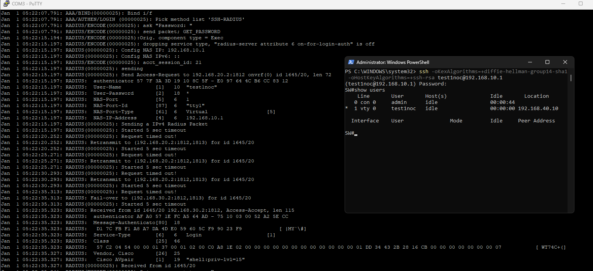
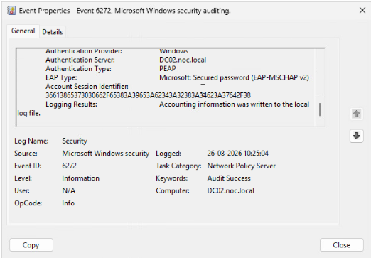
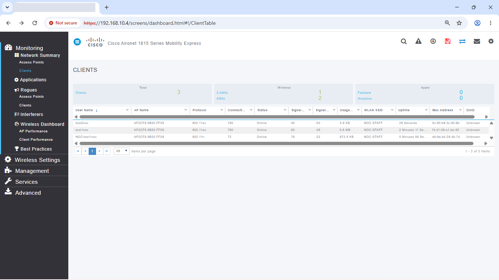

# AD Infrastructure Failover Lab — Part 2: NPS, Certificate Services & AAA (SSH and WPA2-Enterprise Wi-Fi)

> ⚠️ **Status:** Switch SSH authentication, authorization, and RADIUS failover are complete and proven. WPA2-Enterprise Wi-Fi authentication and its RADIUS failover are also proven — but **VLAN40 placement for wireless clients is a known, unfixed gap** (see below): authenticated Wi-Fi clients currently land on the management VLAN, not the client VLAN. Accounting is configured on the switch (start-stop) but not independently evidenced with a captured accounting log entry in this lab — what's directly proven here is authentication and authorization.

This picks up where [Part 1](../01_DNS_DHCP_Failover_and_Redundancy/README.md) left off: DC01 and DC02 are healthy, AD replication is clean, and DHCP/DNS both survive a single-DC outage. This lab adds centralized authentication on top of that foundation — switch admin SSH access authenticated against AD via RADIUS, and WPA2-Enterprise Wi-Fi doing the same — using Network Policy Server (NPS) running on both domain controllers so either one can answer.

A Root CA (`NOC-LAB-ROOT-CA`) was already deployed on DC01 ahead of this lab to issue the NPS server certificate PEAP relies on.

## Addressing additions

| Device | Address | Notes |
|---|---|---|
| Switch RADIUS source (Vlan10 SVI) | 192.168.10.1 | `ip radius source-interface Vlan10` |
| Aironet 1815 Mobility Express | 192.168.10.4 | Free address, verified before assignment |
| NPS1 (DC01) | 192.168.20.2 | Priority 1 RADIUS server |
| NPS2 (DC02) | 192.168.30.2 | Priority 2 RADIUS server |

RADIUS clients and network policies do not replicate between DC01 and DC02 automatically — everything in this lab (RADIUS clients, network policies) was built manually on both, confirmed identical, and that turned out to matter: a client existing on only one DC produces silent request timeouts on the other, rather than an obvious error.

## Part A — Switch SSH AAA

**AD group and RADIUS client setup.** Confirmed `NOC-Network_Admins` group membership for the test account (001), then added the switch as a RADIUS client (friendly name `SW-3560CX`, address `192.168.10.1`) identically on DC01 (002) and DC02 (003) — same shared secret on both, matching the switch's `radius server` key.

**Building the switch-administrator policy — and two real bugs along the way.** The `01-NOC-Switch-Administrators` network policy conditions on Windows Group + Client Friendly Name (004–005). Getting the settings right took two real, distinct mistakes to find:

- **NPS's default Service-Type of "Framed" (paired with a Framed-Protocol attribute) is meant for dial-up/VPN, not a device shell login.** Left at the default, Cisco IOS reads the RADIUS response as "start a PPP session" and drops the SSH connection immediately after a successful Access-Accept, with `Line has invalid autocommand "ppp negotiate"` in the client. Fix: explicitly set **Service-Type = Login** and remove any Framed-Protocol attribute (006).
- **The Cisco AV-Pair privilege attribute is character-for-character sensitive.** `shell:priv-lvl=15` (colon) is correct; `shell-priv-lvl=15` (hyphen, typed once during testing) is silently ignored by IOS — `debug radius` on the switch showed `parse unknown cisco vsa "shell:priv-lvl" – IGNORE`, with no error surfaced anywhere else. The correct Vendor Specific attribute is shown in 007.

**Switch-side AAA configuration.** `aaa new-model`, both `radius server` entries (NPS-DC01 and NPS-DC02) in a server group, `ip radius source-interface Vlan10`, and separate method lists for console (local-only, untouched) versus VTY (RADIUS with local fallback) — the full running-config is in 008 (RADIUS shared secret redacted before publishing). `show aaa servers` (009) gave a clean baseline against both RADIUS servers before any test traffic.

One more real finding sitting in that same screenshot: the switch's SSH host key is only **1024-bit RSA** (`Minimum expected Diffie Hellman key size: 2048 bits` is a separate setting shown right above it — the host key itself is smaller than that minimum). 1024-bit RSA is below current hardening guidance; a production switch should have this regenerated to at least 2048-bit (`crypto key generate rsa modulus 2048`) and the old key removed. I haven't done that yet in this lab.

**Positive test.** SSH as the AD test account succeeded, `show privilege` returned 15 with no `enable` needed, and — the actual proof RADIUS granted access rather than local fallback catching a rejected login — `show users` showed the AD username, not the local `admin` account (010). A negative test — an account outside `NOC-Network_Admins` correctly denied — was also run during this lab, but no screenshot of it was captured, so I can't present it as documented evidence here the way everything else in this README is. The claim that "only the right group gets in" currently rests on the network policy's conditions being correctly configured, not on captured proof of an observed denial. Re-running that test and capturing it is the one thing that would close this gap properly.

**Failover test — proven, not just triggered.** Confirmed NPS running on DC01 as a baseline (011), then stopped it (`Stop-Service IAS`, confirmed stopped) (012).

The evidence in 013 is the strongest single screenshot in this lab: switch debug output shows three real RADIUS retransmit timeouts to `192.168.20.2`, then literally `Fail-over to (192.168.30.2:1812,1813)`, then an `Access-Accept` from DC02 carrying the correct `Service-Type=Login` and `shell:priv-lvl=15` attributes. That's independently corroborated by DC02's own Security log — Event ID `6272`, "Network Policy Server granted access to a user," for the same account (014). Restored DC01's NPS service and set it to Automatic startup afterward (015).

## Part B — WPA2-Enterprise Wi-Fi

**AP RADIUS client and console setup.** Added the AP (`AP-MOBILITY-EXPRESS`, `192.168.10.4`) as a RADIUS client on DC02 (016) and ran it through the Mobility Express console wizard — management IP, SSID `NOC-STAFF`, WPA2-Enterprise, RADIUS server `192.168.20.2:1812` (017). The switch trunk to the AP came up on Gi0/6 exactly as planned: native VLAN 10, allowed VLANs 10 and 40 (018).

**Certificate chain.** The custom `NOC-NPS-SERVER` template issued certificates to both DC01 and DC02 (019–020) with both Server Authentication and Client Authentication EKUs present. Only **Server Authentication** is actually required for PEAP-MSCHAPv2 — it's what identifies the NPS server and protects the PEAP tunnel. The Client Authentication EKU isn't doing anything for this lab's current scope; it would matter for client certificates in an EAP-TLS deployment, not for the server certificate in a PEAP one. Having it present on the server cert isn't wrong, just unnecessary for what's actually being used here.

**Wireless policy.** Built via the NPS 802.1X wizard: connection type Secure Wireless, PEAP with the DC01 certificate, MSCHAPv2 inner method, conditioned on NAS Port Type = Wireless and the `NOC-WiFi-802.1x` group (021–024). One thing worth being precise about here: the wireless policy's Settings tab shows `Service-Type = Framed` and `Framed-Protocol = PPP` (025). `Service-Type = Framed` is correct and meaningful for 802.1X network access — unlike Part A's SSH case, where the same value breaks the session. `Framed-Protocol = PPP`, though, isn't actually doing anything here: per RFC 3580 (§3.6), 802.1X authenticators don't use the Framed-Protocol attribute at all, so it's a harmless leftover from the wizard's default rather than a setting that matters one way or the other. I'd originally described both attributes as "correct" for this policy — that overstated it; only Service-Type is.

**Full test sequence, including failover.** `test2noc` connected and was granted (026); `test1noc` — at that point only in the switch-admin group, not the Wi-Fi group — was correctly denied (027). Partway through testing I added `test1noc` to `NOC-WiFi-802.1x` as a second authorized account, which is why it shows up connected successfully in later screenshots (034) — that's a deliberate change, not an access-control gap.

**AP-side RADIUS redundancy.** The AP itself is configured with both DC01 and DC02 as RADIUS authentication (1812) and accounting (1813) servers (028–029) — confirming the failover setup isn't just an NPS-side concern, the AP is genuinely told about both.

**Client connection walkthrough.** A client authenticating to `NOC-STAFF` with domain credentials (030), trusting the PEAP server certificate issued to `DC01.noc.local` by `NOC-LAB-ROOT-CA` (031), and showing up in the AP's live client list (032–033).

**Wireless failover — proven the same way as SSH.** Stopped NPS on DC01 (037), then authenticated a client to `NOC-STAFF` again.

DC02's own Security log shows Event ID `6272`, with `Authentication Server: DC02.noc.local`, PEAP, EAP-MSCHAPv2, granted to `test2noc` (038–039) — and the AP's own client view confirms the same session live (040). Same evidence standard as Part A: an actual outage, and independent server-side corroboration that the surviving DC handled it.

## A real finding: wireless clients land on VLAN10, not VLAN40

Both successful test clients ended up with `192.168.10.x` addresses — `test1noc` on `192.168.10.12` (034), `test2noc` on `192.168.10.14` (035), and the AP's own client table confirms every session on `NOC-STAFF` sitting on VLAN10 (036) — not `192.168.40.x` as the design intends for client traffic.

The cause traces to how the WLAN was built, not to RADIUS: the Mobility Express console wizard (017) that created `NOC-STAFF` only asks for the SSID, security type, and RADIUS server — it never prompts for VLAN assignment, so the WLAN was left on the AP's own management VLAN (10) by default rather than being explicitly mapped to VLAN40 in the WLAN's **VLAN & Firewall** tab. It compounds with the RADIUS side too: the wireless network policy's Settings (025) only sends `Service-Type=Framed` and `Framed-Protocol=PPP` — there's no `Tunnel-Type` / `Tunnel-Medium-Type` / `Tunnel-Private-Group-ID` attribute set, which is the RADIUS mechanism NPS would use to assign a VLAN per-user dynamically. So there's no path — neither the WLAN's static mapping nor a RADIUS-assigned override — currently putting these clients on VLAN40. Authentication and authorization are both working correctly; it's the network-layer placement that isn't yet wired up.

**Fix, not yet applied:** either set the `NOC-STAFF` WLAN's VLAN & Firewall interface to VLAN40 directly on the AP, or add a `Tunnel-Private-Group-ID = 40` (with matching `Tunnel-Type=VLAN`, `Tunnel-Medium-Type=802`) attribute to the wireless network policy in NPS for dynamic per-user assignment. The static WLAN mapping is the simpler fix for this lab's scope; the RADIUS-attribute approach is what you'd reach for if different user groups needed different VLANs from the same SSID.

Out of scope for this lab entirely (no evidence exists for either): wired 802.1X port authentication and EAP-TLS certificate-based auth, both planned for a later lab once built and tested.

## A naming inconsistency worth flagging

The AD groups actually created in this environment don't match my own planning notes: I planned `NOC-Network-Admins` (hyphen) and built `NOC-Network_Admins` (underscore); I planned `NOC-WiFi-8021X` and built `NOC-WiFi-802.1x`. Both work exactly as configured — NPS matches on whatever string is actually in the condition, and every test above passed — but it's a real inconsistency between plan and environment that would cost time during a future rebuild or handoff. I've left the actual names in place here rather than silently "correcting" the screenshots to match the plan.

## Service-Type and Framed-Protocol comparison

| Policy | Access type | Correct Service-Type | Framed-Protocol |
|---|---|---|---|
| `01-NOC-Switch-Administrators` | Device shell/CLI (SSH) | `Login` | Not applicable — remove any Framed-Protocol attribute; Cisco IOS reads "Framed" as a request to start PPP on the VTY line, which drops the session |
| `NOC-WIFI-802.1X` | Network-layer client access | `Framed` | Not used by 802.1X authenticators at all (RFC 3580 §3.6) — present in this policy as an unused wizard default, not something that needs to be set correctly |

## What I learned

- The same RADIUS attribute default can be correct or a silent connection-killer depending entirely on what kind of access is being granted — Service-Type=Framed is right for a Wi-Fi client and wrong for a switch shell login, and NPS won't warn you either way.
- RADIUS attribute values are character-for-character sensitive in a way that fails silently: a hyphen instead of a colon in a Cisco AV-Pair produces a normal-looking Access-Accept that just doesn't do what it's supposed to.
- `debug radius authentication` and `debug aaa authentication` run live on the switch console, watched during an actual login attempt, found both real bugs in this lab faster than reasoning from client-side symptoms alone would have.
- Proving failover credibly means capturing the failure in progress, not just before/after states — the debug output showing three real timeouts and then an explicit "Fail-over to" line, and the wireless side's matching DC02 Event 6272 during an actual NPS outage, are what make those claims solid rather than assumed.
- NPS configuration doesn't replicate between servers — every RADIUS client and every policy needs to be built (or exported/imported) on both DCs deliberately, or failover silently doesn't work even though everything looks fine on the primary.
- Getting 802.1X authentication and authorization right doesn't automatically get network placement right — RADIUS granting access and a client landing on the correct VLAN are two separate mechanisms (WLAN-level static mapping, or RADIUS-assigned Tunnel-Private-Group-ID), and it's entirely possible for the first to work perfectly while the second silently defaults to the wrong network.
- Positive tests prove a working path exists; they don't prove the negative case is actually enforced. I have a clean denial for the Wi-Fi side (`test1noc` correctly rejected before being added to the group) but not for SSH — that's a real gap in this lab's evidence, not just a formality, since "only the right group gets in" is a claim about what's *rejected*, not just what's accepted.
- Screenshots taken for functional testing often carry security-relevant details that have nothing to do with the test itself — a RADIUS shared secret sitting in a `show running-config` capture, or hardware serial numbers in a `show version`, are easy to miss when you're focused on whether the feature works.

## Interview questions

**Q: A switch RADIUS login succeeds but immediately drops the SSH session afterward. What would you check first?**
A: I'd check the NPS network policy's Standard RADIUS attributes for Service-Type. If it's left at the default "Framed" (often paired with a Framed-Protocol=PPP attribute), Cisco IOS interprets that as an instruction to start a PPP session on the VTY line, which is invalid for an interactive shell login and causes the switch to drop the connection right after granting access — I hit exactly this and the fix was setting Service-Type explicitly to "Login."

**Q: How do you prove a RADIUS failover actually happened, rather than just that the client eventually connected?**
A: The connection succeeding on its own isn't proof — I want to see the failure itself. On the switch side, `debug radius authentication` during the outage shows the retransmit timeouts to the down server followed by an explicit fail-over line to the surviving server. On the server side, the surviving NPS's own Security event log (Event ID 6272 for a grant) for the same account, at the same time, corroborates it independently. Having both — not just a successful login afterward — is what makes the claim solid rather than assumed.

**Q: Why would the same Cisco AV-Pair attribute work for one RADIUS client but not another, even with an apparently identical NPS policy?**
A: Because the attribute value is a literal string IOS parses, and small typos produce a valid-looking Access-Accept that the device silently can't use. In this lab, `shell:priv-lvl=15` (colon) worked; `shell-priv-lvl=15` (hyphen) produced an Access-Accept with no visible NPS-side error, but `debug radius` on the switch showed it explicitly being ignored as an unrecognized VSA. NPS has no way to know the string is wrong, so there's no warning anywhere except on the device consuming it.

**Q: A wireless client authenticates successfully via 802.1X/RADIUS but ends up on the wrong VLAN. What would you check?**
A: Authentication succeeding means RADIUS and the certificate chain are fine — the problem is downstream of that, in how the client gets placed on the network. Two things control that independently: the WLAN's own static VLAN/interface mapping on the AP or controller, and whether the RADIUS server is sending per-user VLAN assignment via `Tunnel-Type`, `Tunnel-Medium-Type`, and `Tunnel-Private-Group-ID` attributes. If neither is configured, the client defaults to whatever VLAN the WLAN profile was created on — in this lab, that meant every wireless client landed on the AP's management VLAN because the WLAN wizard never prompted for VLAN assignment and the network policy wasn't sending Tunnel attributes. I'd check the WLAN's VLAN & Firewall settings first, then the NPS policy's RADIUS attributes if per-user VLANs are actually needed.
