# AD Infrastructure Failover Lab — Part 3: EAP-TLS Certificate Authentication

*Computer certificate template → GPO autoenrollment → NPS switched to EAP-TLS → wireless GPO updated → client reconnects on certificate alone*

This picks up where [Part 2](../02_NPS_Certificate_Services_AAA_SSH_and_WiFi_8021X/README.md) left off. The Wi-Fi setup there authenticates against AD using PEAP-MSCHAPv2 — a username and password, validated through an encrypted tunnel to a server certificate. That's solid, but it still comes down to a password. This part swaps the wireless authentication method over to EAP-TLS, where the client itself holds a certificate and there's no password in the exchange at all, and does it the way you'd actually want to run it across more than one machine: automatic enrollment via Group Policy, not a certificate hand-installed on each PC.

**In one sentence:** I built a computer-certificate template on the existing lab CA, set up autoenrollment through Group Policy so domain-joined PCs pick up their own client certificate without anyone touching them individually, switched the wireless NPS policy over to EAP-TLS, and reconnected a client to confirm it now authenticates on certificate alone and still lands on the correct VLAN.

## Where this fits

The CA (`NOC-LAB-ROOT-CA`) and the wireless infrastructure — AP, trunk, RADIUS clients on both DCs — are already in place from Part 2. This part only adds a new certificate template, a new GPO, and a new NPS policy on top of that foundation; nothing about the underlying network changes.

## Issuing a computer certificate template

The CA was already running on DC01 from Part 2.

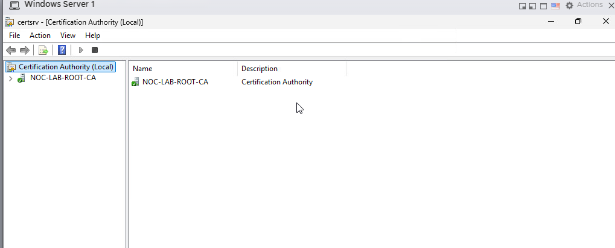

On top of it, `NOC-802.1X-Computer` is a certificate template scoped for exactly this purpose — a computer-based certificate with both Server and Client Authentication EKUs, digital signature and key encipherment as its key usage. The `NOC-8021x-Computers` security group holds Read, Enroll, and Autoenroll permissions on the template, which is what lets computer accounts in that group request and receive the certificate automatically rather than needing an administrator to approve each request by hand.

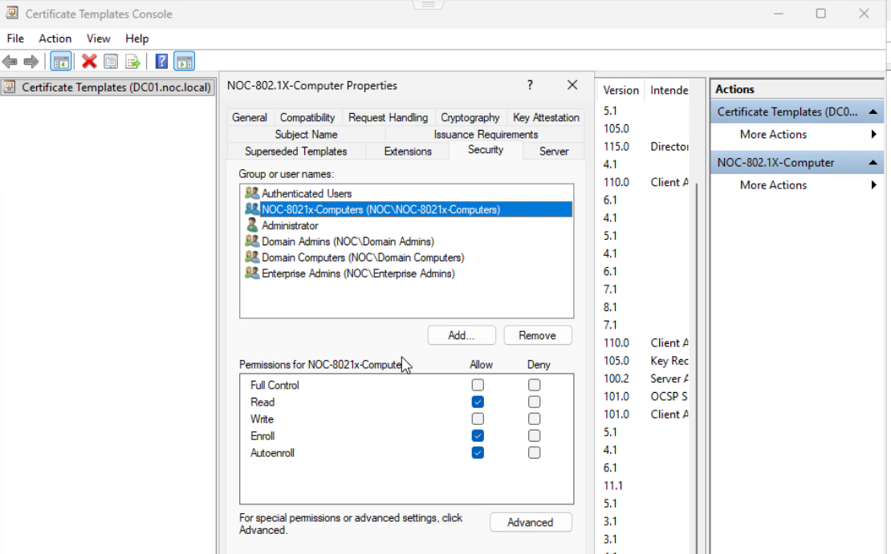

The template also needs to actually be issued on the CA — defining a template isn't the same as making it available, and the CA won't hand out a cert for a template it hasn't been told to issue.

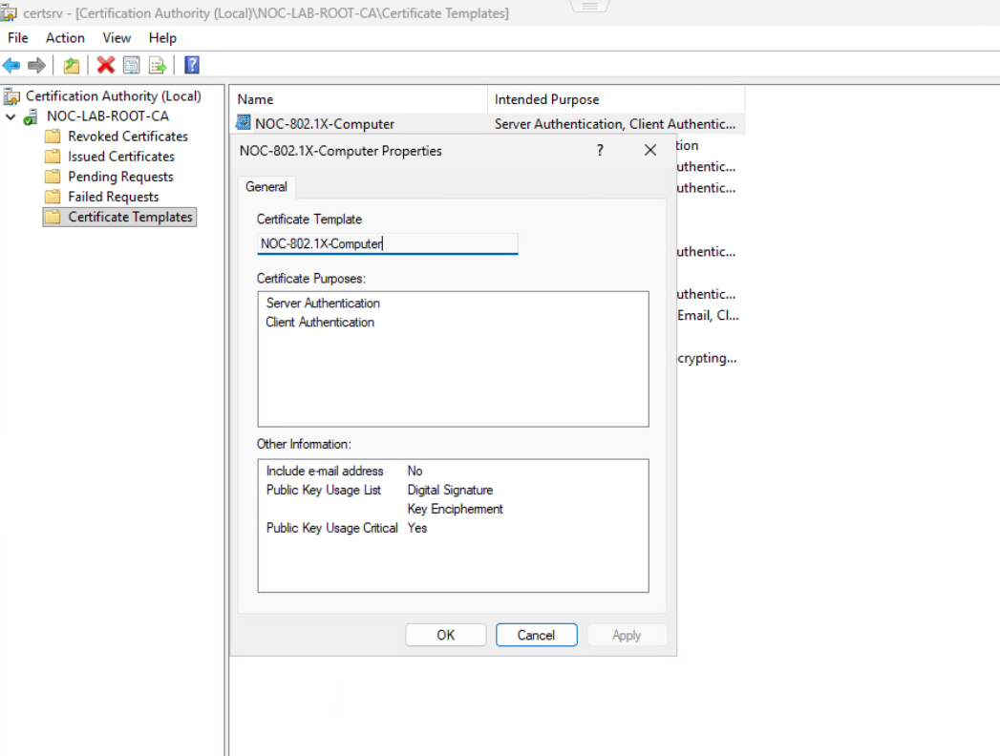

## Autoenrollment via Group Policy

Rather than install a certificate on each machine individually, the delivery mechanism here is a Computer Configuration GPO under **Public Key Policies → Certificate Services Client - Auto-Enrollment**, set to Enabled with certificate renewal and template updates both on.

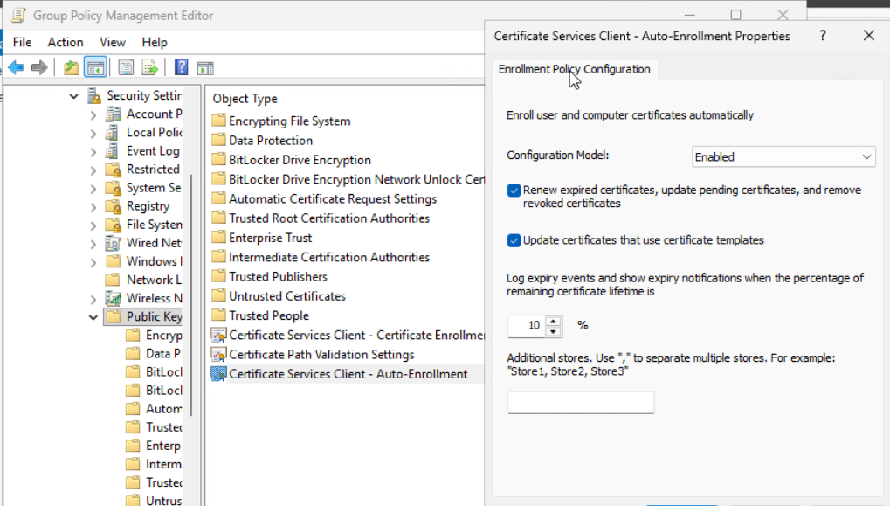

Once this GPO is linked to the OU containing the target computers, every computer account in scope requests and receives its own `NOC-802.1X-Computer` certificate on its normal Group Policy refresh cycle — no manual per-machine step. The certificate lands in the computer's own certificate store with its private key, tied to that specific machine's identity rather than a user's.

## Switching the wireless policy to EAP-TLS

With certificates landing on domain PCs, the wireless NPS policy needed its authentication method changed from PEAP to EAP-TLS — configured as **Microsoft: Smart Card or other certificate (EAP-TLS)** in the policy's authentication methods.

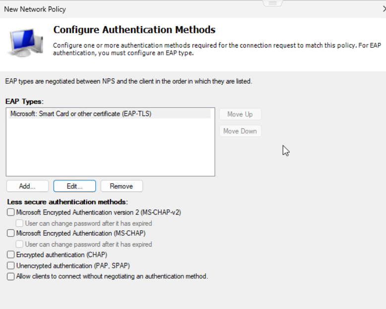

The completed policy, `01-NOC-WiFi-EAP-TLS`, conditions on the `NOC-8021x-Computers` group, NAS Port Type Wireless, and the AP as the client friendly name — the same shape of conditions as the PEAP policy in Part 2, just matched against computer certificates instead of user credentials.

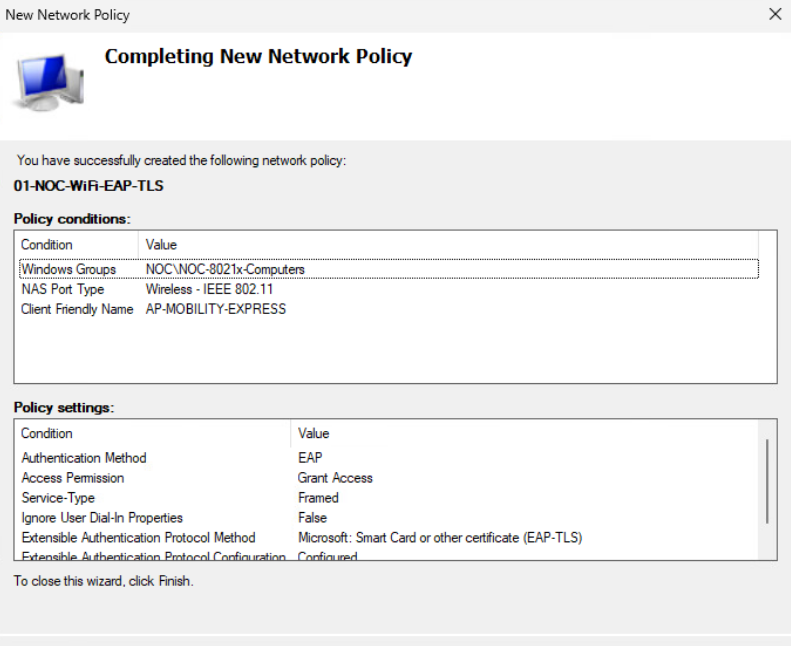

The wireless GPO that pushes the `NOC-STAFF` profile to domain clients — the same GPO mechanism Part 2 used to distribute the SSID and security type automatically rather than relying on each user to configure Wi-Fi manually — stays in place underneath this; only the authentication method the profile expects changes.

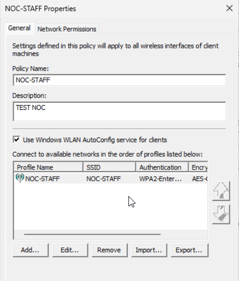

## Confirming the client side

On the test client, `gpresult` confirms the machine received Group Policy and is a member of `NOC-8021x-Computers` — the group both the certificate template and the new NPS policy key off of.

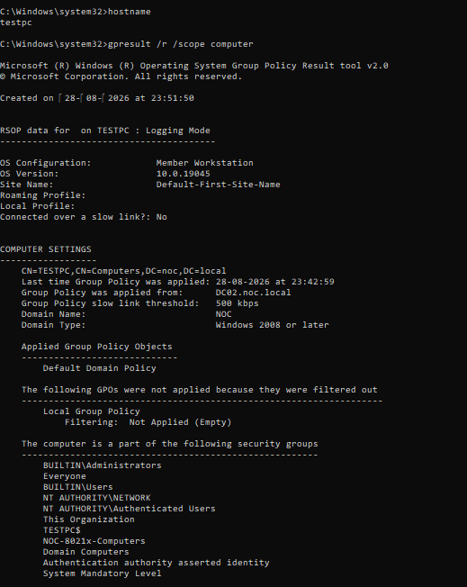

The clearest proof the whole chain works end to end is the connection itself: the client's Wi-Fi properties now show `Type of sign-in info: Microsoft: Smart Card or other certificate` rather than a username/password prompt, connected to `NOC-STAFF` over WPA2-Enterprise with a `192.168.40.11` address and both DCs listed as DNS servers.

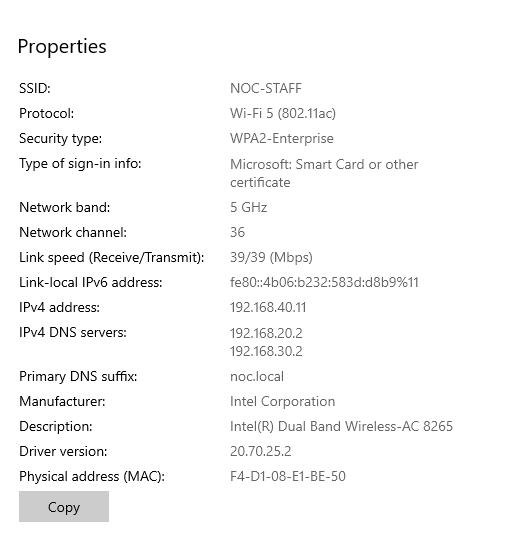

`netsh wlan show interfaces` confirms the same from the command line — connected, WPA2-Enterprise, on the `NOC-STAFF` profile:

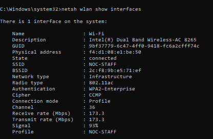

And the full IP configuration shows the client landing correctly on VLAN40 — the same client VLAN as every other device on this SSID, not the AP's management network:

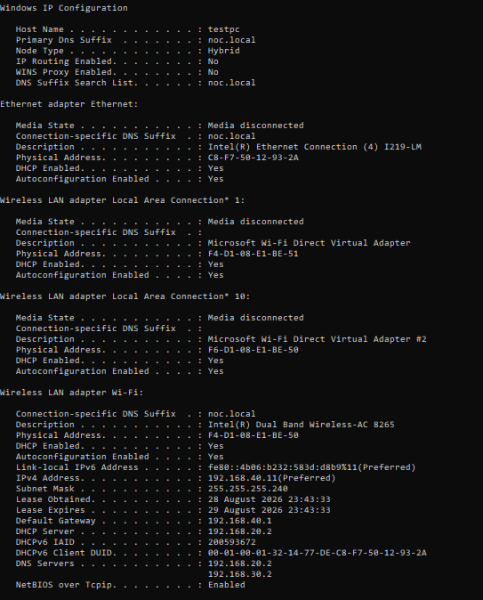

Gateway reachability and DNS resolution both check out from there, resolving `noc.local` through either DC:

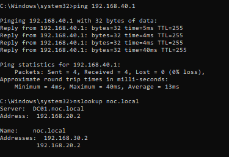

## Testing the other direction: a device without the certificate

Everything above proves an enrolled domain machine gets on `NOC-STAFF` cleanly. The other half of the claim — that EAP-TLS actually keeps everything else out — needed its own test. I tried connecting from a personal phone, manually configured with the correct SSID, the correct EAP method (TLS), and the correct domain identity (`noc.local`) typed in directly. No certificate to offer.

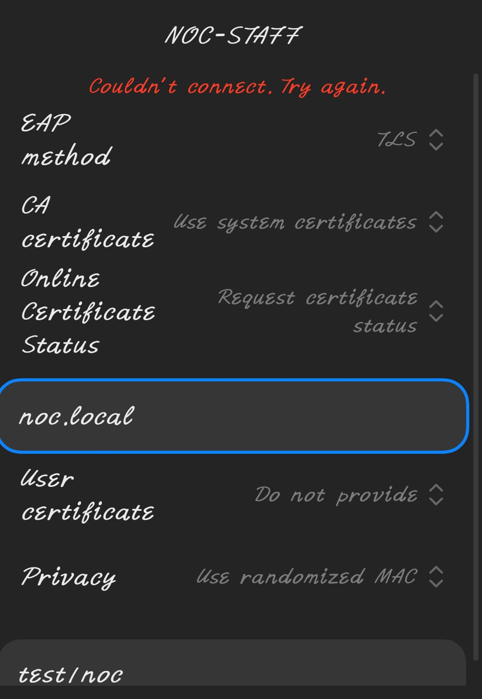

`Couldn't connect. Try again.` Knowing the network name and the domain isn't enough — without a certificate issued by `NOC-LAB-ROOT-CA` and trusted by NPS, there's nothing to authenticate with, and the connection fails at that point regardless of anything else being correct. This is the same principle as the `test1noc` denial in Part 2, just enforced by a different mechanism: there, group membership gated access; here, possession of an enrolled certificate does.

## Validation Matrix

| Test | Expected Result | Actual Result | Status |
|---|---|---|---|
| Certificate template issued with correct EKUs | Server + Client Authentication, issued on CA | Confirmed | PASS |
| Autoenroll permissions on the template | Target computer group has Read/Enroll/Autoenroll | Confirmed on `NOC-8021x-Computers` | PASS |
| Autoenrollment GPO | Enabled, renews and updates certificates automatically | Confirmed | PASS |
| Client group membership | Computer account in `NOC-8021x-Computers` | Confirmed via `gpresult` | PASS |
| NPS wireless policy uses EAP-TLS | Certificate-based authentication, not password | Confirmed — policy conditions and settings match | PASS |
| Client authenticates via EAP-TLS | Connects using certificate, no credential prompt | Confirmed — "Smart Card or other certificate" sign-in type | PASS |
| Client VLAN placement | Client lands on VLAN40 | Confirmed — `192.168.40.11`, correct gateway and DNS | PASS |
| Device without an enrolled certificate | Denied, even with correct SSID/domain knowledge | Confirmed — connection fails at the certificate stage | PASS |

## What I Learned

EAP-TLS and PEAP solve authentication differently in a way that matters operationally, not just cryptographically. PEAP only needs a valid AD credential from any device — which is convenient, but means any device with the right username and password gets on. EAP-TLS ties access to a specific machine holding a specific certificate, which is a stronger guarantee but also a real deployment cost: a device without the enrolled certificate simply can't connect, full stop, regardless of what else it knows correctly. The phone test above makes that concrete — right SSID, right EAP method, right domain name typed in by hand, and it still fails at the first step, because none of that substitutes for the certificate. That's a deliberate tradeoff, not a limitation to work around — it's exactly why autoenrollment matters here. Doing this by hand on more than a couple of machines would be a real maintenance burden; the GPO is what makes certificate-based auth actually practical at any scale beyond a single test PC.

The other thing worth noting is how cleanly this layered on top of Part 2 rather than replacing it. The AP, the trunk, the RADIUS client entries on both DCs, and the wireless GPO distributing the SSID profile all stayed exactly as they were — only the NPS policy's authentication method and the certificate on the client changed. Getting the underlying RADIUS/AP infrastructure right once in Part 2 meant this part was really just adding a new policy and a new certificate source on top of a foundation that didn't need to change.

## Interview Questions

**Q: What's the practical difference between PEAP-MSCHAPv2 and EAP-TLS, beyond "one uses a password and one uses a certificate"?**
A: PEAP validates the server to the client via a certificate, then the client proves itself to the server with a username and password inside that encrypted tunnel — so the client side of the trust is still just a credential, valid from any device. EAP-TLS validates both directions with certificates: the server proves itself to the client, and the client proves itself to the server using its own certificate and private key. That means access is tied to a specific machine holding a specific enrolled certificate, not just to whoever knows a password. The tradeoff is deployment complexity — EAP-TLS needs a working certificate distribution mechanism, which is exactly what the autoenrollment GPO in this lab provides.

**Q: How does a computer get its EAP-TLS certificate without an administrator manually issuing one to it?**
A: Autoenrollment. A Computer Configuration GPO enables the "Certificate Services Client - Auto-Enrollment" policy and links to the OU containing the target machines. The certificate template itself grants Autoenroll permission to a security group those computers belong to. Once both are in place, every in-scope computer requests and receives its certificate automatically on its normal Group Policy refresh cycle — the administrator's one-time setup work is the template and the GPO, not per-machine certificate installation.

**Q: If EAP-TLS authentication is failing for a specific device, what would you check?**
A: First, whether the device actually has the certificate — a personal or non-domain-joined device won't, since it never receives the autoenrollment GPO or has permission on the template. For a domain-joined device that should have one, I'd check `gpresult` to confirm the certificate GPO applied and the computer is in the group the template's autoenroll permission is scoped to, then check the certificate store directly for a valid, non-expired certificate with the Client Authentication EKU. If the certificate looks correct but authentication still fails, clock drift between the client, NPS, and the CA is a common next place to check, since certificate validation is time-sensitive.

**Q: How would you demonstrate that EAP-TLS is actually enforcing certificate possession, not just checking the SSID or domain name?**
A: Try connecting from a device that knows everything except the certificate — the right SSID, the right EAP method, the domain name typed in manually — and confirm it still fails. That's what separates "this network requires certain settings" from "this network requires a certificate this specific device doesn't have." I did exactly that from a personal phone with no enrolled certificate: correct SSID, correct EAP method, correct domain, and it still failed at the connection stage, which is the actual proof the certificate — not just knowledge of the network — is what's being checked.
