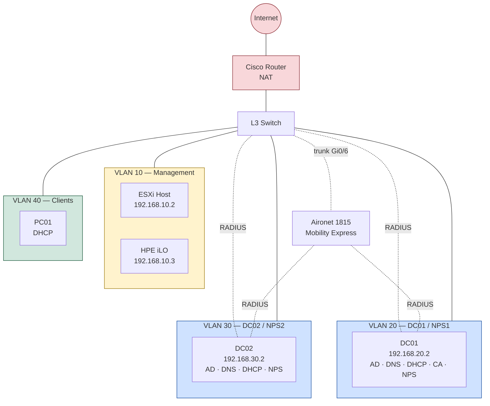

# AD Infrastructure Failover & AAA Lab

Two domain controllers, redundant DHCP/DNS, and centralized RADIUS authentication for both switch admin access and Wi-Fi — built to force myself into the coordination problems that only show up once a second DC enters the picture, and tested by actually pulling the primary down rather than trusting the design on paper.

## What this lab proves

- AD replication between two domain controllers, including a real replication fault found and fixed mid-lab
- DHCP hot-standby failover, evidenced by the standby DC's own address showing up in a client's lease during an outage
- DNS resolution surviving a DC outage — confirmed with an unqualified client query, not just a direct query to the surviving server
- RADIUS authentication and authorization for switch admin SSH access, including two real configuration bugs found and fixed
- RADIUS failover between two NPS servers for both switch SSH and Wi-Fi, each proven with live debug/event output during an actual service outage, not just a before/after comparison
- WPA2-Enterprise Wi-Fi authentication against AD via PEAP-MSCHAPv2
- Honest documentation of what's still open: Wi-Fi client VLAN placement, a switch SSH negative-access test that ran but wasn't captured, and a weak SSH host key — see Real findings below

## Repository structure

```text
AD_Infrastructure_Failover_and_AAA_Lab/
├── README.md                                          (this file)
├── 01_DNS_DHCP_Failover_and_Redundancy/
│   ├── README.md
│   └── Screenshots/                                   (62 files)
└── 02_NPS_Certificate_Services_AAA_SSH_and_WiFi_8021X/
    ├── README.md
    └── Screenshots/                                   (40 files)
```

## Topology



## The two parts

**[01 — DNS & DHCP Failover and Redundancy](01_DNS_DHCP_Failover_and_Redundancy/README.md)**
Builds DC01 and DC02 across three server-side VLANs on ESXi, sets up DHCP hot-standby failover for the client network, and gets DNS redundant between both DCs. A real AD replication fault (error `8524`) surfaced during testing — diagnosed, fixed (missing reverse lookup zone and missing alternate DNS entries, fixed together), and reverified rather than written around. Closes with a genuine DC-down test: DC01 powered off at the host level, and an unqualified client DNS query still resolving through DC02.

**[02 — NPS, Certificate Services & AAA](02_NPS_Certificate_Services_AAA_SSH_and_WiFi_8021X/README.md)**
Picks up from there and adds centralized authentication on top: switch admin SSH access against AD via RADIUS, and WPA2-Enterprise Wi-Fi doing the same, using NPS on both DCs so either can answer. Both failure modes — the switch's primary RADIUS server going down mid-session, and the same for a Wi-Fi client — are proven with live debug output and independently corroborated by the surviving DC's own security event log, not just a before/after screenshot pair. Also documents a real network-placement bug found along the way: authenticated Wi-Fi clients were landing on the management VLAN instead of the client VLAN, and a weak 1024-bit switch SSH host key.

## Real findings across this lab

Everything below was found by testing, not staged — each is documented in full, with root cause and fix, in its respective part.

| Finding | Where | Root cause | Status |
|---|---|---|---|
| AD replication failures (error 8524) | Part 1 | Missing alternate DNS server on both DCs and a missing reverse lookup zone, fixed in the same pass — the alternate-DNS fix has the better-documented link to this specific error; the reverse zone's individual contribution wasn't isolated | Fixed, reverified — `repadmin /replsummary` clean on both DCs |
| Wireless clients land on VLAN10 instead of VLAN40 | Part 2 | AP's WLAN wizard never prompted for VLAN assignment; NPS wireless policy sends no `Tunnel-Private-Group-ID` | Root cause identified, fix documented, not yet applied |
| AD group names drifted from planning docs (`NOC-Network-Admins` → `NOC-Network_Admins`, `NOC-WiFi-8021X` → `NOC-WiFi-802.1x`) | Part 2 | Manual AD group creation typos, never reconciled against the plan | Functional as-is; documented, not yet standardized |
| Switch SSH host key is 1024-bit RSA | Part 2 | Never regenerated from the switch's default | Documented, not yet fixed |
| No captured negative SSH test (denied login) | Part 2 | Test was performed during the lab, but no screenshot was taken at the time | Needs to be re-run and captured before the "group scoping enforced" claim rests on documented evidence rather than configuration alone |

## What ties the two parts together

Every RADIUS-dependent service in Part 2 sits on top of the AD/DNS/DHCP foundation from Part 1 — NPS on both DCs, the switch and AP both configured with both DCs as RADIUS servers, and every failover test in Part 2 depends on the same DNS redundancy Part 1 had to fix first. The two real findings that took the most digging (the `8524` replication error and the VLAN10 misassignment) share a pattern worth naming explicitly: both were things that worked well enough to look fine on a quick check, and only failed a specific test that wasn't part of the original plan — routine replication health checking in one case, checking the client's actual IP address rather than just its authentication result in the other.
