# Cisco ISE and Meraki EAP-TLS Network Access

*WPA2-Enterprise, certificate authentication, approved-device authorization, and dynamic VLAN assignment*

This lab extended my Meraki wireless environment into certificate-based network access control. I deployed Cisco ISE on ESXi, enabled its internal certificate authority, created an EAP-TLS-only policy, and connected a Meraki MR36 SSID to ISE through RADIUS.

The final policy required two independent checks. A client needed a valid certificate created from the approved template, and its real wireless MAC address needed to belong to the correct ISE endpoint group.

**In one sentence:** I built a WPA2-Enterprise SSID where Cisco ISE authenticated Windows devices with EAP-TLS, authorized approved IT and HR endpoints into separate VLANs, and denied a valid certificate when the device MAC was not yet approved.

## What I Built

- Catalyst Layer 3 switching for VLANs 10, 20, 30, and 99
- Routed upstream access through a Cisco edge router
- Meraki MS130 switching with two MR36 access points
- Cisco ISE running as a virtual machine on an ESXi VLAN 30 port group
- ISE internal certificate authority and an EAP-TLS client template
- Certificate authentication with non-TLS fallback methods disabled
- One Meraki SSID with RADIUS VLAN override
- IT authorization to VLAN 10 and HR authorization to VLAN 20
- A negative test proving that a certificate alone did not grant access

## Logical Topology

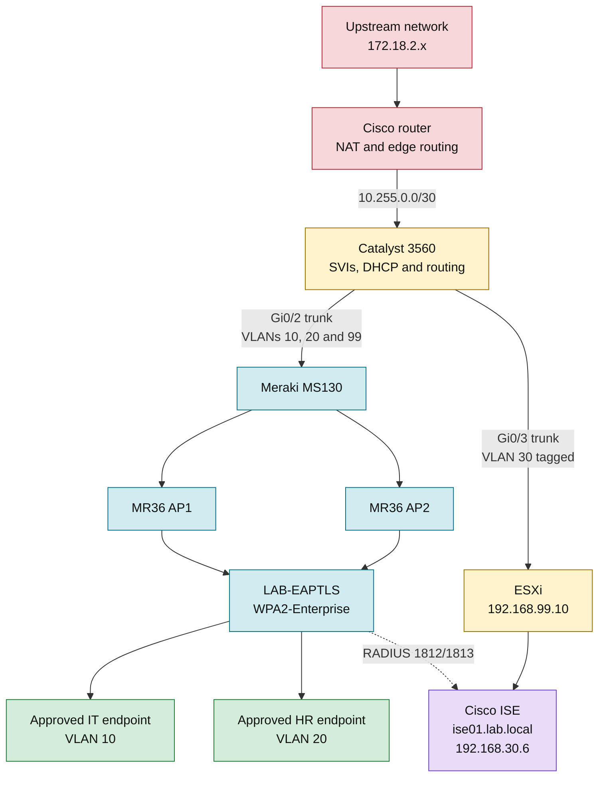
```mermaid
flowchart TB
    classDef edge fill:#f8d7da,stroke:#b02a37,color:#111
    classDef core fill:#fff3cd,stroke:#997404,color:#111
    classDef meraki fill:#d1ecf1,stroke:#0c6f82,color:#111
    classDef ise fill:#e8dcf8,stroke:#6f42c1,color:#111
    classDef endpoint fill:#d4edda,stroke:#227a3b,color:#111

    ISP["Upstream network<br/>172.18.2.x"]:::edge --> R1["Cisco router<br/>NAT and edge routing"]:::edge
    R1 -->|"10.255.0.0/30"| SW["Catalyst 3560<br/>SVIs, DHCP and routing"]:::core
    SW -->|"Gi0/2 trunk<br/>VLANs 10, 20 and 99"| MS["Meraki MS130"]:::meraki
    SW -->|"Gi0/3 trunk<br/>VLAN 30 tagged"| ESXI["ESXi<br/>192.168.99.10"]:::core
    ESXI --> ISE["Cisco ISE<br/>ise01.lab.local<br/>192.168.30.6"]:::ise
    MS --> AP1["MR36 AP1"]:::meraki
    MS --> AP2["MR36 AP2"]:::meraki
    AP1 --> SSID["LAB-EAPTLS<br/>WPA2-Enterprise"]:::meraki
    AP2 --> SSID
    SSID --> IT["Approved IT endpoint<br/>VLAN 10"]:::endpoint
    SSID --> HR["Approved HR endpoint<br/>VLAN 20"]:::endpoint
    SSID -. "RADIUS 1812/1813" .-> ISE
```

## Addressing and VLAN Plan

| VLAN or link | Network | Gateway or address | Purpose |
|---|---|---|---|
| VLAN 10 | `192.168.10.0/24` | `192.168.10.1` | IT clients |
| VLAN 20 | `192.168.20.0/24` | `192.168.20.1` | HR clients |
| VLAN 30 | `192.168.30.0/24` | ISE `192.168.30.6` | Server network |
| VLAN 99 | `192.168.99.0/24` | ESXi `192.168.99.10` | Infrastructure management |
| Router transit | `10.255.0.0/30` | Router `.1`, Catalyst `.2` | Routed upstream path |

## Stage 1: Routing and Switching Foundation

The Catalyst VLAN database contains dedicated IT, HR, server, and management networks. VLAN 999 remains available as an unused parking VLAN.


The trunk view confirms that the Meraki and ESXi paths carry the required VLANs. The same capture also shows active DHCP bindings, including leases in VLAN 10 and VLAN 99.

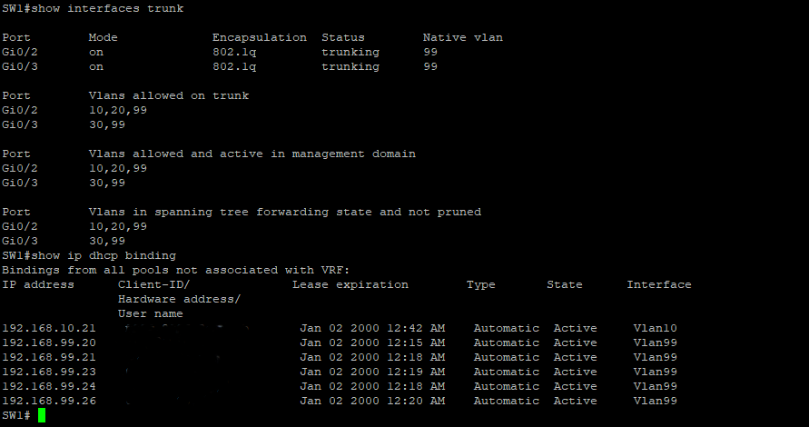

The edge router used one upstream interface and one routed interface toward the Catalyst. Both operational interfaces were up when captured.


The routing table shows a default route toward the upstream gateway, the connected `/30` transit network, and a route toward the internal `192.168.0.0/16` networks through the Catalyst.


NAT statistics and translations provide traffic-path evidence beyond static configuration. The router recorded active translations from an internal VLAN 10 client to external destinations.

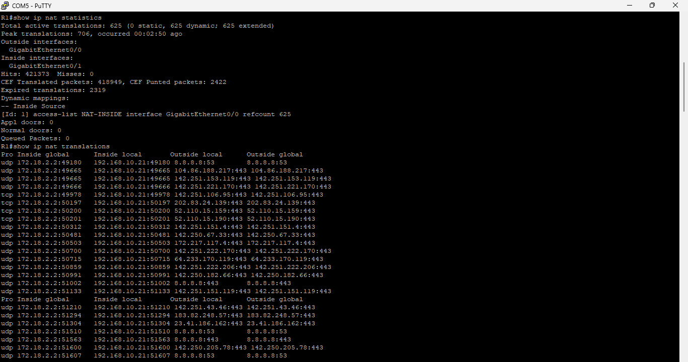

## Stage 2: Meraki Switching and Wireless Infrastructure

The Meraki MS130 port view shows the switch operating as the Layer 2 distribution point for the uplink and connected lab devices.


Meraki Dashboard discovered the MS130 and both MR36 access points in the Layer 2 topology.

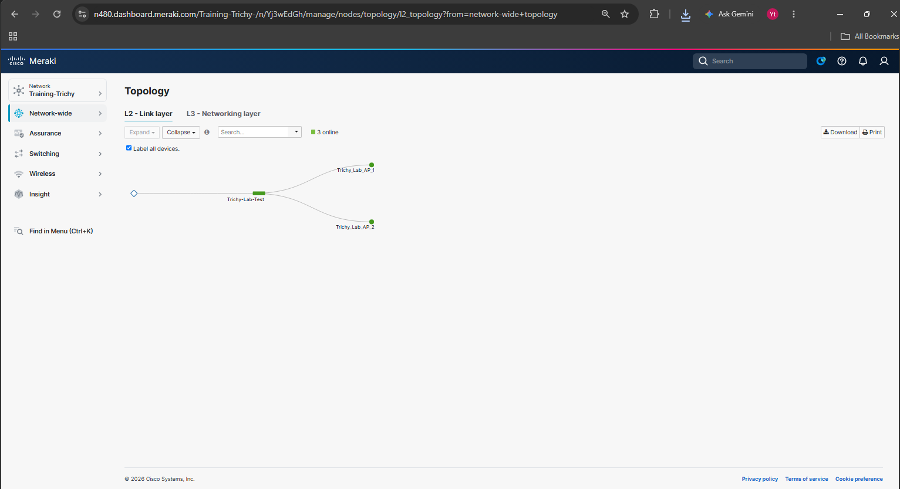

Both MR36 access points were online and running the same firmware when the inventory was captured.


## Stage 3: ESXi and Cisco ISE Deployment

The ESXi management VMkernel interface remained on the management network, separate from the ISE server VLAN.

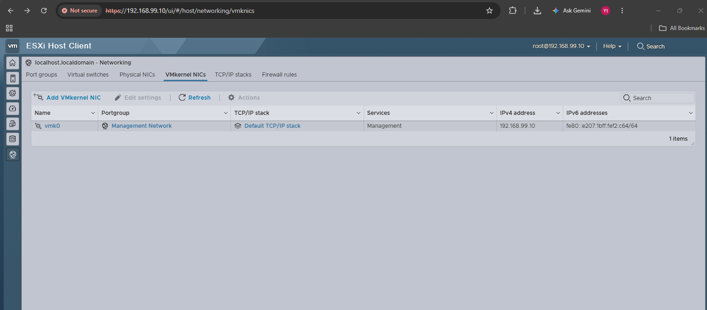

I created an `ISE-VLAN30` port group and assigned VLAN ID 30. This allowed the ISE virtual machine to use the tagged server VLAN while ESXi management stayed on VLAN 99.

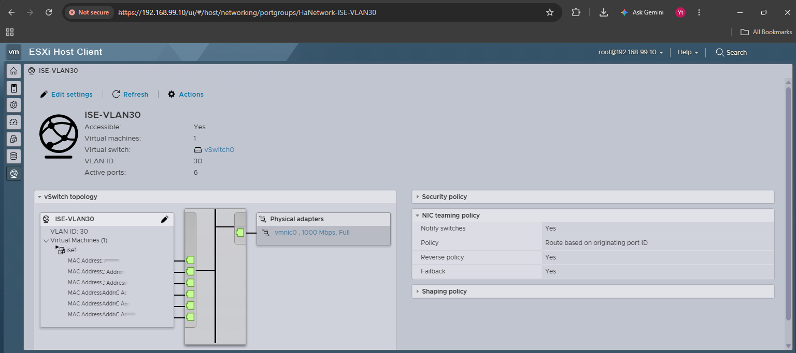

The ISE virtual machine was provisioned with 8 vCPUs, 32 GB RAM, a 300 GB disk, and network adapters connected to the VLAN 30 port group.

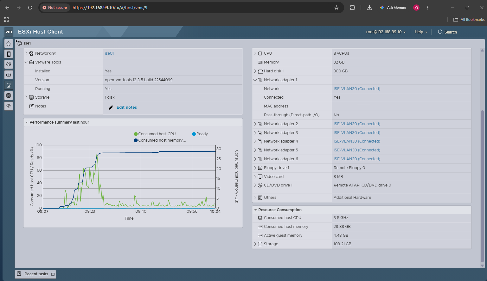

The installed node reported Cisco ISE 3.5 on the Application Deployment Engine platform.

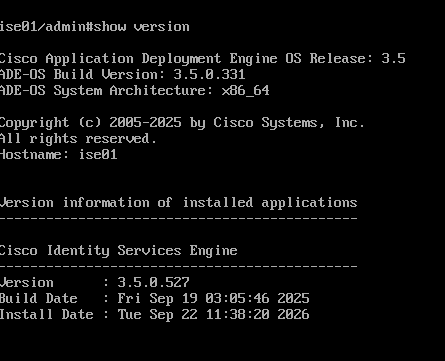

The application-status capture confirms that the database, application server, policy, certificate-authority, logging, API, and protocol services were running.

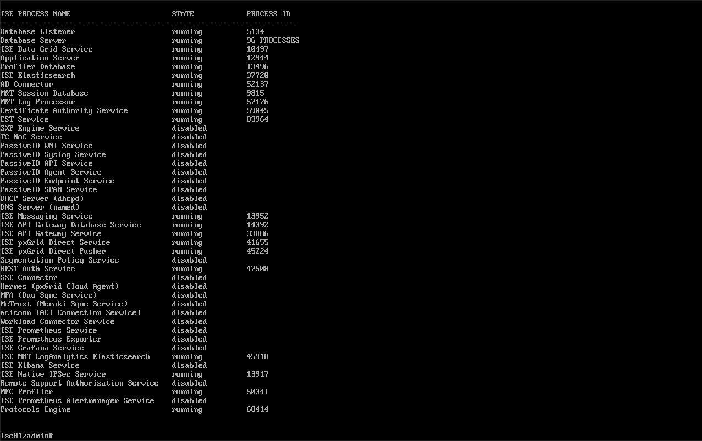

The ISE dashboard provided the first operational view of endpoints, network devices, authentications, alarms, and node health.

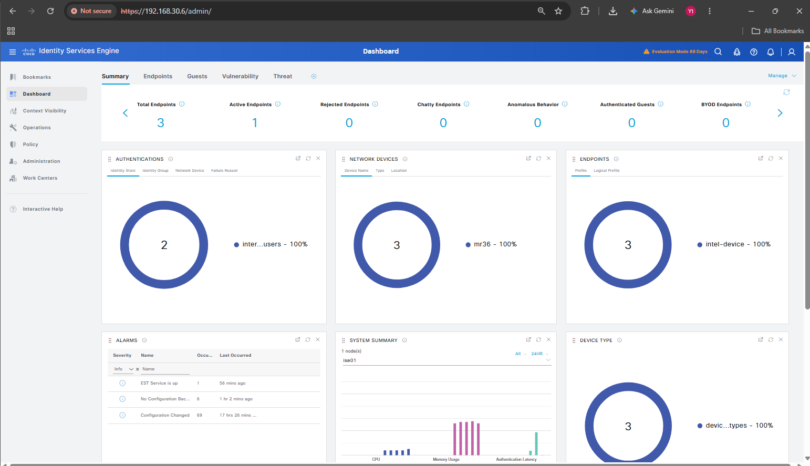

## Stage 4: Certificate Authority and EAP-TLS Identity

ISE held the system certificates required for its administrative, portal, EAP, SAML, pxGrid, and messaging roles.

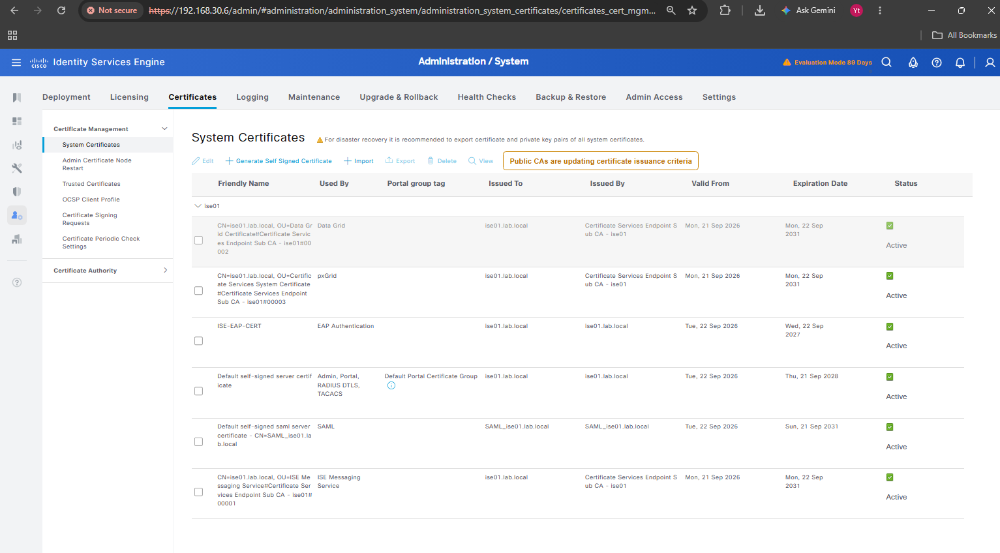

The dedicated `ISE-EAP-CERT` certificate was assigned to EAP authentication. This allowed wireless clients to validate the server during the TLS exchange.


I enabled the ISE internal certificate authority on the standalone node.


The resulting hierarchy included the root CA, node CA, endpoint subordinate CA, and OCSP responder.

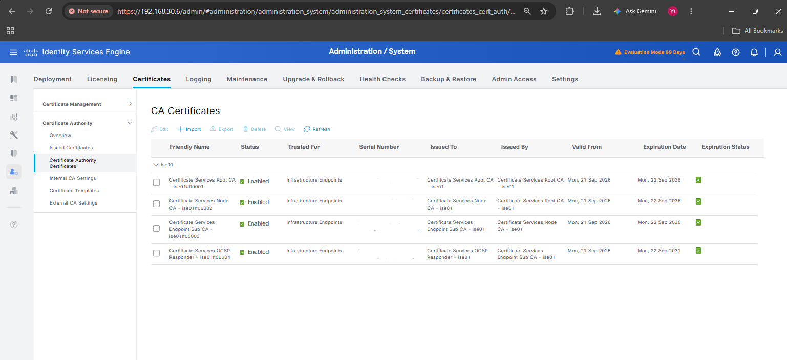

The `Secure_WiFi_EAP_TLS` certificate template used RSA keys and the Client Authentication extended key usage. The template was designed for individual endpoint certificates rather than a shared credential.


On Windows, the client certificate appeared in the Local Computer personal store with a valid path through the ISE endpoint subordinate CA and root hierarchy.

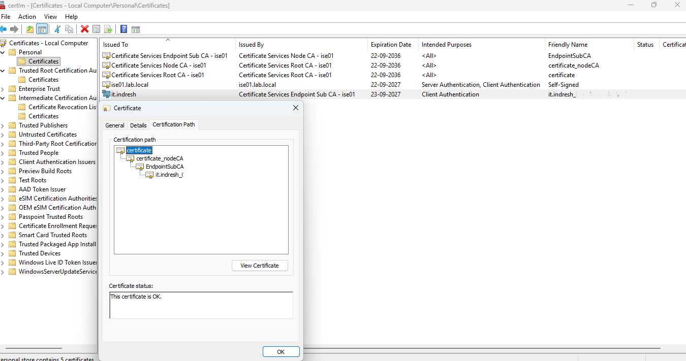

## Stage 5: ISE Network Device and Endpoint Authorization

The Meraki infrastructure was registered in ISE as a network device with RADIUS authentication enabled.


I created approved endpoint groups to add device-level authorization on top of certificate authentication. The captured IT group contains the authorized IT endpoint.


The certificate authentication profile `CAP_EAPTLS_DEVICE` allowed ISE to derive the endpoint identity from the certificate.

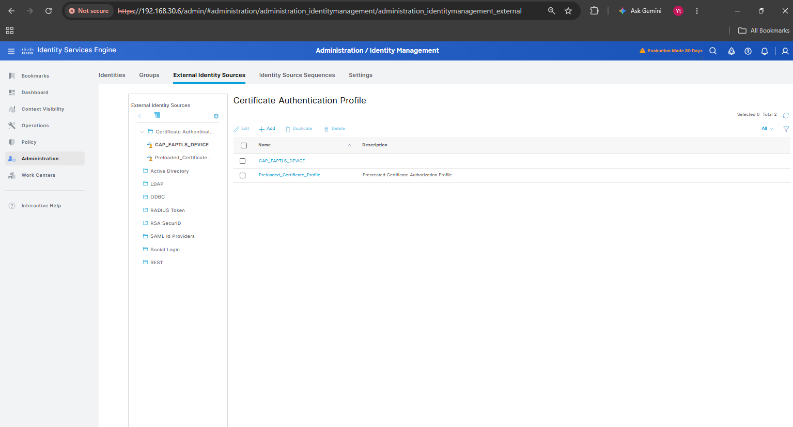

The allowed-protocols policy enabled EAP-TLS and disabled password-based alternatives. This prevented the secure SSID from falling back to PEAP, MS-CHAPv2, PAP, or other weaker methods.

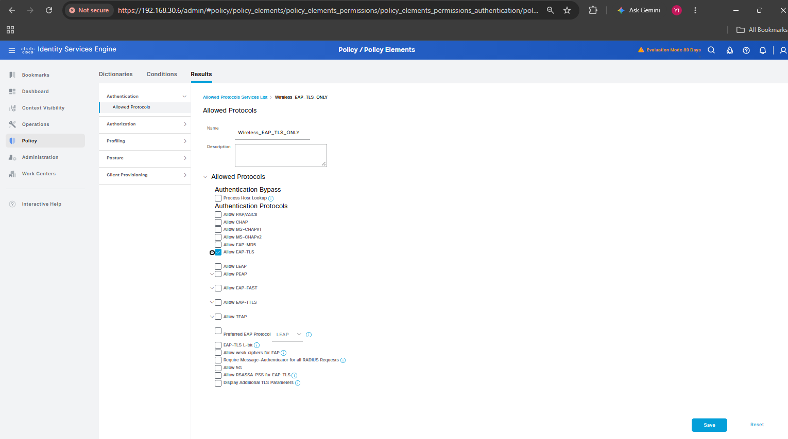

The `Meraki-EAPTLS-Secure` policy set matched wireless 802.1X traffic for `LAB-EAPTLS`. Its authentication rule used the certificate authentication profile and rejected failed or unknown identities.

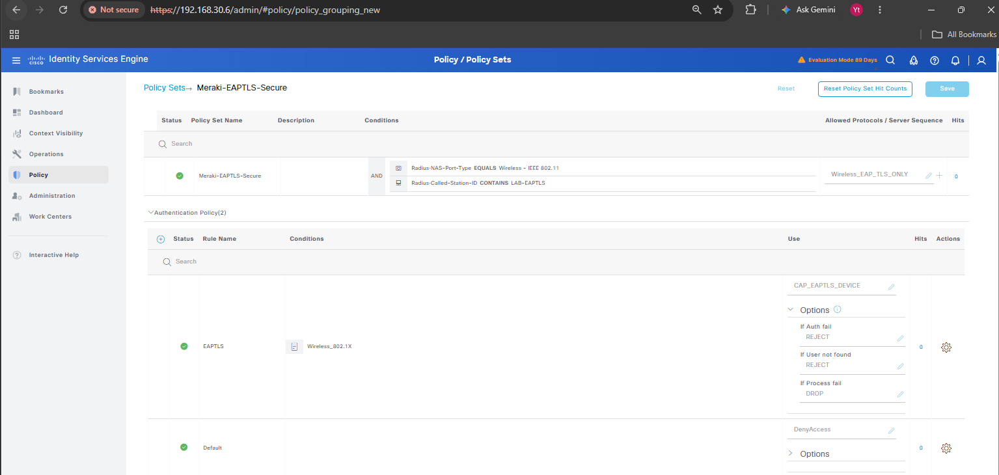

Authorization then checked the EAP method, certificate template, and approved endpoint group:

- `IT-EAPTLS-APPROVED` returned `PERMIT_VLAN10`
- `HR-EAPTLS-APPROVED` returned `PERMIT_VLAN20`
- The default rule returned `DenyAccess`

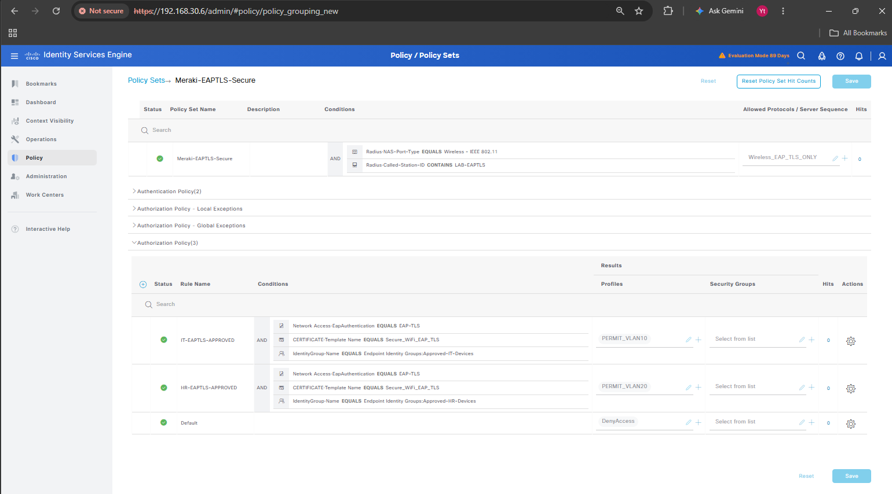

The VLAN authorization profiles returned standard RADIUS tunnel attributes for VLAN 10 and VLAN 20.


## Stage 6: Meraki LAB-EAPTLS SSID

The `LAB-EAPTLS` SSID used Enterprise authentication with the configured RADIUS server.


The SSID used WPA2-Enterprise, with direct access after successful 802.1X authentication and no additional splash page.


Meraki sent authentication to ISE on UDP 1812 and accounting on UDP 1813. The configured shared secret remained obscured in the captured image.


The SSID used bridge mode with external DHCP. RADIUS VLAN override was enabled so ISE could return VLAN 10 or VLAN 20 for the same SSID.


## Stage 7: Windows EAP-TLS Supplicant Configuration

I created the Windows wireless profile manually so the authentication method could be controlled explicitly.

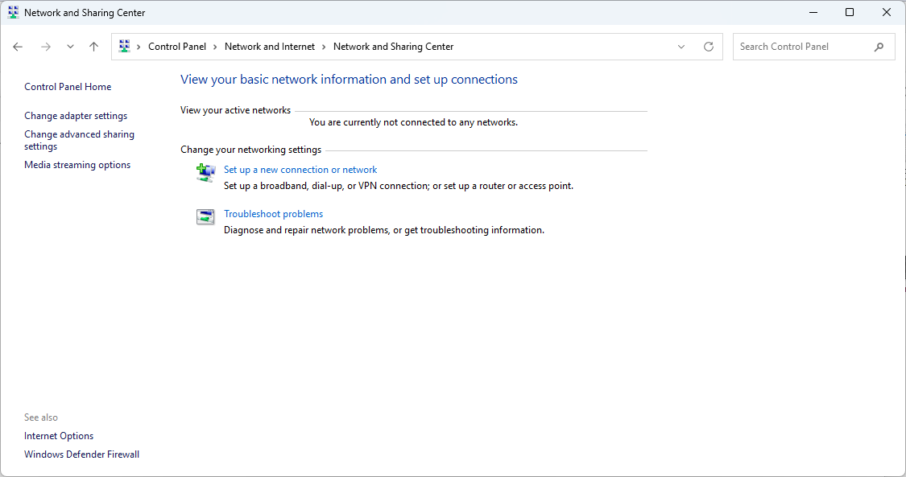


The profile used SSID `LAB-EAPTLS`, WPA2-Enterprise, and AES encryption.


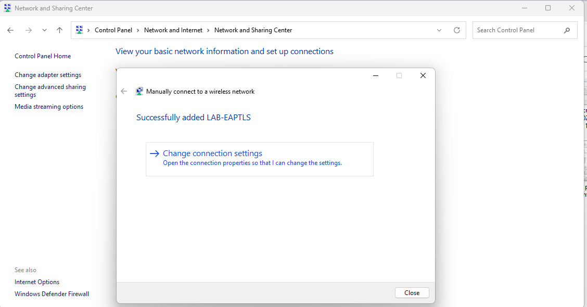

I selected **Microsoft: Smart Card or other certificate (EAP-TLS)** instead of PEAP.

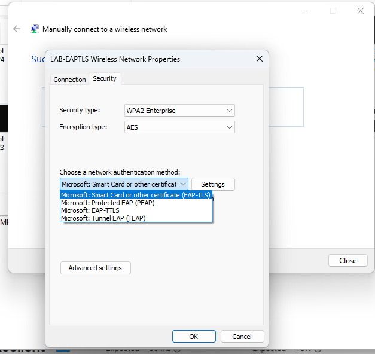

Because the certificate was installed in the Local Computer store, the advanced 802.1X settings used computer authentication.


Windows displayed the first-connect certificate confirmation, then established the secured wireless session.

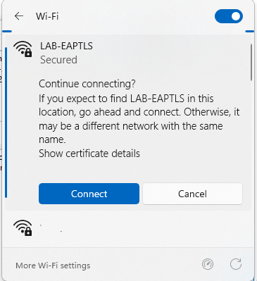


## Stage 8: IT and HR Client Validation

The IT endpoint connected with EAP-TLS and received `192.168.10.25` with gateway `192.168.10.1`. Windows reported WPA2-Enterprise, the certificate sign-in method, and a 5 GHz association.

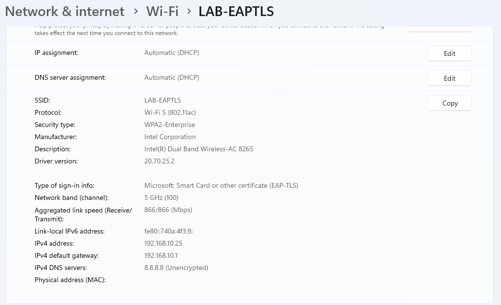

The command-line capture independently confirms the `LAB-EAPTLS` profile, WPA2-Enterprise authentication, and VLAN 10 addressing.


The HR endpoint connected to the same SSID but received `192.168.20.21` with gateway `192.168.20.1`, proving that ISE returned a different VLAN for the approved HR endpoint.

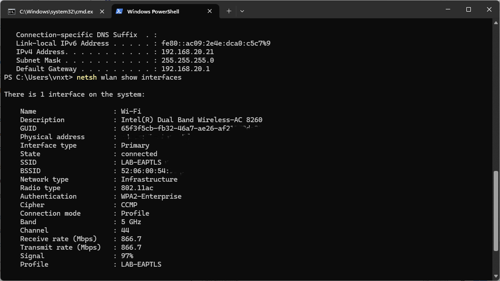

## Stage 9: Negative Test and Final ISE Proof

The ISE Live Logs capture brings the policy together. It contains successful IT authorization to `PERMIT_VLAN10`, an initial HR denial, and a later HR success with `PERMIT_VLAN20`.


The HR denial was intentional and useful:

1. The HR client presented a valid certificate and reached the EAP-TLS authentication policy.
2. Its MAC address was not yet in `Approved-HR-Devices`.
3. Authorization fell through to the default `DenyAccess` result.
4. I added the real wireless MAC to the approved HR group and reconnected.
5. The client matched `HR-EAPTLS-APPROVED` and received `PERMIT_VLAN20`.

This proves that certificate authentication and endpoint authorization were separate controls. Possession of a valid certificate did not automatically grant network access.

## Validation Matrix

| Test | Evidence | Result |
|---|---|---|
| VLAN foundation | Catalyst VLAN and trunk captures | PASS |
| Routed upstream path | Router routes and active NAT translations | PASS |
| Meraki infrastructure | MS130 and two MR36 devices visible online | PASS |
| ISE deployment | VM resources, services, version, and dashboard captured | PASS |
| EAP server identity | EAP certificate assigned and internal CA hierarchy active | PASS |
| EAP-TLS-only policy | EAP-TLS enabled with password-based alternatives disabled | PASS |
| IT authorization | IT rule returned VLAN 10 and client received `192.168.10.25` | PASS |
| HR authorization | HR rule returned VLAN 20 and client received `192.168.20.21` | PASS |
| Valid certificate with unapproved MAC | Authentication reached ISE but authorization returned `DenyAccess` | PASS |
| HR approval change | Adding the HR MAC changed the result to `PERMIT_VLAN20` | PASS |

## What I Learned

- EAP-TLS removes the shared-password problem, but certificate lifecycle management becomes critical.
- Trusting the ISE server certificate is different from installing a client certificate with a private key.
- Authentication and authorization must be tested separately.
- A valid certificate can still be denied by an endpoint-group condition.
- RADIUS VLAN override allows one SSID to serve multiple departments without duplicating SSIDs.
- Randomized wireless MAC addresses can break endpoint-group matching unless they are disabled or handled deliberately.
- ISE Live Logs provide the strongest proof because they show the policy set, authentication rule, authorization rule, and returned result together.

## Troubleshooting Approach

When an EAP-TLS connection fails, I check the path in this order:

1. Confirm the client can see and associate with `LAB-EAPTLS`.
2. Confirm the Windows profile uses EAP-TLS, not PEAP.
3. Verify the client certificate, private key, template, expiry, and CA chain.
4. Check that the real wireless MAC belongs to the intended endpoint group.
5. Open ISE Live Logs and identify the exact failed stage.
6. Verify the matched policy set, authentication rule, and authorization rule.
7. Confirm that Meraki accepted the returned VLAN and that DHCP succeeded there.

## Final Result

```text
IT certificate + approved IT endpoint
-> EAP-TLS success
-> IT-EAPTLS-APPROVED
-> PERMIT_VLAN10
-> 192.168.10.25

HR certificate + unapproved endpoint
-> EAP-TLS identity accepted
-> authorization condition not met
-> DenyAccess

HR certificate + approved HR endpoint
-> EAP-TLS success
-> HR-EAPTLS-APPROVED
-> PERMIT_VLAN20
-> 192.168.20.21
```

[Back to the Cisco ISE Identity and Access Control overview](../)
