# Cisco ISE TACACS+ Device Administration

*Centralized administrator authentication, role-based command authorization, and command accounting*

After completing the EAP-TLS wireless lab, I used the same Cisco ISE deployment to control administrative access to a Cisco Catalyst switch. This lab focused on the management plane rather than endpoint network access.

I created separate administrator and read-only roles, mapped each role to a TACACS+ policy, and tested the result from the switch CLI. The administrator received full privilege 15 access. The read-only user could run approved `show` commands but could not enter configuration mode. ISE also recorded the authentication, authorization, and accounting events.

**In one sentence:** I used Cisco ISE TACACS+ to centralize switch administrator access, enforce different command permissions for two roles, and retain evidence of each management action.

## What I Built

- Cisco ISE Device Administration service for TACACS+
- Two internal identity groups: `NetAdmins` and `NetReadOnly`
- Two test identities: `net.admin` and `net.viewer`
- Catalyst switch registration as a TACACS+ network device
- A privilege 15 shell profile
- `PermitAll` and `ShowOnly` command sets
- Role-based authentication and authorization rules
- Command accounting for administrative activity
- Positive and negative CLI tests from the Catalyst switch

## Logical Topology

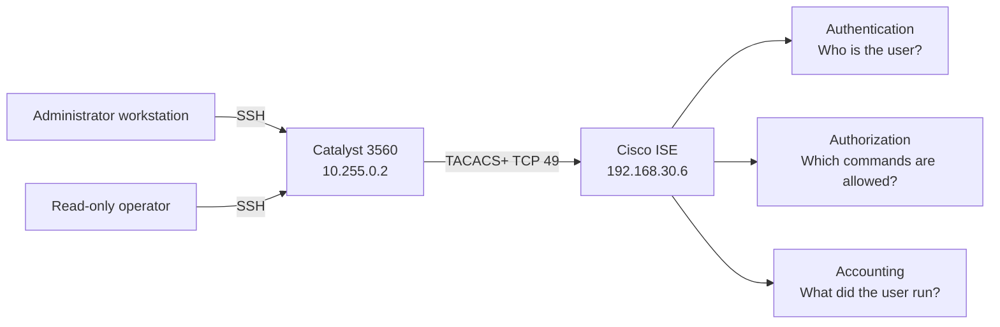

The switch is the TACACS+ client, also called the network access device. Cisco ISE acts as the policy decision point. SSH remains the management entry method, while ISE decides whether the supplied identity can log in and which commands it can use.

## Role and Policy Design

| Identity | ISE group | Shell profile | Command set | Expected result |
|---|---|---|---|---|
| `net.admin` | `NetAdmins` | `Priv15` | `PermitAll` | Full administrative access |
| `net.viewer` | `NetReadOnly` | `Priv15` | `ShowOnly` | Monitoring commands allowed, configuration denied |
| Unknown or invalid credentials | None | None | None | Access denied |

Giving both accepted users a privilege 15 shell profile did not give both users the same command rights. ISE performed command authorization separately. That distinction allowed the read-only account to reach the EXEC prompt while still blocking configuration commands.

## Stage 1: Enable ISE Device Administration

I first enabled the Device Administration service on the ISE policy service node. I then confirmed that the required ISE application services were running before building the TACACS+ policy.

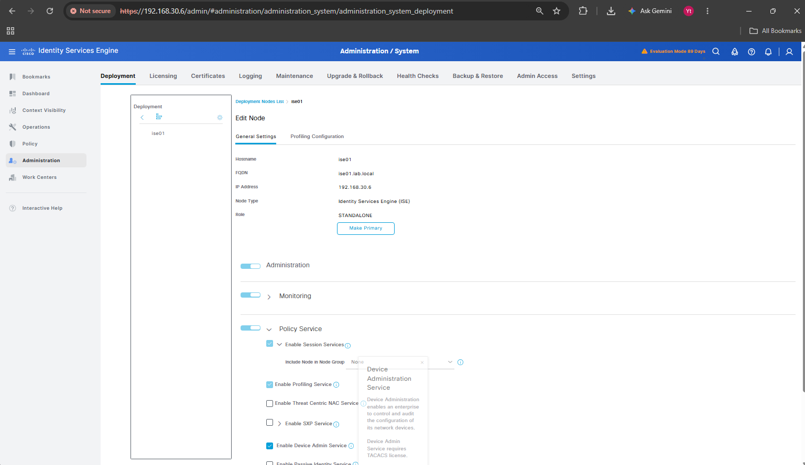


## Stage 2: Create Identities and Register Network Devices

I created separate identity groups for administrators and read-only operators. I added one internal user to each group so the policy could make decisions from group membership rather than individual usernames.

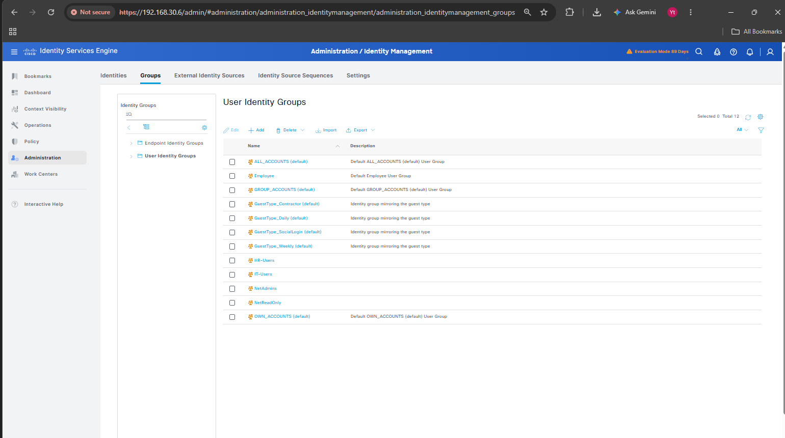

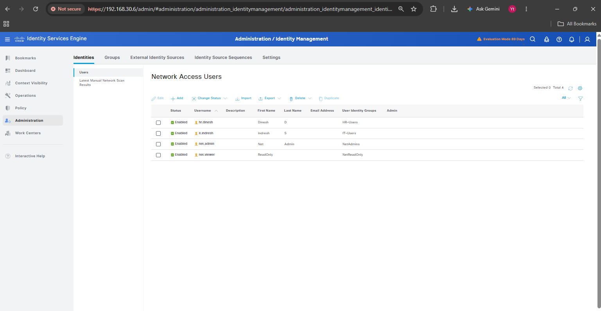

I registered the lab network devices in ISE with their management addresses. The switch entry used `10.255.0.2/32`, while the router object used `10.255.0.1/32`.


The router registration is visible in ISE, but this repository does not include router-side TACACS+ test evidence. The validated CLI results in this chapter belong to the Catalyst switch.

## Stage 3: Build Shell and Command Authorization Profiles

The `Priv15` shell profile assigns privilege level 15 after successful authorization. I paired it with different command sets to separate full administration from read-only monitoring.


The `PermitAll` command set supports the administrator role.

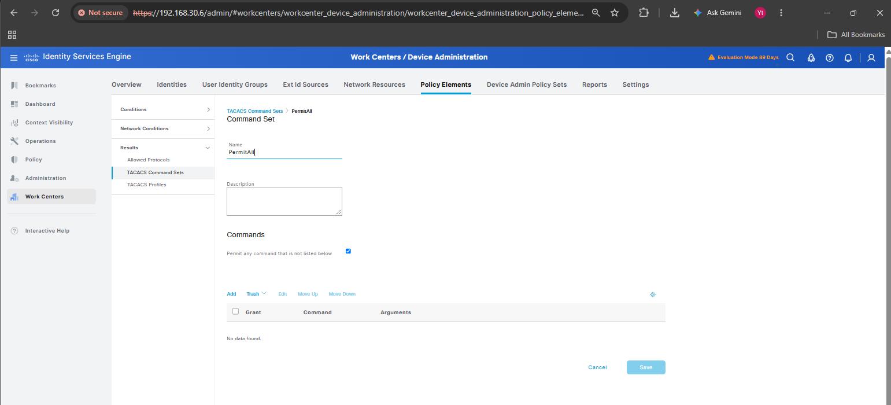

The `ShowOnly` command set permits operational inspection while preventing configuration changes.


## Stage 4: Build the TACACS+ Policy Set

I created the `Network-Device-Admin` policy set and matched TACACS+ requests from the registered network devices.


The authentication policy used the ISE internal user database for the two lab identities.

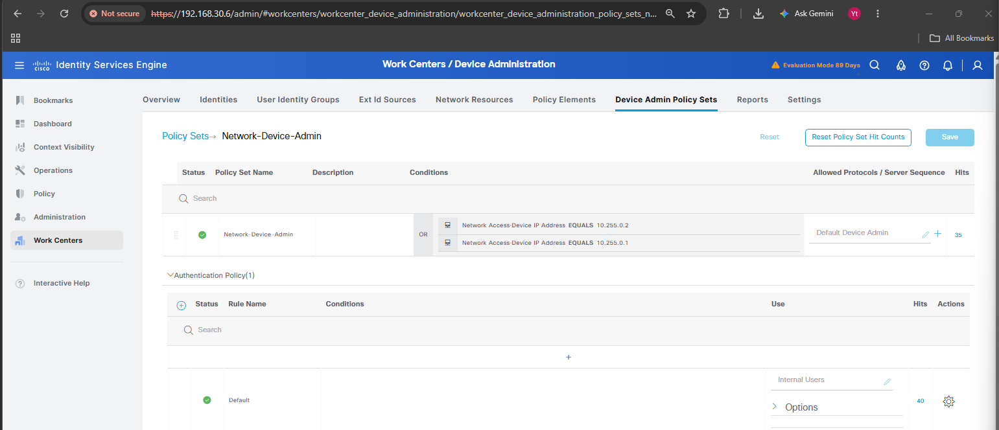

Authorization then mapped each identity group to its shell profile and command set:

- `NetAdmins` received `Priv15` with `PermitAll`
- `NetReadOnly` received `Priv15` with `ShowOnly`
- unmatched requests reached the default deny rule

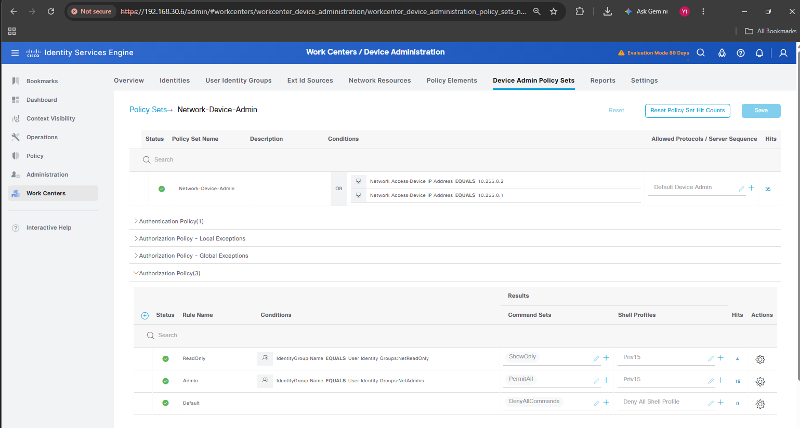

## Stage 5: Configure Catalyst AAA and TACACS+

On the switch, I enabled AAA, defined the ISE TACACS+ server, and applied TACACS+ to login, EXEC authorization, command authorization, and accounting. I also selected the routed interface used to reach ISE as the TACACS+ source.


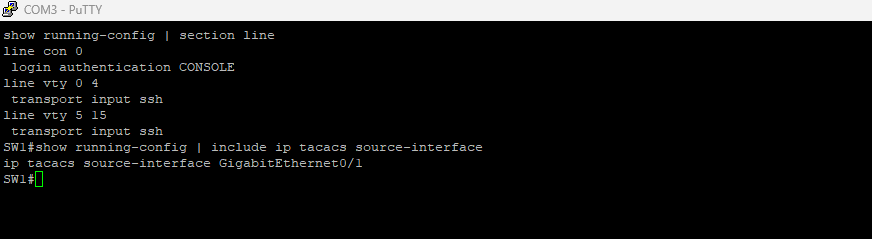

The publication-safe configuration pattern is shown below. The shared secret is deliberately represented by a placeholder.

```text
aaa new-model
tacacs server ISE01
 address ipv4 192.168.30.6
 key <TACACS_SHARED_SECRET>

aaa authentication login default group tacacs+ local
aaa authorization exec default group tacacs+ local if-authenticated
aaa authorization commands 15 default group tacacs+ local
aaa accounting commands 15 default start-stop group tacacs+
ip tacacs source-interface <ROUTED_INTERFACE>
```

I used the switch authentication test to confirm communication with the TACACS+ server before relying on an interactive SSH test.


## Stage 6: Validate Role-Based CLI Access

The key authorization test used the read-only account. It could run approved monitoring commands, but `configure terminal` was rejected. This proves that login success did not automatically provide configuration rights.


| Test | Expected | Observed |
|---|---|---|
| `net.admin` login | Authentication succeeds | Passed |
| `net.admin` authorization | Full administrative policy | Passed in ISE |
| `net.viewer` login | Authentication succeeds | Passed |
| `net.viewer` show command | Command allowed | Passed |
| `net.viewer` configuration command | Command denied | Passed |

## Stage 7: Confirm Admin and Read-Only Decisions in ISE

ISE recorded successful command authorization for `net.admin` and exposed the protocol details behind the decision.

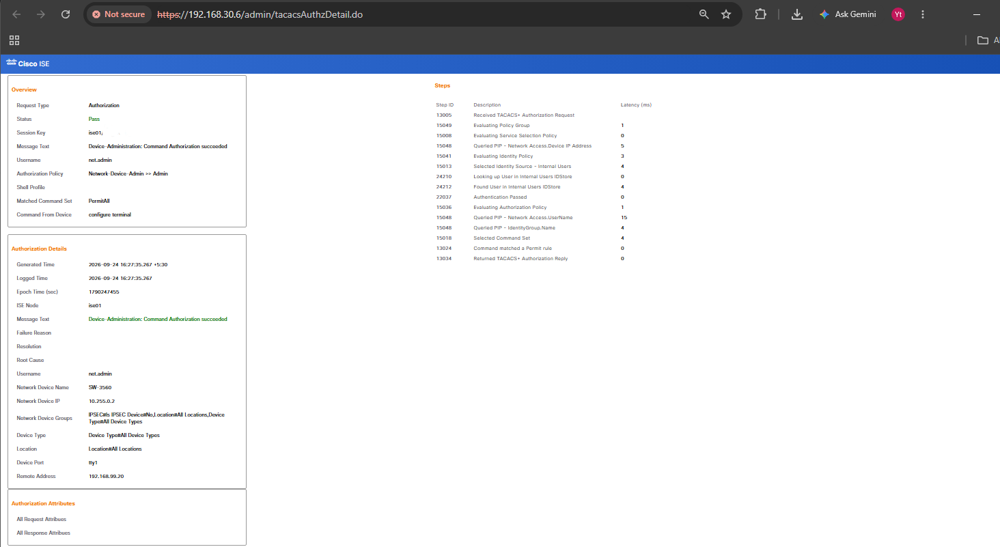

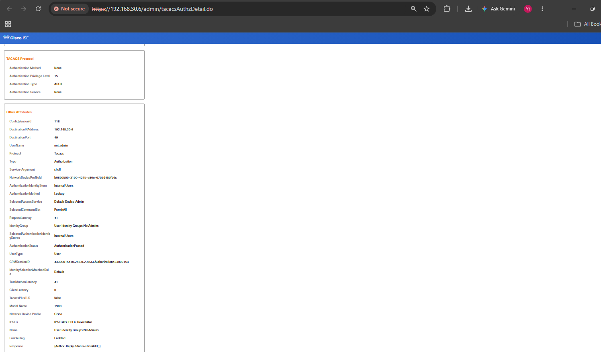

The `net.viewer` login also succeeded because the identity and password were valid.

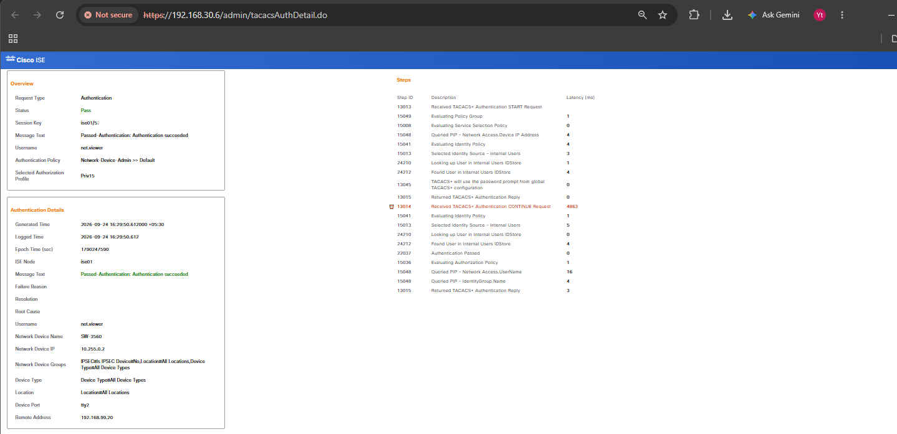

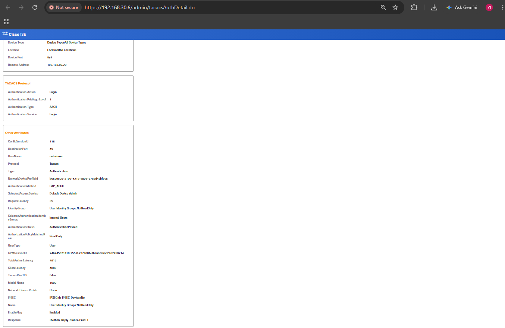

When the same user attempted a configuration command, ISE denied that command through the read-only authorization policy.

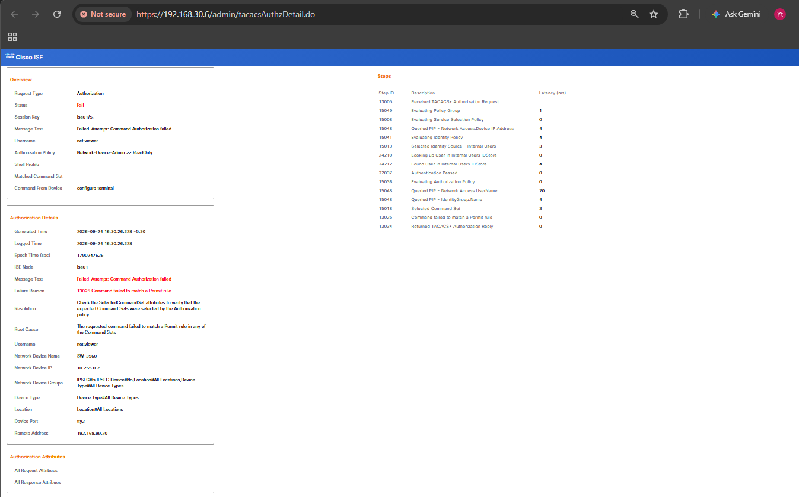

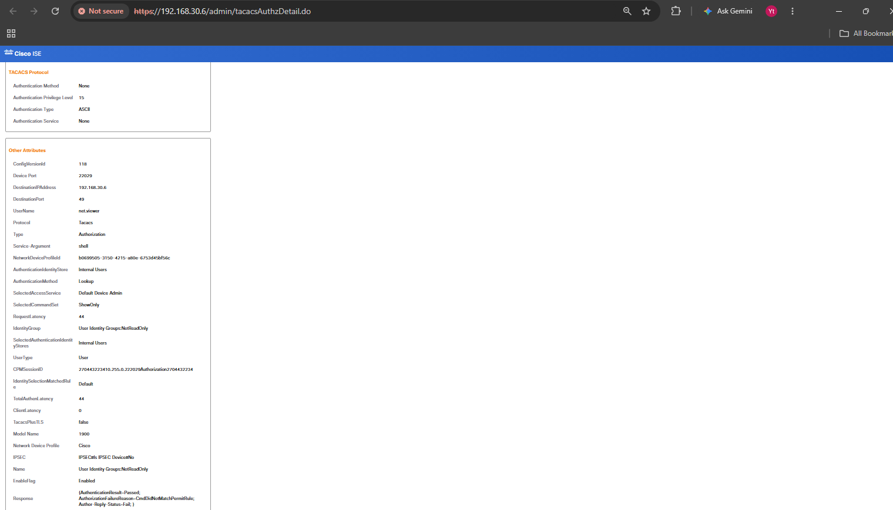

This is an important separation: the user passed authentication but failed authorization for one specific action. The account was valid. Its assigned role simply did not permit the command.

## Stage 8: Review Live Logs and Command Accounting

The TACACS+ live logs showed the role-based results together, which made it easier to compare successful authentication with command authorization decisions.

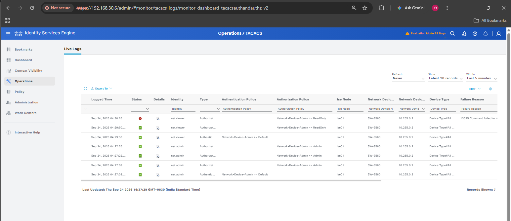

I then reviewed a command accounting event. The detailed record identified the administrator activity received from the network device.


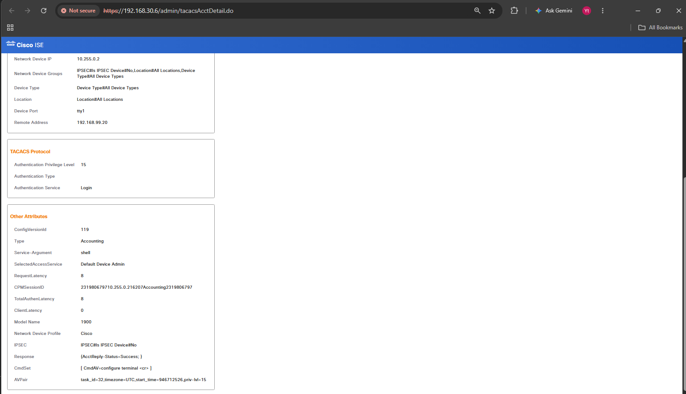

The accounting report provided a consolidated view of recorded commands. This gives the design an audit trail, not just centralized login control.


## Stage 9: Run a Negative Authentication Test

I tested an incorrect password to confirm that ISE rejected invalid credentials. The live log showed the failed request, and the detailed views exposed the failure reason and protocol attributes.

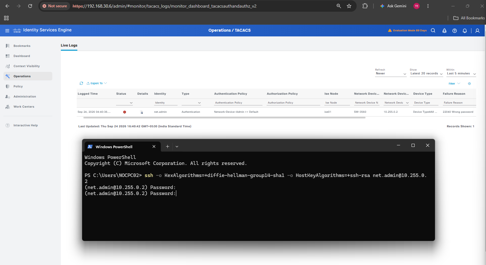

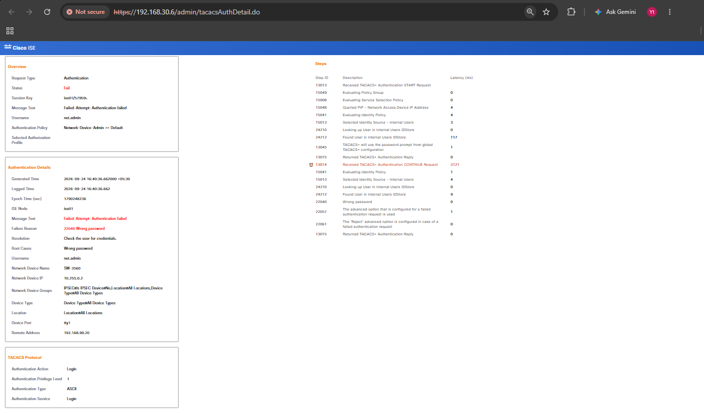

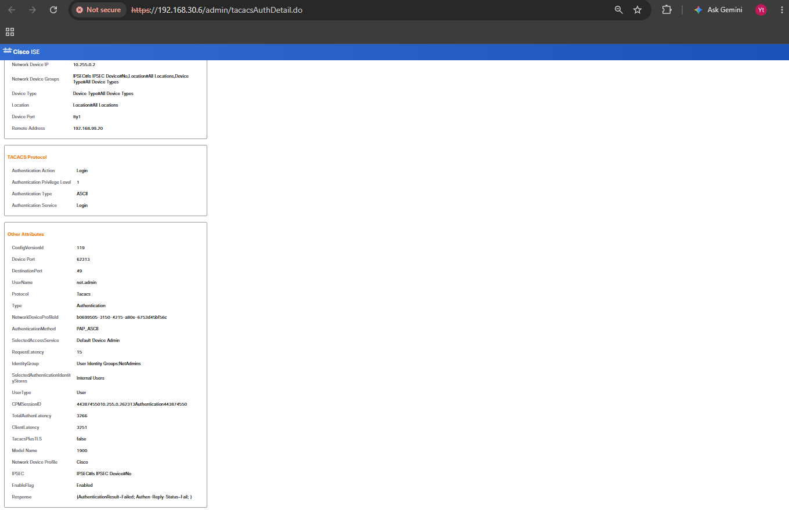

This negative test matters because a successful admin login alone does not prove the deny path. The failed-password record confirms that the authentication policy also handled invalid credentials as expected.

## Validation Matrix

| Validation point | Evidence | Result |
|---|---|---|
| ISE Device Administration enabled | ISE deployment settings | Passed |
| TACACS+ service operational | ISE application status | Passed |
| Catalyst registered as a network device | ISE network device list | Passed |
| `net.admin` authentication | Switch test and ISE record | Passed |
| Administrator command authorization | ISE authorization record | Passed |
| `net.viewer` authentication | Switch CLI and ISE record | Passed |
| Read-only show command | Switch CLI | Passed |
| Read-only configuration attempt | Switch denial and ISE record | Passed |
| Command accounting | ISE accounting details and report | Passed |
| Incorrect password | ISE failed authentication record | Passed |
| Router-side TACACS+ login | No CLI evidence captured | Not claimed |
| Local fallback during ISE outage | No outage test evidence captured | Not claimed |

## What I Learned

1. Authentication, authorization, and accounting solve different problems. A good AAA design needs all three.
2. Privilege level and command authorization are related but not identical. A privilege 15 shell can still be restricted by an ISE command set.
3. A read-only role should be tested with both an allowed command and a denied command.
4. Live logs explain the decision, while accounting records show what an accepted administrator actually did.
5. A negative credential test is essential. Otherwise, the documentation only proves the happy path.

## Troubleshooting Approach

If TACACS+ access fails, I would check the path in this order:

1. Confirm IP reachability from the switch source interface to ISE.
2. Confirm TCP port 49 is reachable.
3. Verify that the switch source address matches the ISE network device entry.
4. Verify the TACACS+ shared secret on both sides without exposing it in screenshots or command output.
5. Check the ISE live log to determine whether the failure occurred during authentication or authorization.
6. Confirm the user belongs to the intended ISE identity group.
7. Confirm the matched authorization rule returned the correct shell profile and command set.
8. Review command accounting only after authentication and authorization work correctly.

For a production deployment, I would also test a local break-glass account during a controlled TACACS+ outage. That test was outside the captured evidence for this lab, so I have not presented it as completed here.

## Final Result

The Catalyst switch used Cisco ISE for centralized TACACS+ administration. The administrator role received full command access, while the read-only role could inspect the switch but could not enter configuration mode. ISE recorded the successful sessions, the denied command, command accounting details, and an incorrect-password failure.

This lab demonstrates more than centralized login. It shows identity-based administrative control with a usable audit trail and clear evidence for both permit and deny decisions.

[Back to the Cisco ISE Identity and Access Control overview](../)
