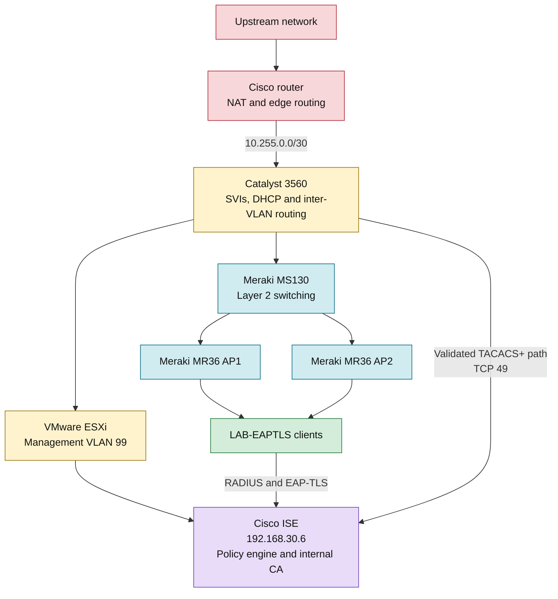

# Cisco ISE Identity and Access Control

*Certificate-based wireless access and role-based network-device administration with Cisco ISE*

This project brings together two related security implementations built and tested on the same lab network. The first controls **who and what can join the wireless network**. The second controls **who can administer the network devices and which commands they can run**.

**In one sentence:** I used Cisco ISE as a shared policy engine for Meraki EAP-TLS wireless access and Catalyst TACACS+ device administration, then validated certificate authentication, dynamic VLAN assignment, role-based CLI authorization, command accounting, and deliberate denial cases.

## Two Security Implementations

| Lab | Protocol | Security question | Validated outcome |
|---|---|---|---|
| [Meraki EAP-TLS Network Access](01-Meraki-EAP-TLS-Network-Access/) | RADIUS with EAP-TLS | Can this endpoint join the network, and which VLAN should it receive? | Approved IT and HR devices received VLAN 10 and VLAN 20. A valid certificate with an unapproved MAC was denied. |
| [TACACS+ Device Administration](02-TACACS-Device-Administration/) | TACACS+ | Can this administrator enter the switch, and which commands may they execute? | ISE authorized `net.admin` through the full-access policy. `net.viewer` received show-only access, configuration was denied, and commands were recorded in ISE. |

## Solution Architecture



## Why These Labs Belong Together

The two protocols handle different trust decisions:

```text
RADIUS + EAP-TLS
Endpoint -> Wireless network -> Certificate and device policy -> VLAN assignment

TACACS+
Administrator -> Router or switch -> Identity and role policy -> Command decision
```

The shared ISE deployment makes the separation easy to see. Authentication answers **who or what is requesting access**. Authorization decides **what that identity may do**. Accounting records **what happened afterward**.

## Shared Addressing and VLANs

| VLAN or link | Network | Purpose |
|---|---|---|
| VLAN 10 | `192.168.10.0/24` | IT wireless clients |
| VLAN 20 | `192.168.20.0/24` | HR wireless clients |
| VLAN 30 | `192.168.30.0/24` | Cisco ISE server network |
| VLAN 99 | `192.168.99.0/24` | Infrastructure management |
| Router-to-Catalyst | `10.255.0.0/30` | Routed transit and TACACS+ source addresses |

Key systems captured in the lab include Cisco ISE at `192.168.30.6`, ESXi management at `192.168.99.10`, and the Catalyst TACACS+ source at `10.255.0.2`. The router was registered in ISE at `10.255.0.1`, but router-side TACACS+ testing was not captured.

## Validation Highlights

- Cisco ISE ran as the certificate authority and policy decision point.
- The `LAB-EAPTLS` SSID used WPA2-Enterprise with EAP-TLS only.
- ISE combined certificate properties with endpoint-group membership.
- Approved IT and HR clients received different VLANs from the same SSID.
- A valid HR certificate was denied while its MAC was absent from the approved HR group.
- The same HR endpoint was authorized for VLAN 20 after its MAC was added.
- TACACS+ separated full administrators from read-only operators.
- `net.viewer` could run diagnostic commands but could not enter configuration mode.
- ISE recorded successful authentication, command authorization decisions, accounting events, and a wrong-password failure.

## Repository Structure

```text
Cisco-ISE-Identity-and-Access-Control/
|-- README.md
|-- 01-Meraki-EAP-TLS-Network-Access/
|   |-- README.md
|   `-- Screenshots/
`-- 02-TACACS-Device-Administration/
    |-- README.md
    `-- Screenshots/
```

## Start Here

1. Read [Part 1: Meraki EAP-TLS Network Access](01-Meraki-EAP-TLS-Network-Access/) to follow certificate issuance, ISE policy construction, Meraki SSID configuration, Windows supplicant setup, and VLAN validation.
2. Continue with [Part 2: TACACS+ Device Administration](02-TACACS-Device-Administration/) to see administrator roles, command sets, Catalyst AAA, authorization decisions, and command accounting.

Together, the two implementations show Cisco ISE operating on both sides of network identity: endpoints entering the network and engineers administering the infrastructure.
