# Cisco Meraki MR36 Wireless Exploration Lab

*Cloud onboarding, SSID creation, guest access, Meraki DHCP, splash authentication, client visibility, and wireless troubleshooting*

This lab extended my introduction to the Cisco Meraki platform from switching into cloud-managed wireless. I onboarded two MR36 Wi-Fi 6 access points into the existing `Training-Trichy` network and used Meraki Dashboard to explore access-point monitoring, SSID configuration, client addressing, captive portals, event logs, and connection troubleshooting.

**In one sentence:** I brought two MR36 access points online, created three wireless access experiences, tested direct password access, a click-through splash page, and SMS authentication, then used Dashboard to inspect clients, addressing, usage, authentication events, and connection failures.

## What I Explored

- Claiming and onboarding two MR36 access points
- Access-point inventory, status, firmware, uplink traffic, and connected clients
- SSID creation and per-SSID access-control settings
- WPA2 pre-shared key access with no splash page
- Open wireless access with a click-through captive portal
- SMS-based splash authentication
- Local LAN addressing compared with Meraki DHCP and NAT mode
- Wireless client isolation in Meraki DHCP mode
- Event logs, connection logs, DHCP health, DNS health, and ARP health
- Shared SSIDs across multiple APs and the difference between gateway and repeater operation

## Physical Lab Setup

The wireless extension used two Cisco Meraki MR36 access points with the existing Meraki switch. Both APs powered on successfully and joined the same Dashboard network.

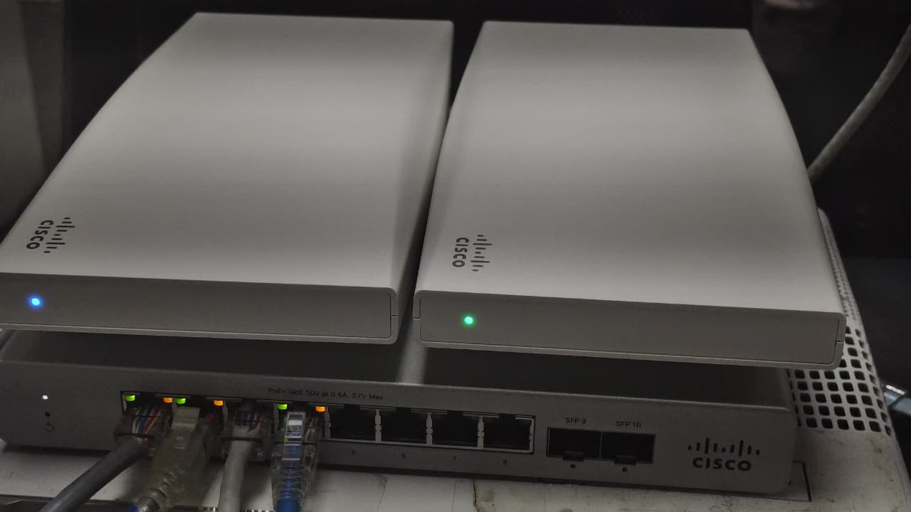

## Logical Topology

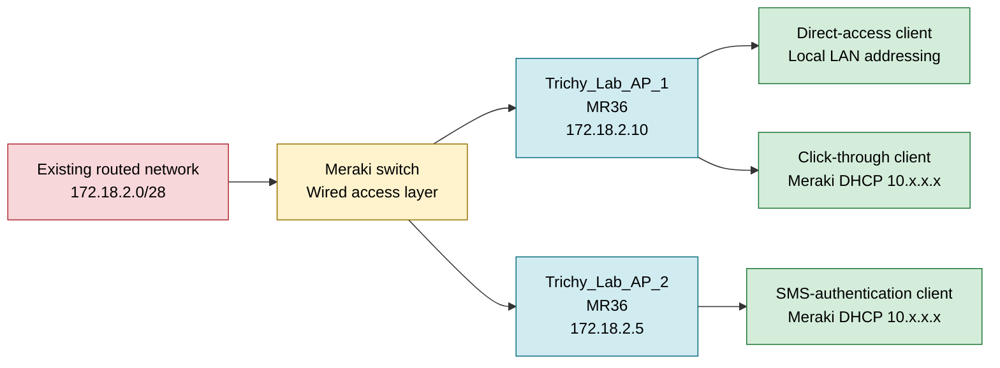

## Stage 1: Onboarding the MR36 Access Points

I added both MR36 units to the `Training-Trichy` network and named them:

- `Trichy_Lab_AP_1`
- `Trichy_Lab_AP_2`

The Access Points page shows both devices online with no offline, alerting, or dormant APs. The recorded management addresses were `172.18.2.10` and `172.18.2.5`.

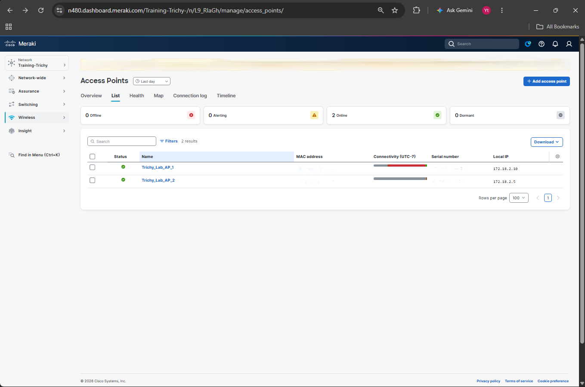

The Dashboard Layer 2 topology shows the Meraki switch `Trichy-Lab-Test` connected directly to both MR36 access points. All three managed devices were online when the view was captured.

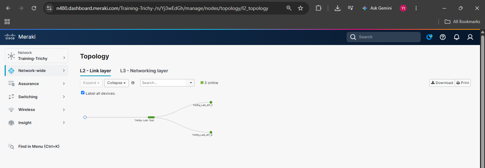

Opening the AP summary provided a useful introduction to device-level monitoring. The page showed AP status, current firmware, uplink traffic, associated clients, SSID, channel, channel width, usage, and DNS, DHCP, and ARP health.

At the time of capture, `Trichy_Lab_AP_1` was online on MR firmware `32.2.4` with two connected clients. Both clients were using 5 GHz channel 100 with an 80 MHz channel width.

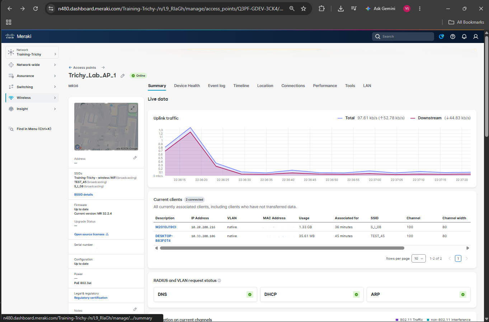

## Stage 2: Creating Three Wireless Access Experiences

I enabled three SSIDs to compare different access and addressing methods.

| SSID | Association security | Client addressing | User experience |
|---|---|---|---|
| `Training-Trichy - wireless WiFi` | WPA2 pre-shared key | Local LAN | Enter the Wi-Fi password and connect directly |
| `S_I_08` | Open association | Meraki DHCP | Join the SSID and accept the click-through splash page |
| `TEST_45` | WPA2 pre-shared key | Meraki DHCP | Join the SSID and complete SMS splash authentication |

The SSID overview confirms that all three networks were enabled. It also shows the difference between Local LAN addressing and Meraki DHCP.

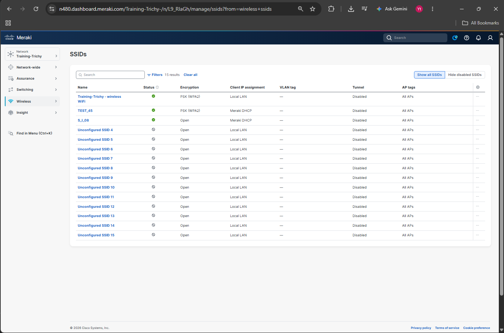

### Method 1: Password and Direct Access

`Training-Trichy - wireless WiFi` used WPA2 with a pre-shared key. The client joined by entering the wireless password, and the SSID used Local LAN client addressing.

This was the simplest access method in the lab. It provided encrypted association without adding a captive portal step.

### Method 2: Click-Through Splash Page

`S_I_08` was configured as an open SSID with Meraki DHCP. After association, the mobile device reported that the network required authorization.

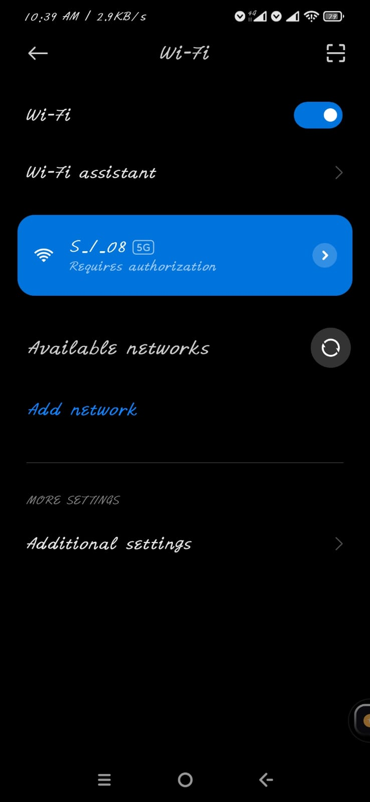

The Meraki-hosted captive portal then displayed a **Continue to the Internet** button. Selecting it completed the click-through process and granted access for the configured splash duration.

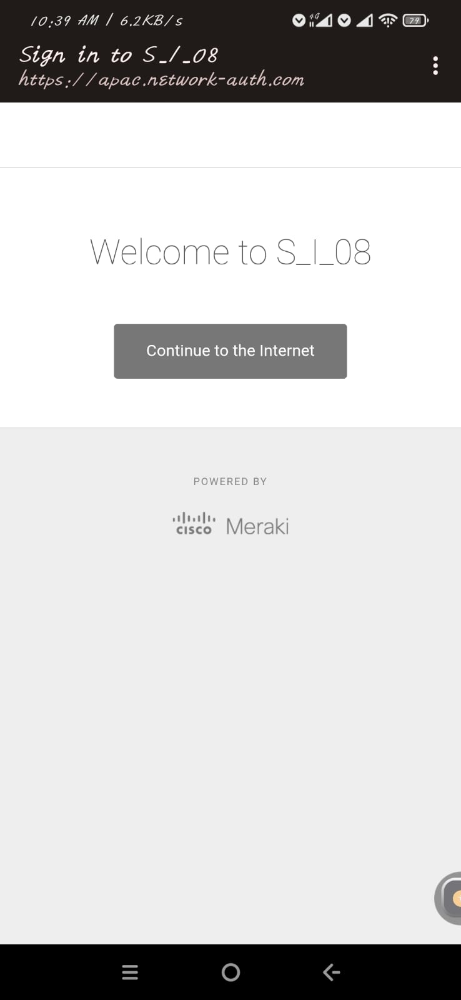

Dashboard recorded both the 802.11 association and the splash authentication. The event log shows the client connected to `Trichy_Lab_AP_1` on 5 GHz channel 100 with an RSSI of `-48 dBm`, followed by a splash-authentication event with a duration of 86,400 seconds.

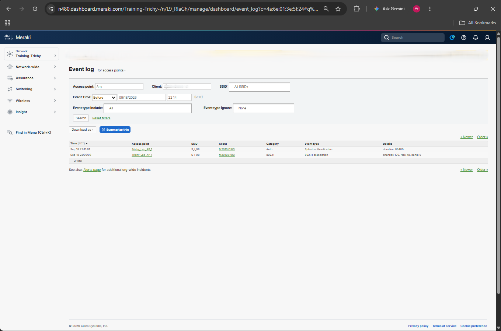

### Method 3: SMS Authentication

`TEST_45` combined WPA2 association with a Meraki splash page that requested a mobile number. The user had to consent to receiving the login code before continuing.

This method adds user verification after Wi-Fi association. It is more suitable for controlled guest access than a shared click-through button, although SMS availability and charges depend on the configured service and the user's mobile provider.

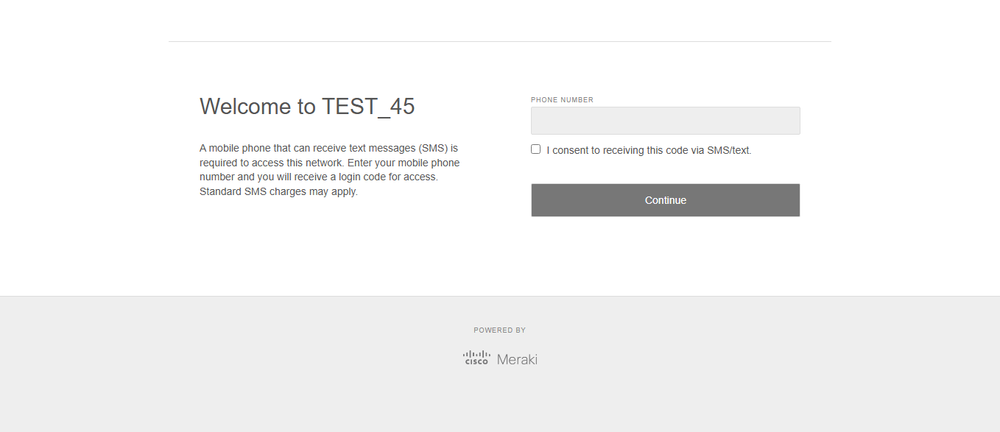

## Stage 3: Meraki DHCP and NAT Mode

The upstream network was `172.18.2.0/28`. A `/28` contains 16 addresses, with 14 usable host addresses after reserving the network and broadcast addresses. That small pool also had to support infrastructure such as the switch, access points, firewall, and wired test systems.

For `S_I_08` and `TEST_45`, I enabled **Meraki DHCP**, also called NAT mode. In this mode, the AP runs DHCP for wireless clients and assigns an address from `10.0.0.0/8`. The addresses can look random, but Meraki generates them by hashing the client MAC address. Client traffic is translated to the AP's management IP before entering the wired LAN.

The client inventory shows this separation clearly:

- Wired client: `172.18.2.7`
- Wireless client: `10.189.11.166`
- Wireless client: `10.20.208.216`
- Wireless client: `10.33.208.106`

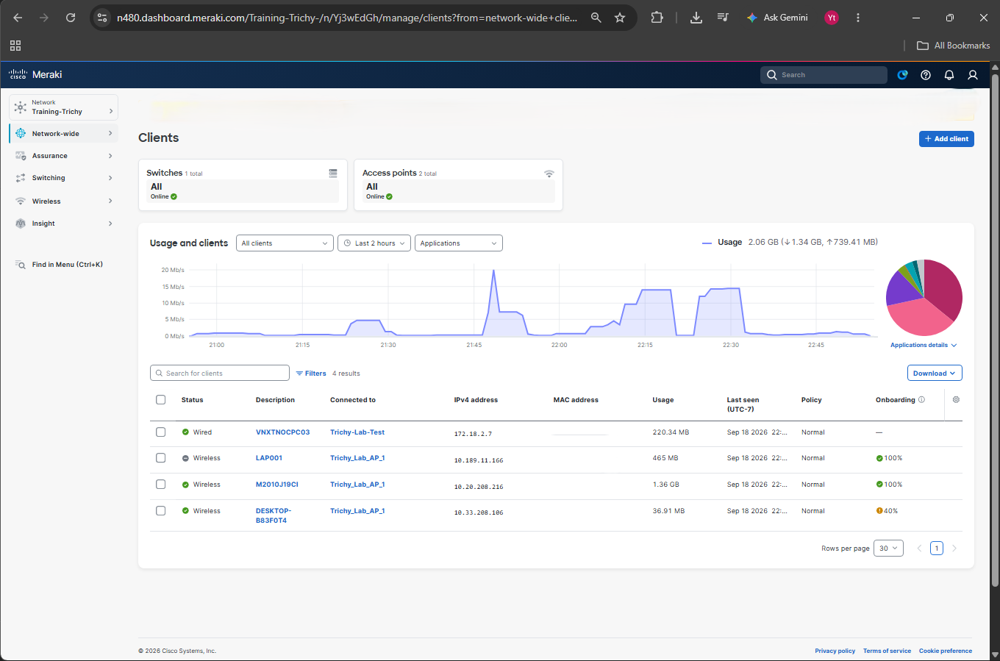

Meraki DHCP avoided consuming additional addresses from the limited `/28` pool for every wireless client. It also provided built-in wireless client isolation. Clients using Meraki DHCP can reach upstream resources when firewall rules permit, but the AP does not forward traffic directly between those isolated wireless clients.

This behavior makes NAT mode useful for guest access. It is less suitable for services that require peer-to-peer discovery, such as wireless printing, casting, and some local collaboration tools.

## Stage 4: Shared Wireless Network and Mesh Behavior

Both MR36 access points belonged to the same Meraki wireless network and broadcast the configured SSIDs. This creates a consistent wireless experience across both APs and allows centralized monitoring in Dashboard.

The screenshots show a Local IP address for each AP, so this lab evidence represents two **wired gateway APs**. It does not show one AP operating as a wireless repeater.

Meraki mesh operation is automatic. An AP with a working wired address and route acts as a gateway AP. An AP without a usable wired uplink can form a wireless mesh connection to another Meraki AP and operate as a repeater. Both gateway and repeater APs can serve wireless clients, but a mesh hop consumes wireless airtime and can reduce throughput.

## Stage 5: Client and Connection Troubleshooting

The Dashboard connection log helped separate association problems from addressing and DNS problems. The captured entries included:

- A DHCP request on `S_I_08` that the DHCP service rejected
- DNS requests on `TEST_45` that did not receive a response
- Events recorded against both `Trichy_Lab_AP_1` and `Trichy_Lab_AP_2`

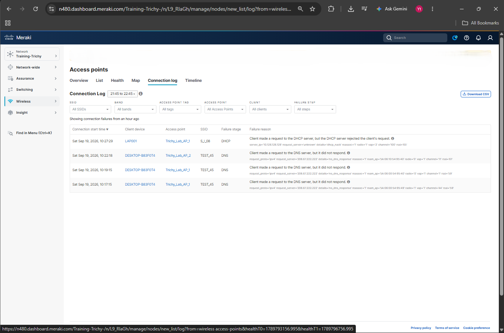

This view is valuable because a client can associate successfully with an SSID but still fail later during DHCP, DNS, captive-portal authentication, or internet access. Dashboard identifies the stage and records a reason that can guide the next troubleshooting step.

## MR36 Capacity and Feature Notes

The MR36 is a cloud-managed Wi-Fi 6 access point with concurrent 2.4 GHz and 5 GHz client radios, a dedicated WIDS/WIPS and spectrum-analysis radio, and an integrated Bluetooth Low Energy radio.

Cisco documents the association limit for Wi-Fi 6 MR models as:

| Client radio | Documented association limit |
|---|---:|
| 2.4 GHz | 512 clients |
| 5 GHz | 512 clients |
| Total per AP | 1024 clients |

The 1024 figure is a maximum association limit, not a recommended production load. Practical capacity is normally much lower and depends on application traffic, channel utilization, interference, signal quality, client capabilities, AP placement, and upstream bandwidth. Capacity planning should focus on airtime and user experience rather than the largest number of devices that can associate.

Other useful MR36 features explored or identified during the lab include:

- Centralized cloud configuration and monitoring
- Automatic firmware delivery
- 2x2:2 MU-MIMO and OFDMA
- Up to 80 MHz channels on 5 GHz
- Application visibility and traffic shaping
- Per-SSID access-control and addressing policies
- Captive portals and guest-access workflows
- Wireless security monitoring through the dedicated scanning radio
- Client usage, association, authentication, and health visibility
- Automatic mesh gateway and repeater operation

## Validation Summary

| Check | Result | Status |
|---|---|---|
| AP onboarding | Two MR36 access points appear online | PASS |
| AP monitoring | Firmware, traffic, clients, channel, and health data visible | PASS |
| Direct password SSID | WPA2 PSK with Local LAN addressing enabled | PASS |
| Click-through SSID | Authorization prompt and Continue button displayed | PASS |
| Splash authentication | Dashboard recorded the splash-auth event | PASS |
| SMS access workflow | Mobile-number and SMS-code portal displayed | PASS |
| Meraki DHCP | Three wireless clients received different `10.x.x.x` addresses | PASS |
| Wired addressing | Wired client remained on `172.18.2.0/28` | PASS |
| Client visibility | Dashboard displayed client, AP, address, usage, and onboarding data | PASS |
| Troubleshooting visibility | DHCP and DNS failure stages appeared in the connection log | PASS |

## What I Learned

The main lesson was that Meraki Dashboard connects configuration and troubleshooting in one place. I could move from the SSID list to an AP, inspect associated clients, confirm their addressing mode, check an authentication event, and then identify DHCP or DNS failures without logging directly into each access point.

The three access methods also showed that association security and captive-portal authentication are separate decisions. A user may connect with only a WPA2 key, join an open SSID and accept a click-through page, or associate to a protected SSID and then complete an SMS sign-in.

Meraki DHCP solved a practical address-space problem in this lab. Instead of using the limited `/28` pool for every guest device, the AP assigned isolated `10.x.x.x` addresses and translated the traffic through its own management address.

Finally, sharing the same Dashboard network and SSIDs across two APs is not the same as repeater mode. The AP uplink determines the role. A working wired uplink makes an AP a gateway, while an AP without a usable wired uplink can use another Meraki AP as its wireless mesh gateway.

## Next Step: From Basic Wireless Access to Cisco ISE

This lab was my introduction to the Cisco Meraki MR36 and Meraki Dashboard. I stopped at the foundational access methods: a shared WPA2 password, click-through splash access, and SMS-based guest authentication. These methods helped me understand AP onboarding, SSID creation, client addressing, captive portals, monitoring, and basic troubleshooting.

The next step was to move beyond shared credentials and guest-access workflows. I connected the Meraki wireless environment to Cisco ISE and built a WPA2-Enterprise SSID using RADIUS and EAP-TLS. Instead of granting access from a shared password, ISE checked the client certificate and the device's approved endpoint group. It then assigned IT and HR devices to different VLANs from the same SSID.

Continue with [Cisco ISE and Meraki EAP-TLS Network Access](../Cisco-ISE-Identity-and-Access-Control/01-Meraki-EAP-TLS-Network-Access/) to see the progression from basic MR36 onboarding to certificate-based enterprise wireless access.

## Interview Questions

**Q1. Why did the wireless clients receive `10.x.x.x` addresses?**

The SSIDs used Meraki DHCP in NAT mode. The AP supplied the client address and translated outbound traffic to its own management IP.

**Q2. Why use Meraki DHCP when the LAN already has DHCP?**

The upstream `/28` had only 14 usable addresses. Meraki DHCP allowed more guest clients to connect without consuming one LAN address per client and added client isolation.

**Q3. Can clients on a Meraki DHCP SSID communicate with each other?**

No. NAT mode isolates the wireless clients, so the AP does not forward traffic directly from one Meraki DHCP client to another.

**Q4. What is the difference between a click-through splash page and SMS authentication?**

A click-through page grants access after the user acknowledges the page. SMS authentication asks for a mobile number and requires a login code before access is granted.

**Q5. Were the two APs operating as repeaters?**

The captured Dashboard list gives both APs wired Local IP addresses, so the evidence shows gateway AP operation. A repeater would use a wireless mesh path through another AP instead of a working wired uplink.

**Q6. Does the 1024-client figure mean one MR36 should serve 1024 active users?**

No. It is the documented association limit across the two client radios. Real deployments should use RF surveys, airtime demand, application requirements, channel reuse, and measured user experience to determine AP density.

## Technical References

- [Cisco Meraki MR36 Datasheet](https://documentation.meraki.com/Wireless/Product_Information/Overviews_and_Datasheets/MR36_Datasheet)
- [Approximating Maximum Clients per Access Point](https://documentation.meraki.com/MR/Design_and_Configure/Architecture_and_Best_Practices/Approximating_Maximum_Clients_per_Access_Point)
- [NAT Mode with Meraki DHCP](https://documentation.meraki.com/Wireless/Design_and_Configure/Configuration_Guides/Client_Addressing_and_Bridging/NAT_Mode_with_Meraki_DHCP)
- [Wireless Mesh Networking](https://documentation.meraki.com/Wireless/Design_and_Configure/Architecture_and_Best_Practices/Wireless_Mesh_Networking)
- [Enabling a Click-Through Splash Page](https://documentation.meraki.com/Wireless/Operate_and_Maintain/How_Tos/Splash_Page/Enabling_Click-through_splash-page)
- [Wireless Access Control](https://documentation.meraki.com/Wireless/Design_and_Configure/Configuration_Guides/Access_Control)
