# Cisco Meraki MS130-8P Onboarding and FortiGate 40F VLAN Trunking Lab

*Meraki Dashboard onboarding + 802.1Q trunking + FortiGate DHCP, routing, firewall policy, and NAT*

This lab began as my introduction to the Cisco Meraki platform. I first claimed the MS130-8P into Meraki Dashboard, added it to the `Training-Trichy` network, and spent time learning the basic cloud-managed workflow before connecting it to a FortiGate 40F.

After claiming the switch, I added it to the `Training-Trichy` network and continued with the VLAN trunking lab.

**In one sentence:** I onboarded a Meraki MS130-8P into the Trichy lab, built a tagged uplink to a FortiGate 40F, placed IT and HR clients into separate VLANs, and verified DHCP, gateway access, DNS resolution, internet connectivity, cloud management, and policy usage.

## What I Built

The Meraki operates as a Layer 2 access switch. The FortiGate owns the Layer 3 interfaces, DHCP services for the user VLANs, the default route, firewall policies, and NAT.

The uplink design uses an unused native VLAN, VLAN 999. That keeps the management VLAN tagged as VLAN 1 when it crosses the trunk toward the FortiGate `Vlan1` subinterface.

### Logical Topology

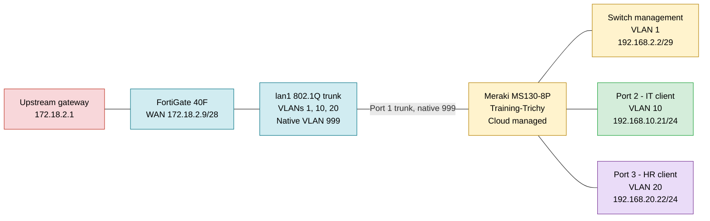

### Physical Lab Setup

The lab used a Cisco Meraki MS130-8P with a FortiGate 40F. The front-panel photo shows the powered devices and active Ethernet links on Meraki ports 1, 2, and 3. Port 1 served as the FortiGate trunk, while ports 2 and 3 connected the IT and HR test clients.


## Addressing and VLAN Plan

| Purpose | VLAN | Gateway or address | Implemented state |
|---|---:|---|---|
| Meraki management | 1 | FortiGate `192.168.2.1/29`, switch `192.168.2.2` | Switch shown online with a static management address |
| IT clients | 10 | `192.168.10.1/24` | DHCP enabled, test client received `192.168.10.21` |
| HR clients | 20 | `192.168.20.1/24` | DHCP enabled, test client received `192.168.20.22` |
| Unused trunk native VLAN | 999 | No FortiGate gateway | Port 1 shown as trunk with native VLAN 999 |
| WAN transit | N/A | FortiGate `172.18.2.9/28`, gateway `172.18.2.1` | Default route enabled through `wan` |

## Lab Environment

The firewall used in this build is a FortiGate 40F running FortiOS 7.4.11 in NAT mode. Selected serial-number and public-address fields were obscured in the publication copy.

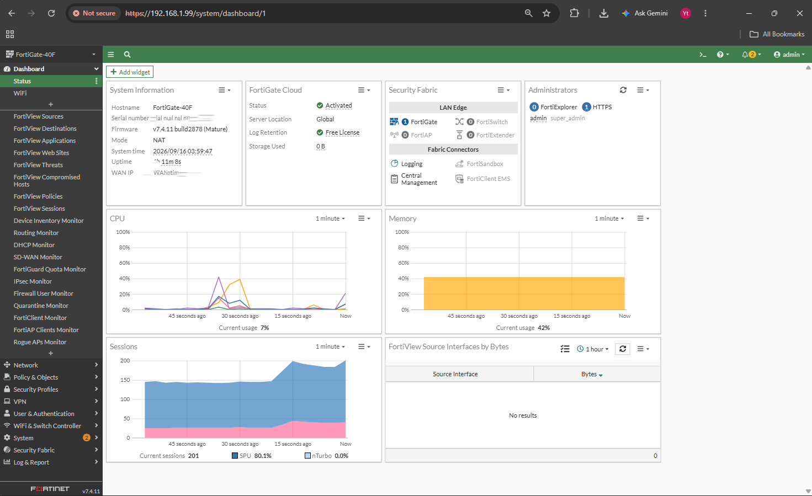

The Meraki device is an MS130-8P running cloud-managed switch firmware. Selected hardware identifiers and public-address values were obscured before publication.

## Stage 1: Meraki Dashboard Onboarding and Basic Exploration

After claiming the switch, I placed it in the `Training-Trichy` network and named it `Trichy-Lab-Test`. The Dashboard inventory shows one switch online, zero switches offline, zero alerting devices, cloud configuration, the `Test-Vlan` profile, and local management address `192.168.2.2`.


This confirms that the switch was successfully onboarded into the lab network.

I also reviewed the switch power page as part of the platform introduction. Port 7 reported a powered-device request of 16 W, with about 1.895 W in use when the screenshot was taken.


That page was useful for understanding the Meraki hardware view, but PoE was not part of the VLAN reachability test.

## Stage 2: FortiGate VLAN Gateway Design

I removed Layer 3 addressing from physical `lan1` and used it as the parent for three 802.1Q VLAN interfaces. The interface overview shows:

- `Vlan1` at `192.168.2.1/29`
- IT `Vlan10` at `192.168.10.1/24`
- HR `Vlan20` at `192.168.20.1/24`
- Physical `lan1` at `0.0.0.0`
- WAN at `172.18.2.9/28`


### Management VLAN 1

The management interface is a tagged VLAN subinterface on `lan1`, using VLAN ID 1 and gateway address `192.168.2.1/29`.

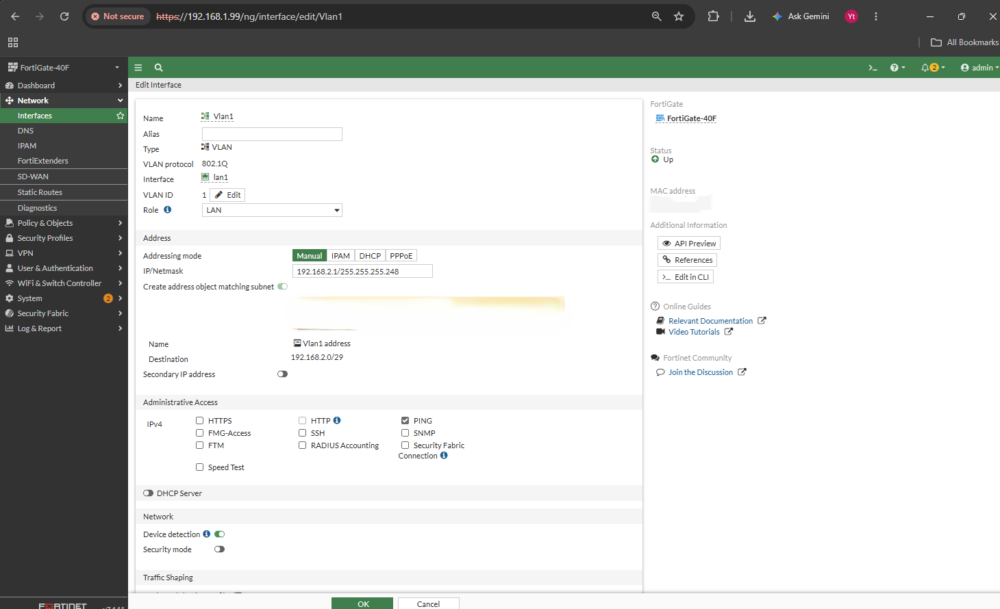

The Meraki switch uses the static management address `192.168.2.2` on VLAN 1. Its gateway is the FortiGate `Vlan1` interface at `192.168.2.1/29`.

### VLAN 10 for IT

The IT interface uses VLAN ID 10, gateway `192.168.10.1/24`, and a DHCP range from `192.168.10.20` to `192.168.10.254`.


### VLAN 20 for HR

The HR interface uses VLAN ID 20, gateway `192.168.20.1/24`, and a DHCP range from `192.168.20.20` to `192.168.20.254`.

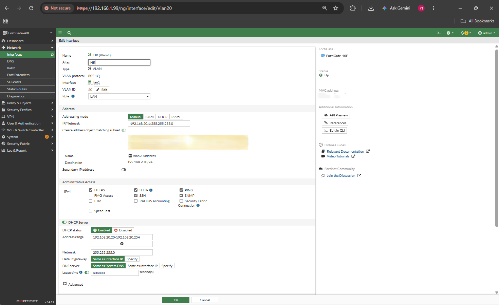

## Stage 3: Routing and Internet Policies

The FortiGate default route sends `0.0.0.0/0` to upstream gateway `172.18.2.1` through `wan` with administrative distance 10.

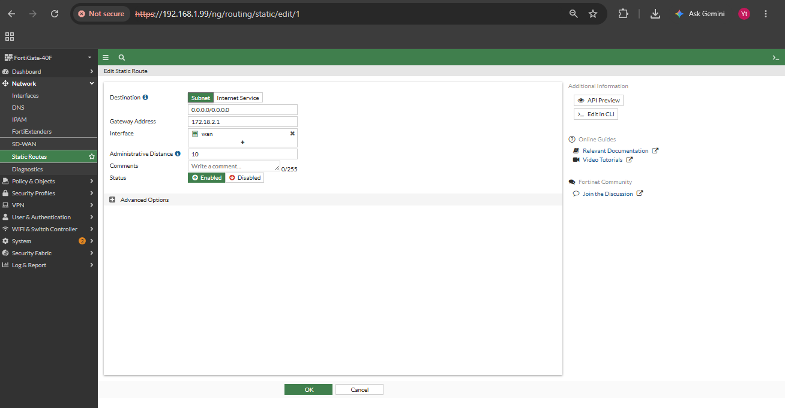

I created separate VLAN-to-WAN policies for management, IT, and HR traffic. The policy view shows destination `all`, action `ACCEPT`, and NAT enabled for all three policies.


The byte counters are important evidence:

| Policy path | Captured traffic |
|---|---:|
| HR VLAN 20 to WAN | `965.28 MB` |
| IT VLAN 10 to WAN | `3.17 GB` |
| Management VLAN 1 to WAN | `568.67 kB` |

These counters prove that the policies carried traffic. They do not by themselves prove client experience, which is why the endpoint tests later in this write-up matter.

## Stage 4: Meraki VLAN Profile and Port Configuration

The `Test-Vlan` profile contains four named VLANs:

| VLAN name | VLAN ID |
|---|---:|
| Default | 999 |
| IT | 10 |
| HR | 20 |
| Management | 1 |

The profile was assigned to one switch with active VLANs set to `all`.

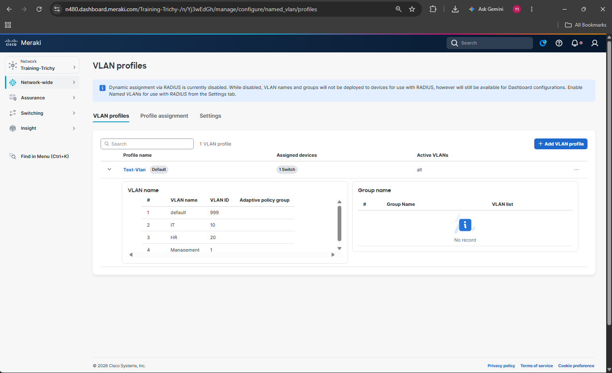

The switch-port summary shows the operational port roles:

- Port 1: trunk, native VLAN 999
- Port 2: access, VLAN 10
- Port 3: access, VLAN 20

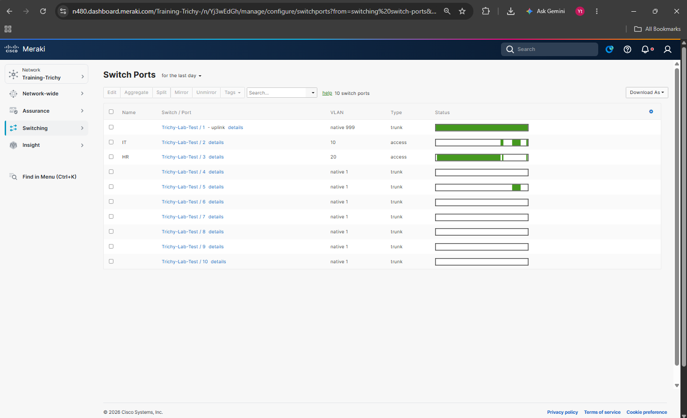

The switch-port summary shows the uplink as a trunk with native VLAN 999. Ports 2 and 3 provide access for VLAN 10 and VLAN 20. Successful client tests confirm that both tagged user VLANs crossed the uplink.

### Why VLAN 999 Is Native

The FortiGate `Vlan1` interface expects tagged frames. If the Meraki uplink used native VLAN 1, the switch would send VLAN 1 traffic untagged while the FortiGate waited for an 802.1Q VLAN 1 tag.

Using VLAN 999 as the unused native VLAN avoids that mismatch. Management VLAN 1 can then remain tagged across the uplink.

## Stage 5: Control-Plane and Lease Verification

The FortiGate routing monitor shows the connected routes for the WAN transit, original LAN, management VLAN, IT VLAN, and HR VLAN. It also shows the static default route through `172.18.2.1`.

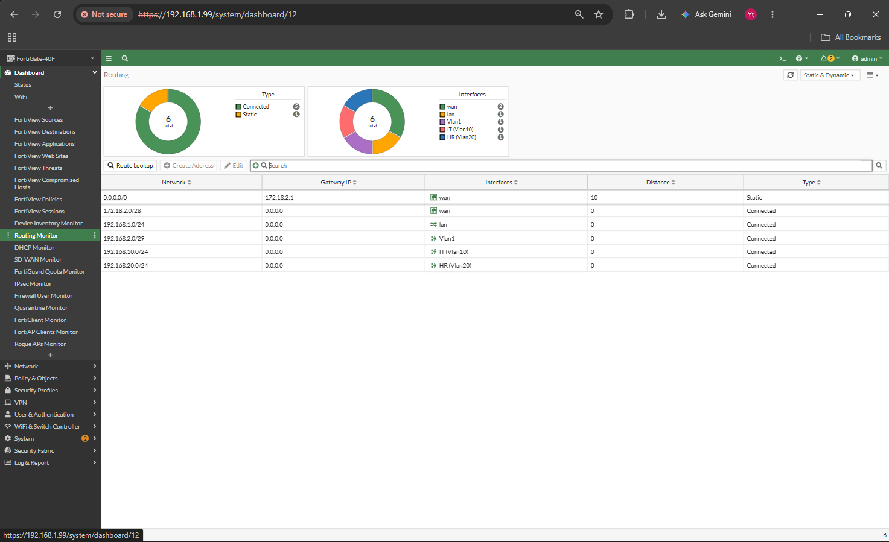

The DHCP monitor records active leases in both user VLANs:

- IT client: `192.168.10.21` on `IT (Vlan10)`
- HR client: `192.168.20.22` on `HR (Vlan20)`

An older lease on the original `lan` interface is also visible. MAC-address values were obscured in the publication image.

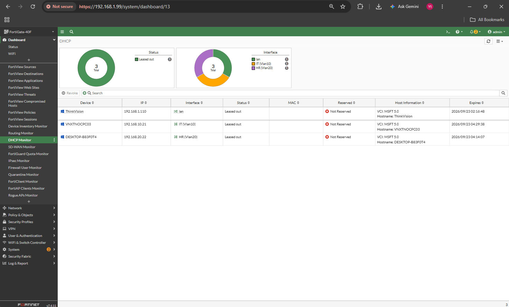

## Stage 6: IT and HR Client Validation

### IT Client on VLAN 10

The IT client received:

```text
IPv4 address: 192.168.10.21
Subnet mask: 255.255.255.0
Default gateway: 192.168.10.1
```

It then completed three checks:

- Gateway ping: 4 replies, 0% loss, under 1 ms
- Internet ping to `8.8.8.8`: 4 replies, 0% loss, 11 ms average
- DNS lookup for `google.com`: successful response from `8.8.8.8`

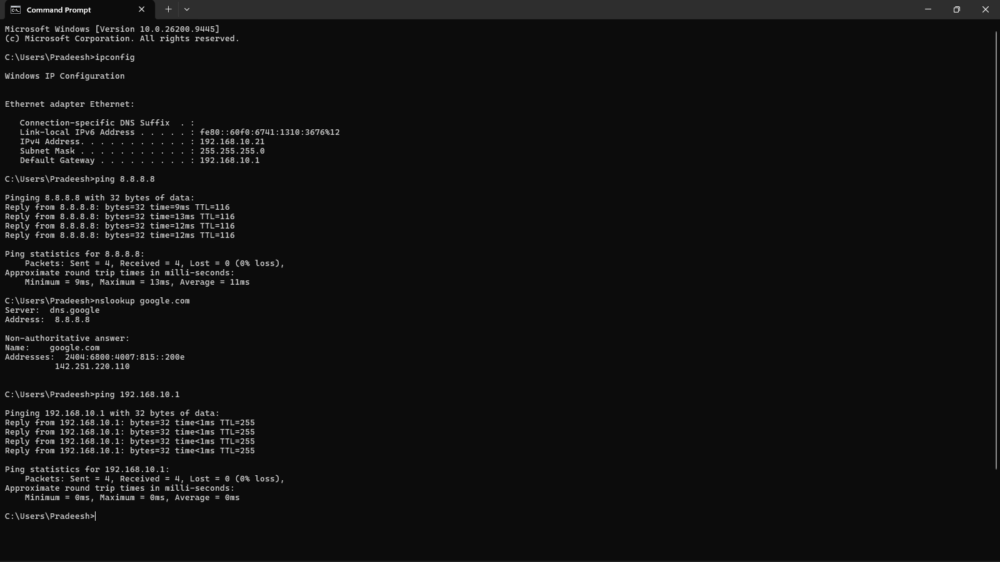

### HR Client on VLAN 20

The HR client received:

```text
IPv4 address: 192.168.20.22
Subnet mask: 255.255.255.0
Default gateway: 192.168.20.1
```

Its validation produced:

- Gateway ping: 4 replies, 0% loss, under 1 ms
- Internet ping to `8.8.8.8`: 4 replies, 0% loss, 7 ms average
- DNS lookup for `google.com`: successful response from `8.8.8.8`

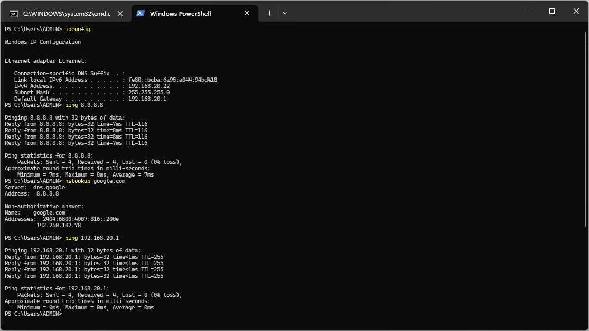

These results prove working DHCP, local gateway reachability, DNS resolution, and internet reachability for one client in each VLAN at the time of testing.

## Stage 7: Meraki Cloud and Client Visibility

Meraki Dashboard identified two wired clients behind `Trichy-Lab-Test`, using `192.168.10.21` and `192.168.20.22`. MAC-address values were obscured in the publication image.


The switch summary provides the strongest final Meraki view. It shows:

- Switch state: Online
- Configuration source: Cloud
- Configuration: Up to date
- LAN IPv4: `192.168.2.2`
- Management interface: VLAN 1
- Client `192.168.10.21`: VLAN 10 on port 2
- Client `192.168.20.22`: VLAN 20 on port 3

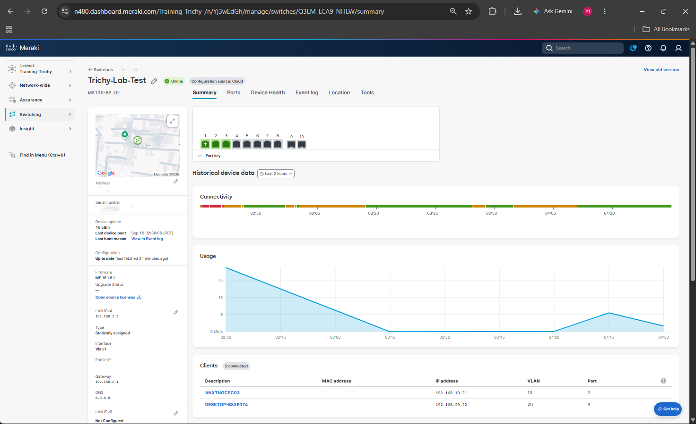

## Validation Matrix

| Check | Expected | Captured result | Status |
|---|---|---|---|
| Meraki onboarding | Switch appears in Training-Trichy | One MS130-8P online and cloud managed | PASS |
| Management VLAN | Switch remains reachable on VLAN 1 | Online at `192.168.2.2`, interface VLAN 1 | PASS |
| Port 1 uplink | Trunk with unused native VLAN | Trunk, native VLAN 999 | PASS |
| IT access port | Port 2 assigned to VLAN 10 | Port 2 access VLAN 10 | PASS |
| HR access port | Port 3 assigned to VLAN 20 | Port 3 access VLAN 20 | PASS |
| IT DHCP | Client receives `192.168.10.x` | Client received `192.168.10.21` | PASS |
| HR DHCP | Client receives `192.168.20.x` | Client received `192.168.20.22` | PASS |
| IT gateway | `192.168.10.1` responds | 4 of 4 replies, under 1 ms | PASS |
| HR gateway | `192.168.20.1` responds | 4 of 4 replies, under 1 ms | PASS |
| IT internet | Public test address responds | 4 of 4 replies, 0% loss | PASS |
| HR internet | Public test address responds | 4 of 4 replies, 0% loss | PASS |
| IT DNS | `google.com` resolves | Successful response through `8.8.8.8` | PASS |
| HR DNS | `google.com` resolves | Successful response through `8.8.8.8` | PASS |
| Firewall policies | Counters rise above zero | All three VLAN-to-WAN policies show traffic | PASS |

## Troubleshooting Lessons

### VLAN 1 Must Stay Tagged

The most important design detail was separating the trunk native VLAN from the FortiGate management subinterface. VLAN 999 handles untagged traffic, while VLAN 1 remains tagged end to end.

### A Policy Destination of `all` Matters

The final firewall-policy screenshot shows destination `all`. An address object representing only the FortiGate WAN interface would not match arbitrary internet destinations, even if DHCP and local gateway connectivity worked.

### Cloud Status and Client Tests Answer Different Questions

An online Dashboard status confirms that the switch can reach Meraki cloud services. It does not prove that an IT or HR client can resolve DNS or reach the internet. The endpoint tests establish that separately.

## What I Learned

Meraki makes configuration centralized, but cloud management does not remove the need to understand the packet path. The switch still has to tag the correct VLAN, the firewall still has to own the right gateway, and the policy still has to match the real destination.

The native-VLAN decision was the part that tied the two platforms together. The Meraki port and FortiGate subinterface had to agree on whether VLAN 1 arrived tagged. Moving the unused native role to VLAN 999 kept management traffic consistent with the FortiGate VLAN design.

The lab also reinforced a useful evidence habit. A green cloud status, a rising firewall counter, and a successful client test prove different things. Putting all three together gives a much stronger result than relying on any one dashboard.

## Interview Questions

**Q1. Why use VLAN 999 as the native VLAN?**

The FortiGate management interface is an 802.1Q VLAN 1 subinterface, so it expects VLAN 1 to be tagged. Making VLAN 999 native prevents the Meraki from stripping the VLAN 1 tag on the uplink.

**Q2. Which device performs routing in this design?**

The FortiGate performs routing through its `Vlan1`, `Vlan10`, and `Vlan20` interfaces. The Meraki MS130-8P provides Layer 2 access and trunking.

**Q3. What proves VLAN 10 and VLAN 20 reached the internet?**

Each client received the correct DHCP address and gateway, reached its gateway with zero loss, resolved `google.com`, and received four replies from `8.8.8.8`. The matching FortiGate policy counters also show traffic.

**Q4. Does the Online badge prove the VLAN design works for clients?**

No. It proves the switch can reach Meraki cloud services. Client connectivity requires separate DHCP, gateway, DNS, and internet tests.
