# Cisco 3850 StackWise Real-Device Lab — VLAN1 Transit, No Firewall

*Router → L2SW1 (VLAN 1 transit) → Catalyst 3850 StackWise (Layer-3 gateway) → L2SW2 → VLAN10 / VLAN20*

---

## Overview

This lab picks up right where the FortiGate HA build left off — same edge router, same WAN/management IP plan, same L2SW1/L2SW2 uplink and downstream switches, same VLAN10/VLAN20 subnets — but the FortiGate HA pair is gone. In its place, two Catalyst 3850s are cabled into a StackWise ring and take over as the Layer-3 gateway for VLAN10 and VLAN20.

The point of the exercise was to see how much of the FortiGate design could be reused once the "gateway" role moved from a firewall pair to a switch stack, and where the two approaches genuinely diverge — no firewall inspection, no HA heartbeat, just StackWise plus a pair of LACP EtherChannels doing the redundancy work, and the router carrying NAT/PAT since nothing downstream of it does firewalling anymore.

```text
FortiGate HA lab:   Router -> L2SW1 -> FortiGate HA pair -> L2SW2 -> VLAN10/20
This lab:           Router -> L2SW1 -> 3850 StackWise     -> L2SW2 -> VLAN10/20
```

Covered in this build:

- StackWise data stacking across two Catalyst 3850s, with an Active/Standby priority split
- LACP EtherChannel between L2SW1 and the stack, and between the stack and L2SW2
- VLAN 1 kept as a pure transit/management VLAN on L2SW1 — no VLAN10/VLAN20 leak upstream of the stack
- Inter-VLAN routing for VLAN10/VLAN20 done entirely on the 3850 stack
- Static routing between the Router and the stack, with NAT/PAT on the router for Internet access
- SSH management on every device
- A SPAN-fed Wireshark station used to observe VLAN10 traffic the way a small NOC would
- Four real resiliency tests: an uplink EtherChannel member failure, a downlink EtherChannel member failure, a full power-off of the active stack member, and a StackWise ring link failure

## Equipment

```text
1 x Cisco 1900 Series Router        - WAN/ISP-facing router
1 x Catalyst 2960/3560-CX (L2SW1)   - uplink switch, Router side
2 x Catalyst 3850                   - StackWise members (C3850-STACK-1 / C3850-STACK-2)
1 x Catalyst 2960/3560-CX (L2SW2)   - downstream/access switch
2 x PCs / NOC laptops               - VLAN10 and VLAN20 clients, plus a SPAN monitoring station
```

No FortiGate anywhere in this build — the 3850 stack is the gateway.

---

## Topology

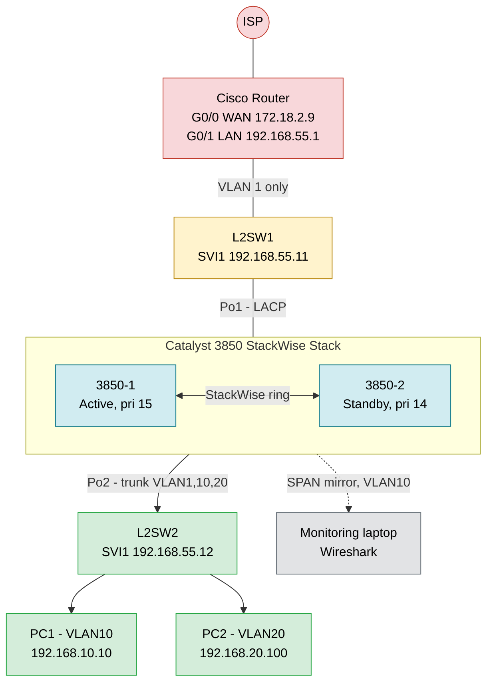
```mermaid
flowchart TD
    classDef wan fill:#f8d7da,stroke:#c0392b,stroke-width:1px,color:#000;
    classDef transit fill:#fff3cd,stroke:#b8860b,stroke-width:1px,color:#000;
    classDef stack fill:#d1ecf1,stroke:#117a8b,stroke-width:1px,color:#000;
    classDef lan fill:#d4edda,stroke:#28a745,stroke-width:1px,color:#000;
    classDef noc fill:#e2e3e5,stroke:#6c757d,stroke-width:1px,color:#000;

    ISP((ISP)):::wan --- RTR[Cisco Router<br/>G0/0 WAN 172.18.2.9<br/>G0/1 LAN 192.168.55.1]:::wan
    RTR ---|VLAN 1 only| L2SW1[L2SW1<br/>SVI1 192.168.55.11]:::transit
    L2SW1 ---|Po1 - LACP| STACK
    subgraph STACK[Catalyst 3850 StackWise Stack]
        direction LR
        S1[3850-1<br/>Active, pri 15]:::stack
        S2[3850-2<br/>Standby, pri 14]:::stack
        S1 <-->|StackWise ring| S2
    end
    STACK -->|Po2 - trunk VLAN1,10,20| L2SW2[L2SW2<br/>SVI1 192.168.55.12]:::lan
    L2SW2 --> PC1[PC1 - VLAN10<br/>192.168.10.10]:::lan
    L2SW2 --> PC2[PC2 - VLAN20<br/>192.168.20.100]:::lan
    STACK -.->|SPAN mirror, VLAN10| NOC[Monitoring laptop<br/>Wireshark]:::noc
```

L2SW1 never carries VLAN10 or VLAN20 — it is purely a Layer-2 transit switch for VLAN 1 between the Router and the 3850 stack. Inter-VLAN routing for VLAN10/VLAN20 doesn't happen until traffic reaches the stack.

## IP Address Plan

Same ranges as the FortiGate HA lab, so the two builds are directly comparable.

| Zone | Network | Device | Address |
|---|---|---|---|
| WAN (Router ↔ ISP) | 172.18.2.0/24 | Router G0/0 | 172.18.2.9 |
| WAN (Router ↔ ISP) | 172.18.2.0/24 | Upstream gateway | 172.18.2.1 |
| Transit / Mgmt (Router ↔ L2SW1 ↔ Stack) | 192.168.55.0/24 | Router G0/1 | 192.168.55.1 |
| Transit / Mgmt | 192.168.55.0/24 | 3850 Stack SVI1 | 192.168.55.10 |
| Transit / Mgmt | 192.168.55.0/24 | L2SW1 SVI1 | 192.168.55.11 |
| Transit / Mgmt | 192.168.55.0/24 | L2SW2 SVI1 | 192.168.55.12 |
| VLAN10 (routed on stack) | 192.168.10.0/24 | Gateway (3850 SVI10) | 192.168.10.1 |
| VLAN10 | 192.168.10.0/24 | PC1 | 192.168.10.10 |
| VLAN20 (routed on stack) | 192.168.20.0/24 | Gateway (3850 SVI20) | 192.168.20.1 |
| VLAN20 | 192.168.20.0/24 | PC2 | 192.168.20.100 |

VLAN 1 is the only VLAN carried between the Router, L2SW1, and the 3850 stack. VLAN10/VLAN20 start at the stack and are carried downward toward L2SW2 over the trunked EtherChannel.

## Cabling

| From | To | Notes |
|---|---|---|
| Router G0/0 | ISP / upstream | WAN |
| Router G0/1 | L2SW1 Gi0/1 | VLAN 1 |
| L2SW1 Gi0/2 | 3850-1 Gi1/0/1 | Po1 member |
| L2SW1 Gi0/3 | 3850-2 Gi2/0/1 | Po1 member |
| 3850-1 StackWise Port1 | 3850-2 StackWise Port2 | StackWise ring |
| 3850-1 StackWise Port2 | 3850-2 StackWise Port1 | StackWise ring |
| 3850-1 Gi1/0/2 | L2SW2 Gi0/1 | Po2 member |
| 3850-2 Gi2/0/2 | L2SW2 Gi0/2 | Po2 member |
| L2SW2 Gi0/3 | PC1 | VLAN10 access |
| L2SW2 Gi0/4 | PC2 | VLAN20 access |

L2SW1 uses three ports, all in VLAN 1: one to the Router, two into the Po1 EtherChannel toward the stack.

The StackWise cables get connected first — cross-connected, Port1↔Port2 and Port2↔Port1, to close the ring — and both 3850s are powered on together so the stack forms before anything else is touched.

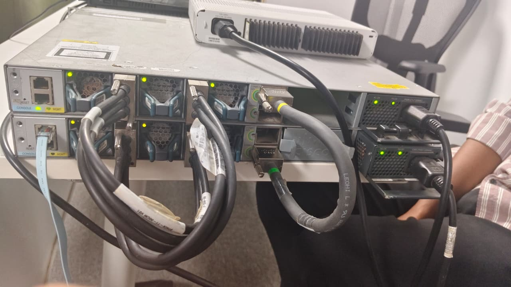

This is the pair mid-cabling: StackWise ring on the left two slots, console cables hanging off the front panel for the initial `show switch` checks, and the power modules going in on the right before the ring comes up.

---

## Step 1 — Router Config

```bash
enable
configure terminal

hostname LAB-ROUTER

interface GigabitEthernet0/0
 description WAN-TO-ISP
 ip address 172.18.2.9 255.255.255.0
 ip nat outside
 no shutdown
 exit

interface GigabitEthernet0/1
 description LAN-TO-L2SW1
 ip address 192.168.55.1 255.255.255.0
 ip nat inside
 no shutdown
 exit

! Default route toward ISP
ip route 0.0.0.0 0.0.0.0 172.18.2.1

! Routes back to user VLANs behind the 3850 stack
ip route 192.168.10.0 255.255.255.0 192.168.55.10
ip route 192.168.20.0 255.255.255.0 192.168.55.10

! NAT/PAT for Internet access from VLAN10, VLAN20, and the inside
! management/transit segment on G0/1
access-list 1 permit 192.168.10.0 0.0.0.255
access-list 1 permit 192.168.20.0 0.0.0.255
access-list 1 permit 192.168.55.0 0.0.0.255
ip nat inside source list 1 interface GigabitEthernet0/0 overload

! SSH
ip domain-name lab.local
username admin privilege 15 secret Admin@12345
crypto key generate rsa modulus 2048
ip ssh version 2

line vty 0 4
 transport input ssh
 login local
 exit

end
write memory
```

NAT/PAT translates VLAN10, VLAN20, and 192.168.55.0/24 hosts to the router's WAN address `172.18.2.9` on the way out. The `192.168.55.0/24` line in the ACL covers the router's own LAN/transit segment — L2SW1, the stack's management SVI, and L2SW2's management SVI — not the router itself; router-originated traffic doesn't need NAT.

**Verification, straight off the router console:**

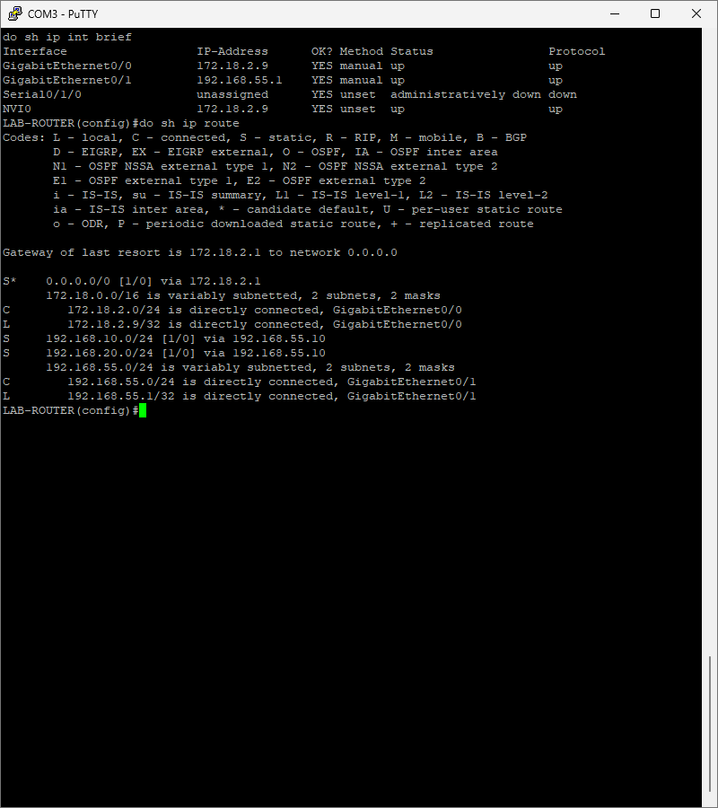

`G0/0` and `G0/1` are both up/up with the addresses above, `Serial0/1/0` is administratively down and unused, and the route table shows exactly what the config intends: a default route via `172.18.2.1`, static routes to `192.168.10.0/24` and `192.168.20.0/24` via `192.168.55.10`, and the two directly-connected subnets.

## Step 2 — L2SW1 (Uplink Switch) Config

L2SW1 stays a pure Layer-2 transit switch here. It never sees VLAN10 or VLAN20 — all three of its connected ports live in VLAN 1.

```bash
enable
configure terminal

hostname L2SW1

interface Vlan1
 ip address 192.168.55.11 255.255.255.0
 no shutdown
 exit

ip default-gateway 192.168.55.1

! Port 1: Router
interface GigabitEthernet0/1
 description TO-ROUTER
 switchport mode access
 switchport access vlan 1
 no shutdown
 exit

! Port 2: 3850 stack member 1
interface GigabitEthernet0/2
 description TO-3850-MEMBER-1
 switchport mode access
 switchport access vlan 1
 channel-group 1 mode active
 no shutdown
 exit

! Port 3: 3850 stack member 2
interface GigabitEthernet0/3
 description TO-3850-MEMBER-2
 switchport mode access
 switchport access vlan 1
 channel-group 1 mode active
 no shutdown
 exit

interface Port-channel1
 description LACP-TO-3850-STACK
 switchport mode access
 switchport access vlan 1
 no shutdown
 exit

! SSH
ip domain-name lab.local
username admin privilege 15 secret Admin@12345
crypto key generate rsa modulus 2048
ip ssh version 2

line vty 0 15
 transport input ssh
 login local
 exit

end
write memory
```

> Port numbers will vary depending on the actual 2960/3560-CX in front of you — what matters is that the Router-facing port and both 3850-facing ports all sit in VLAN 1, and L2SW1 never gets VLAN10 or VLAN20 configured on it.

## Step 3 — 3850 Stack Config

### Cabling the ring and watching it form

With both members freshly cabled and powered, `show switch stack-ports` on the console starts out with both stack ports on both members down — the ring hasn't converged yet:

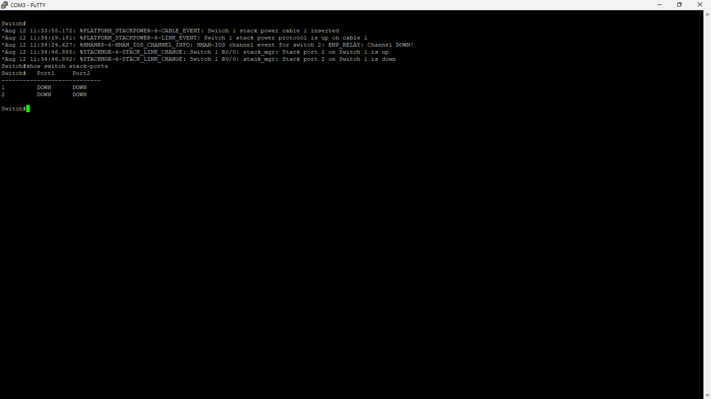

A few seconds later, the syslog on the console shows the stack ports coming up one at a time, switch 2 being added to the stack, and every physical interface on switch 2 cycling through a down/up transition as it re-initializes under the new stack member number — then `show switch stack-ports` comes back `OK/OK` on both members:

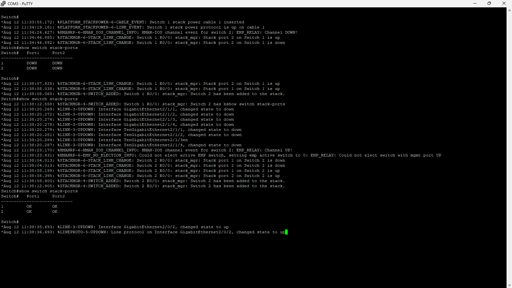

`show switch` at this point already shows switch 1 as Active and switch 2 present, though its role hadn't settled into "Standby" wording yet — it briefly reports as "Member" while the stack finishes electing roles:

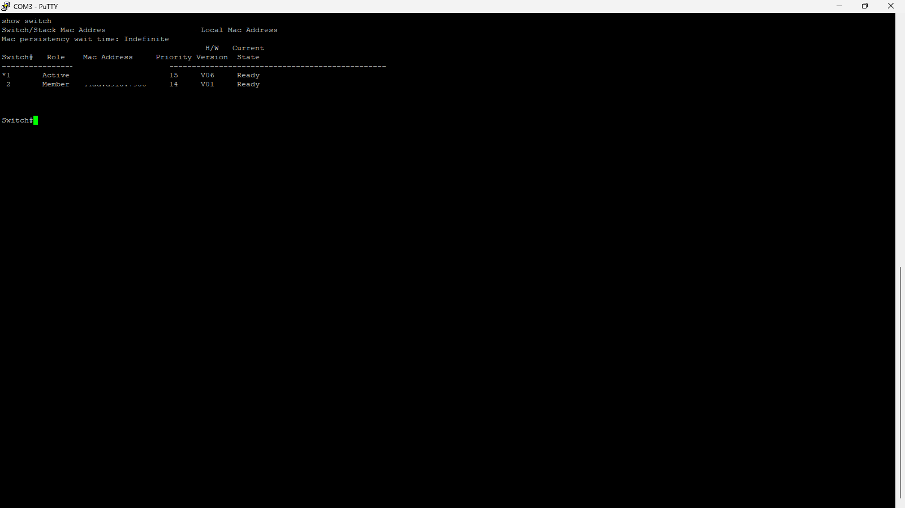

Once the stack settles, `show switch detail` shows the final state — switch 1 Active, switch 2 Standby, both stack ports OK on both members, and each member correctly showing the other as its Port 1/Port 2 neighbor:

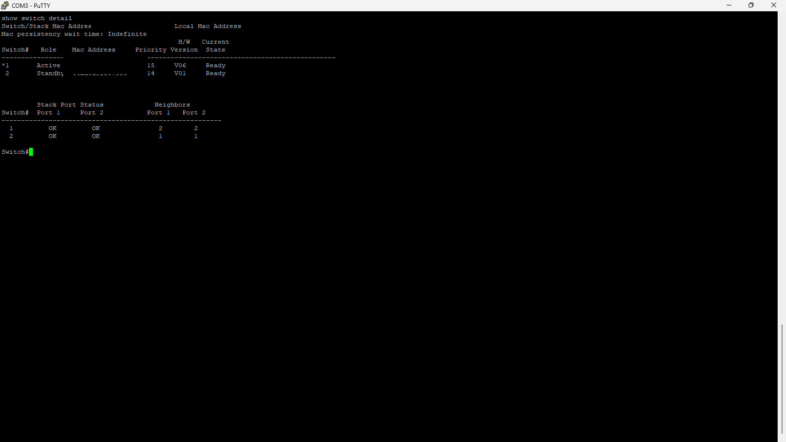

### Base config — both members

```bash
enable
configure terminal

hostname C3850-STACK-1
ip domain-name lab.local
username admin privilege 15 secret Admin@12345
crypto key generate rsa modulus 2048
ip ssh version 2

line vty 0 15
 transport input ssh
 login local
 exit

end
write memory
```

Run the same base config on the second member before the stack forms — or afterward, through the stack's single shared CLI once StackWise has merged the two into one control plane.

### Stack priority

```bash
enable
configure terminal
switch 1 priority 15
switch 2 priority 14
end
write memory
```

This is what puts switch 1 in the Active role and switch 2 in Standby in the `show switch detail` output above, rather than leaving the election to whichever member happened to boot first.

### Stack power

The two members also share a stack-power ring, not just the data ring:

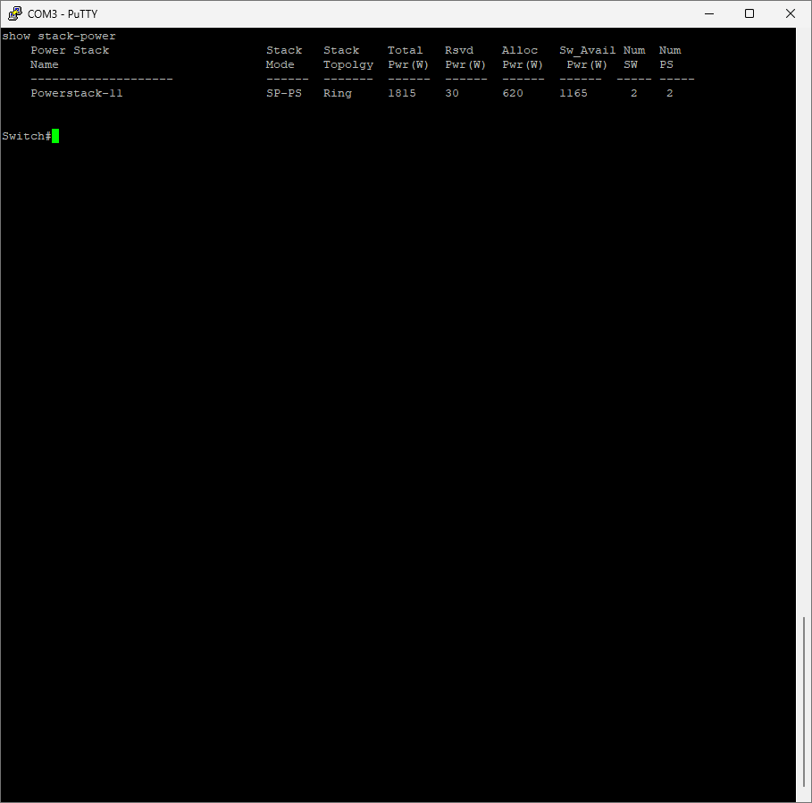

`SP-PS` mode with a `Ring` topology means both members' power supplies are pooled and can back each other up — relevant later, in the failover testing section.

### Enable routing + management SVI

```bash
enable
configure terminal

ip routing

interface Vlan1
 description STACK-MGMT-AND-UPLINK
 ip address 192.168.55.10 255.255.255.0
 no shutdown
 exit

! default route out to the router — no firewall in this design
ip route 0.0.0.0 0.0.0.0 192.168.55.1

end
write memory
```

### Create VLAN10 / VLAN20 and their gateway SVIs

```bash
enable
configure terminal

vlan 10
 name VLAN10-USERS
 exit

vlan 20
 name VLAN20-USERS
 exit

interface Vlan10
 description GATEWAY-VLAN10
 ip address 192.168.10.1 255.255.255.0
 no shutdown
 exit

interface Vlan20
 description GATEWAY-VLAN20
 ip address 192.168.20.1 255.255.255.0
 no shutdown
 exit

end
write memory
```

### Uplink EtherChannel to L2SW1 (Po1 — VLAN 1 access)

Po1 spans both stack members on purpose — if one member goes down, the other still has a live link in the channel.

```bash
enable
configure terminal

interface range GigabitEthernet1/0/1 , GigabitEthernet2/0/1
 description UPLINK-TO-L2SW1
 switchport mode access
 switchport access vlan 1
 channel-group 1 mode active
 no shutdown
 exit

interface Port-channel1
 description UPLINK-TO-L2SW1
 switchport mode access
 switchport access vlan 1
 no shutdown
 exit

end
write memory
```

### Downlink EtherChannel to L2SW2 (Po2)

This is the link that carries VLAN10, VLAN20, and VLAN1 management traffic down to the access switch.

```bash
enable
configure terminal

interface range GigabitEthernet1/0/2 , GigabitEthernet2/0/2
 description DOWNLINK-TO-L2SW2
 switchport mode trunk
 switchport trunk allowed vlan 1,10,20
 channel-group 2 mode active
 no shutdown
 exit

interface Port-channel2
 description DOWNLINK-TO-L2SW2
 switchport mode trunk
 switchport trunk allowed vlan 1,10,20
 no shutdown
 exit

end
write memory
```

> Swap `GigabitEthernet1/0/1`, `2/0/1`, `1/0/2`, `2/0/2` for whatever ports you actually cable — the design rule that matters is one port from each stack member in every Port-channel.

### Throughput check with iperf3

With LACP up on both channels, I wanted to know what each physical member link was actually delivering rather than just trusting the "1 Gbps" label on the port. Running `iperf3` client/server across each cable individually — not the bonded Port-channel, one physical link at a time — consistently landed in the **930–950 Mbps** range on links negotiated at 1 Gbps.

That's expected, not a fault. A 1 Gbps link is a raw line rate; it doesn't all belong to your data. Ethernet preamble and inter-frame gap, frame headers, IP/TCP headers, and ACK traffic going back the other way all eat into it before an iperf3 test ever sees a byte — call it the toll for getting a payload on and off the wire. Landing consistently in the 93–95% range of line rate is the normal, healthy result for a copper Gigabit link; if a link were showing well below that, that gap would be worth chasing as a sign of duplex mismatch, cabling issues, or a problem on one of the two ends.

```text
Expected ceiling:        1000 Mbps (line rate)
Observed, per member:    930–950 Mbps
Overhead accounted for:  L1/L2 framing, IP/TCP headers, ACKs
```

This was a per-cable sanity check rather than a Port-channel aggregate test — with Po1 and Po2 each carrying two members, the two links don't act as one combined 2 Gbps pipe for a single flow; LACP hashes individual conversations onto one member or the other. Testing each physical link independently is what actually tells you whether that member is healthy.

---

## Step 4 — L2SW2 (Downstream Switch) Config

```bash
enable
configure terminal

hostname L2SW2

interface Vlan1
 ip address 192.168.55.12 255.255.255.0
 no shutdown
 exit

ip default-gateway 192.168.55.10

vlan 10
 name VLAN10-USERS
 exit

vlan 20
 name VLAN20-USERS
 exit

interface range GigabitEthernet0/1 - 2
 description LACP-TO-3850-STACK
 switchport mode trunk
 switchport trunk allowed vlan 1,10,20
 channel-group 2 mode active
 no shutdown
 exit

interface Port-channel2
 description LACP-TO-3850-STACK
 switchport mode trunk
 switchport trunk allowed vlan 1,10,20
 no shutdown
 exit

! VLAN1 is the management VLAN for L2SW2 and must traverse Po2

ip domain-name lab.local
username admin privilege 15 secret Admin@12345
crypto key generate rsa modulus 2048
ip ssh version 2

line vty 0 15
 transport input ssh
 login local
 exit

end
write memory
```

## Step 5 — Access Ports for PC1 / PC2

```bash
enable
configure terminal

interface GigabitEthernet0/3
 description PC1-VLAN10
 switchport mode access
 switchport access vlan 10
 spanning-tree portfast
 no shutdown
 exit

interface GigabitEthernet0/4
 description PC2-VLAN20
 switchport mode access
 switchport access vlan 20
 spanning-tree portfast
 no shutdown
 exit

end
write memory
```

PC addressing used in this build (static):

```text
PC1: 192.168.10.10  / 255.255.255.0 / gateway 192.168.10.1
PC2: 192.168.20.100 / 255.255.255.0 / gateway 192.168.20.1
```

---

## Baseline Verification

Before touching anything else — NOC monitoring or failover testing — the stack's basic health was confirmed in one pass: hostname, switch roles, stack-port status, and both EtherChannels.


`show switch` confirms switch 1 Active / switch 2 Standby, both Ready. `show switch stack-ports` shows `OK/OK` on both members. `show etherchannel summary` shows both `Po1(SU)` and `Po2(SU)` — Layer 2, in use, up — with `Gi1/0/1(P)` + `Gi2/0/1(P)` bundled into Po1, and `Gi1/0/2(P)` + `Gi2/0/2(P)` bundled into Po2. This is the known-good state every test below starts from and returns to.

## End-to-End Traffic Flow

```text
PC1 (VLAN10)
  -> L2SW2 access port
  -> Po2 trunk (VLAN10,20)
  -> 3850 stack — inter-VLAN routing + default route
  -> VLAN1 / 192.168.55.10
  -> Po1 EtherChannel
  -> L2SW1 — VLAN1 only
  -> Router G0/1 — 192.168.55.1
  -> NAT/PAT
  -> Router G0/0 — 172.18.2.9
  -> ISP -> Internet
```

For an Internet-bound session, the 3850 stack makes the Layer-3 routing decision, the traffic crosses the Layer-2 VLAN 1 transit segment untouched, and the router performs NAT/PAT before handing it to the ISP.

---

## NOC-Style Monitoring: SPAN + Wireshark on VLAN10

Once the build was passing pings end-to-end, I wanted to see what a small NOC/SOC technician would actually see watching this network live — so I added a dedicated SPAN destination port on the stack and turned a laptop into a temporary monitoring station.

### SPAN design

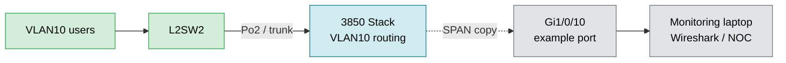
```mermaid
flowchart LR
    classDef lan fill:#d4edda,stroke:#28a745,stroke-width:1px,color:#000;
    classDef stack fill:#d1ecf1,stroke:#117a8b,stroke-width:1px,color:#000;
    classDef noc fill:#e2e3e5,stroke:#6c757d,stroke-width:1px,color:#000;

    V10[VLAN10 users]:::lan --> L2SW2[L2SW2]:::lan
    L2SW2 -->|Po2 / trunk| STACK[3850 Stack<br/>VLAN10 routing]:::stack
    STACK -.->|SPAN copy| MON[Gi1/0/10<br/>example port]:::noc
    MON --> LAP[Monitoring laptop<br/>Wireshark / NOC]:::noc
```

The destination is a **dedicated, otherwise-unused physical Ethernet port** on the stack — never a StackWise port, an EtherChannel member, or a Port-channel interface.

### Configure SPAN on the 3850 stack

```cisco
enable
configure terminal

! Source = all traffic entering/leaving VLAN10
monitor session 1 source vlan 10 both

! Destination = dedicated monitoring laptop port
monitor session 1 destination interface GigabitEthernet1/0/10

end
write memory
```

Verify:

```cisco
show monitor session 1
```

```text
Session 1
---------
Type                   : Local Session
Source VLANs           : 10
Direction              : RX Only / TX Only / Both
Destination Ports      : Gi1/0/10
```

> SPAN is a copy of traffic for monitoring — it doesn't put the monitoring laptop into VLAN10, and it doesn't insert the laptop into the production forwarding path.

### What SPAN actually shows you

Contrary to what I assumed going in, SPAN traffic isn't a black box just because it's HTTPS. The TLS **ClientHello** carries the destination hostname in plaintext in its SNI field, so Wireshark shows exactly which site a connection is headed to — you just can't see anything past that handshake. The three scenarios below make good use of that.

---

## NOC Traffic Scenarios

Each scenario was run one at a time, with Wireshark capturing continuously on the SPAN port throughout.

### Scenario 1 — Normal web browsing

**Goal:** watch a normal browsing session and pick out the DNS, TLS, and destination endpoints.

The VLAN10 PC (192.168.10.10) opened two ordinary HTTPS sites in separate tabs — torproject.org first, then duckduckgo.com — giving Wireshark two distinct destinations to tell apart in the capture.


Before checking Wireshark, an `nslookup` was run for both domains from the same VLAN10 host. Both queries came back through the `8.8.8.8` resolver with a full set of A/AAAA records — exactly what should also show up as DNS traffic in the capture.

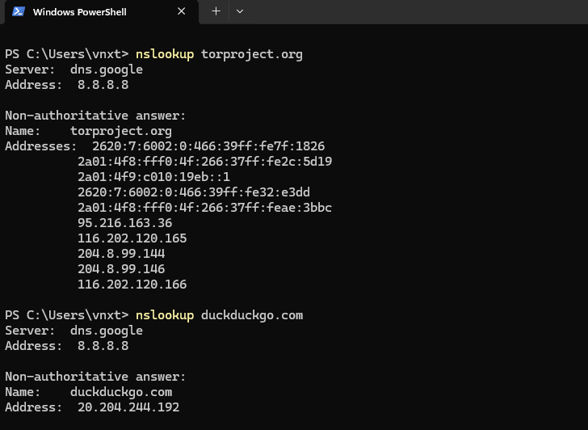

Filtering the capture on `ip.addr == 192.168.10.10 && tls` lands directly on the TLS Client Hello for each site, and the SNI field spells out the destination in plain text — no decryption needed:

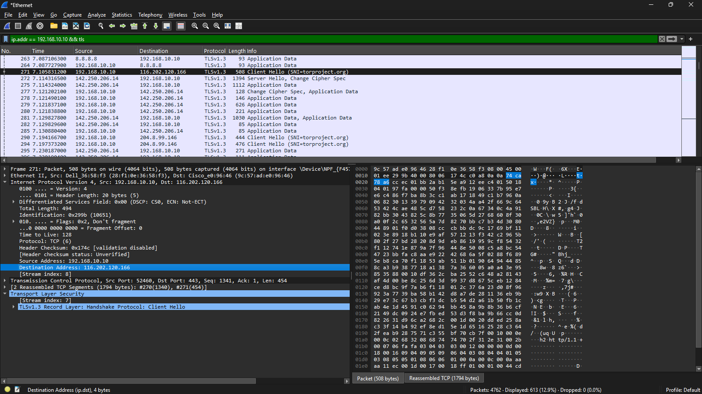

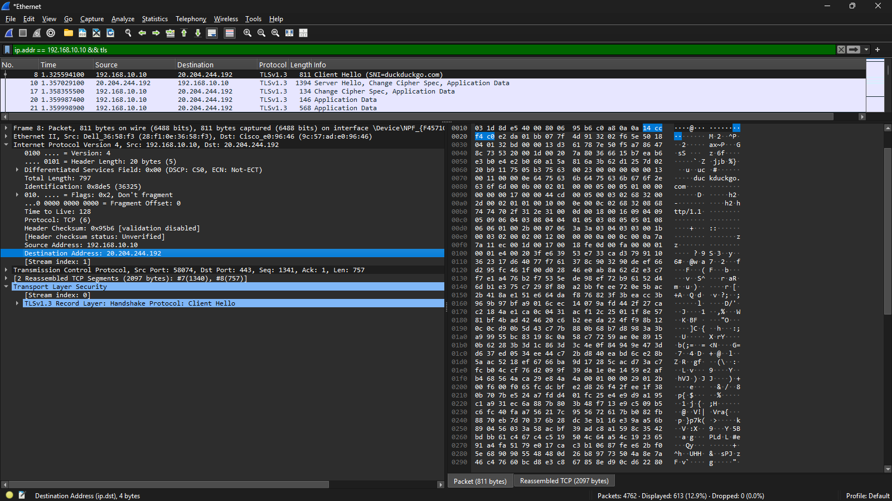

Past the handshake, everything is Application Data — the page content itself stays encrypted. What a NOC technician gets from this pattern is: DNS lookups for the requested domains, a TLS handshake naming the destination, then a short burst of encrypted packets while the page loads.

### Scenario 2 — Large file download

**Goal:** simulate a user pulling down a large file and pick that flow out from everything else on VLAN10.

The VLAN10 PC downloaded a multi-gigabyte Windows Server evaluation ISO from microsoft.com — large enough to keep a long-lived TCP flow running for several minutes.

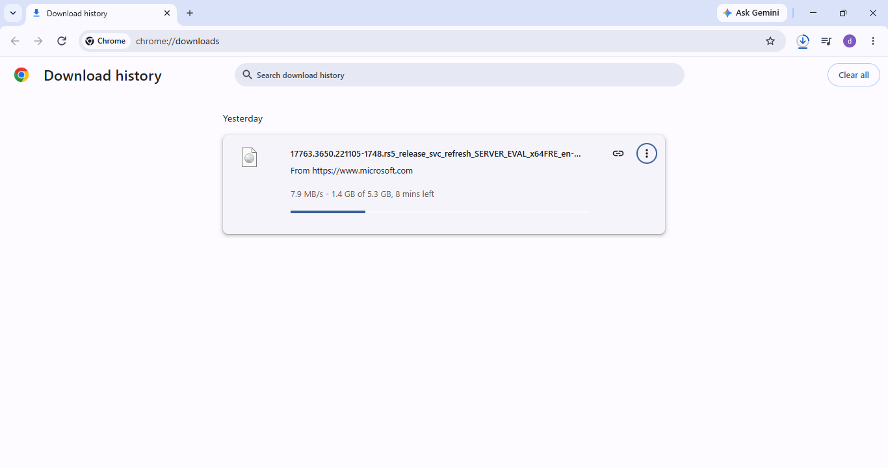

Filtering on `ip.addr == 192.168.10.10 && tcp.port == 443` before the download starts shows a quiet link — just a couple of stray ACKs:

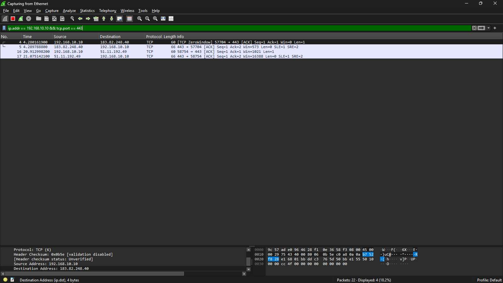

Once the transfer is running, the same filter is a wall of 1394-byte segments back-to-back from `183.82.248.40`, with retransmissions and reassembled TCP PDUs showing up as the flow sustains itself:

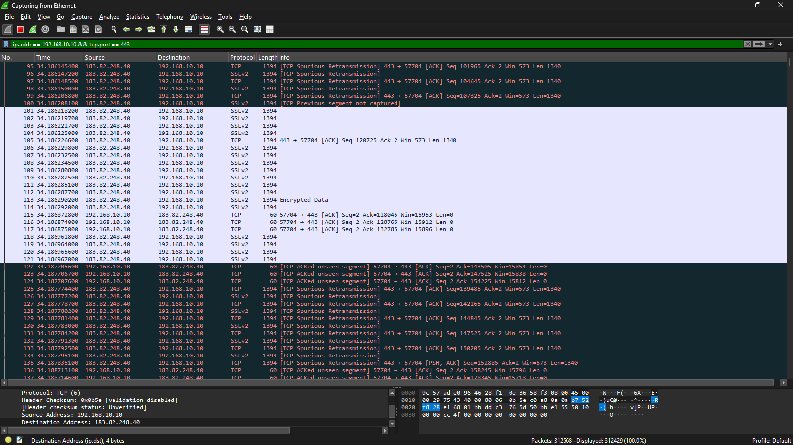

Toward the end, the flow tapers into keep-alives and zero-window signals as the transfer finishes and the connection idles down:

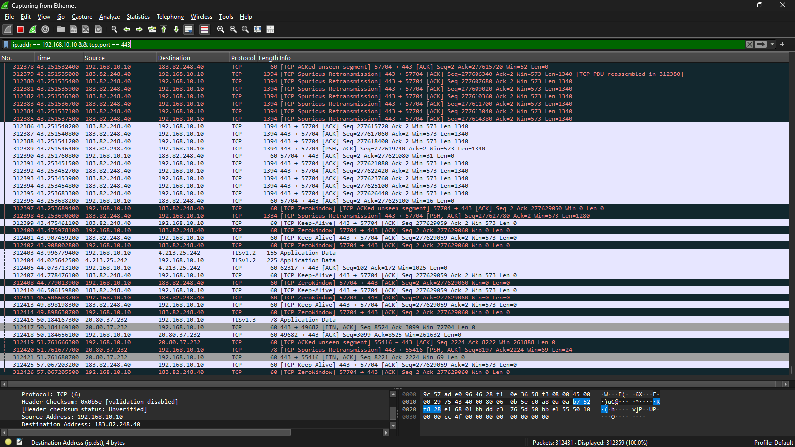

`Statistics → Conversations → TCP` makes the scale of it obvious: one single conversation between `192.168.10.10` and `183.82.248.40` racked up **312,301 packets and 296 MB**, dwarfing every other conversation in the capture by two to three orders of magnitude.

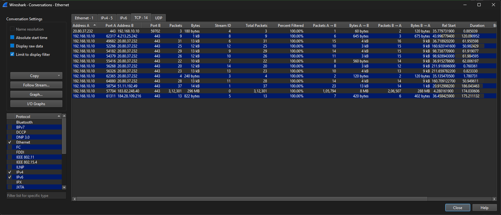

The bitrate view of the same table shows that conversation running at roughly **13 Mbps** sustained, versus low-kbps/low-bps bursts everywhere else:

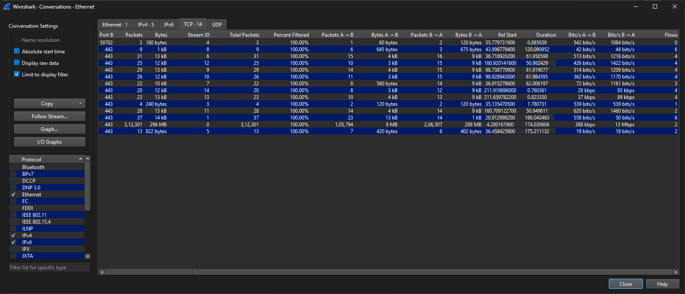

And the I/O graph tells the same story visually — a sharp, sustained spike to over 40,000 packets/sec for the ~10 seconds the download was actively pulling, against a flat baseline before and after:

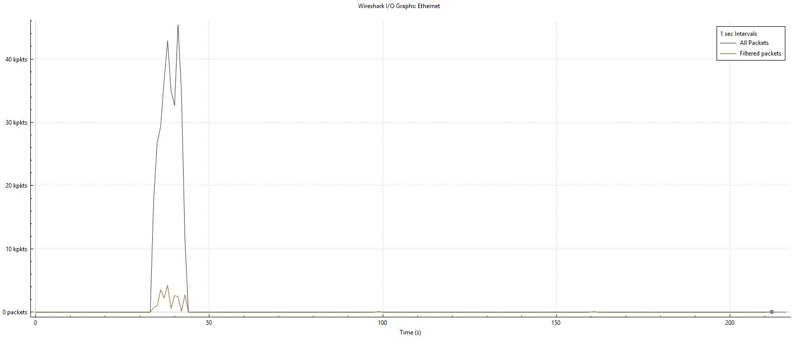

This is the shape a NOC operator would flag as "sustained high-volume session from 192.168.10.10" — no need to know it was a Windows ISO specifically, the traffic pattern alone tells you it's a large, one-directional bulk transfer.

### Scenario 3 — Video streaming

**Goal:** watch a streaming session and compare its shape against the download in Scenario 2.

YouTube was used as the streaming source, playing for several minutes while the capture ran in the background.


The I/O graph for this session looks nothing like the download's clean spike — instead it's a series of separate bursts (roughly 1, 3, and 5.5 thousand packets/sec at different points, with quiet gaps in between), which is exactly what you'd expect from a player buffering chunks of video ahead of playback rather than pulling one continuous stream:

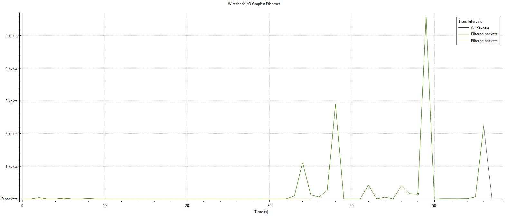

### What the three scenarios show side by side

| Pattern | Browsing | Large download | Streaming |
|---|---|---|---|
| DNS activity | Yes, per page | Minimal after initial lookup | Minimal after initial lookup |
| Destination visible via SNI | Yes (torproject.org, duckduckgo.com) | Yes, but a CDN/hosting IP rather than a friendly name | Depends on CDN endpoint |
| Flow duration | Short bursts | One long-lived flow (~3 min, 312k packets) | Long-lived, bursty |
| Byte volume | Low | High (296 MB) | Moderate–high |
| Traffic shape | Load, pause, load | One steady ~40 kpps spike | Repeated buffering bursts |
| Typical protocol | TCP/TLS :443 | TCP :443 | TLS or QUIC, sometimes UDP |

None of this required decrypting application content — DNS, SNI, timing, and volume were enough to tell all three apart, which is exactly the kind of first-pass triage a NOC technician does before escalating to deeper tools like a proxy or firewall inspection.

### Removing SPAN after testing

```cisco
enable
configure terminal
no monitor session 1
end
write memory
```

> This monitoring exercise is for your own lab traffic only — use it exclusively on networks and devices you're authorized to monitor.

---

## High Availability / Resiliency Testing

Four resiliency tests were actually run against this build, each with a "before" baseline, the fault introduced, and an "after" check. Two target the EtherChannels, one is a full power-off of the active stack member, and one targets the StackWise ring itself.

### Test 1 — Po1 uplink EtherChannel member failure

**Baseline**, taken right before the test — both channels healthy, both members bundled:

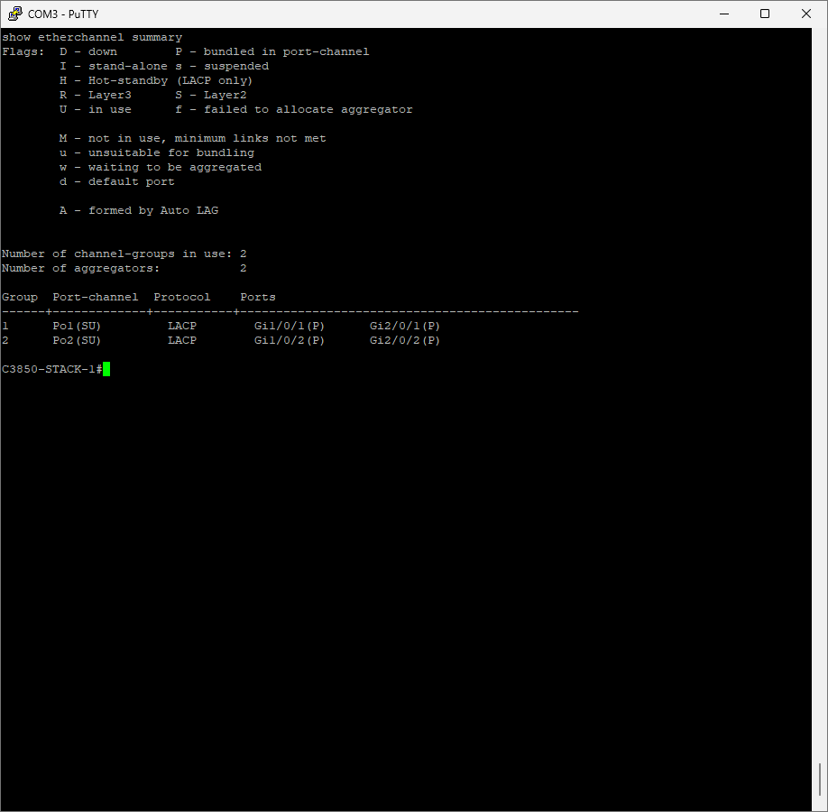

With `Gi1/0/1` taken down, the syslog shows the expected link-down/line-protocol-down messages, and `show etherchannel summary` immediately afterward still reports **`Po1(SU)`** — up and in use — now running on its one remaining physical member (`Gi2/0/1`), while `Gi1/0/1` shows as `(D)` for down:

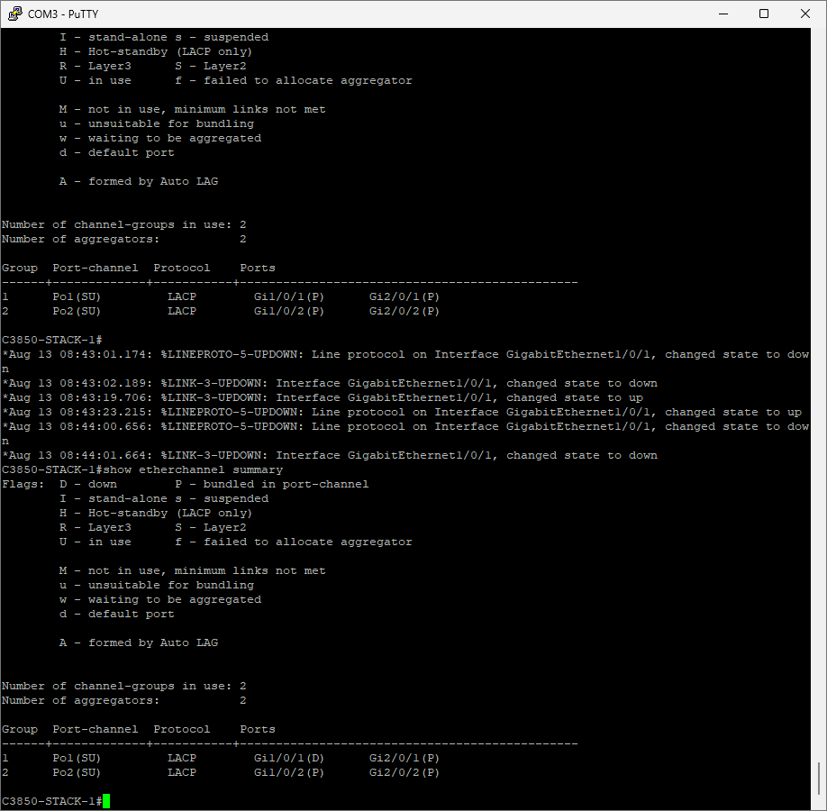

A continuous ping to `8.8.8.8` running through the whole test tells the real story: **6 of 7 packets replied, 1 lost (14% loss)** during the transition, then normal replies resumed:

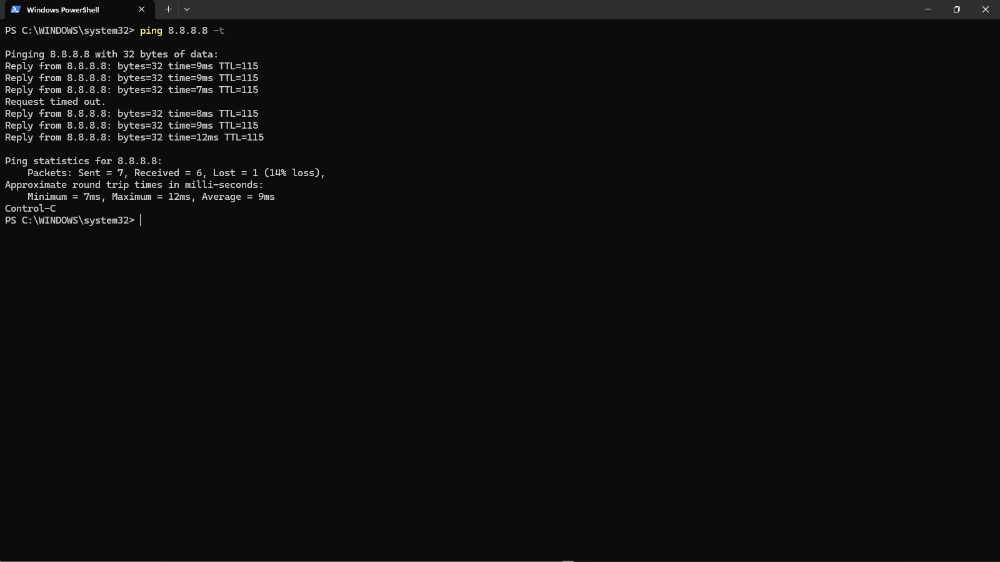

### Test 2 — Po2 downlink EtherChannel member failure

Same test, other EtherChannel. **Baseline** confirms both channels healthy before the fault:


With `Gi1/0/2` taken down, `Po2` stays **`SU`** on its remaining member (`Gi2/0/2`), same as Test 1. This screenshot also captures a concurrent ping to `192.168.10.10` from a second machine (hostname `NOCPC02`) running through the fault: **8 of 9 packets replied, 1 lost (11% loss)**, then recovery:

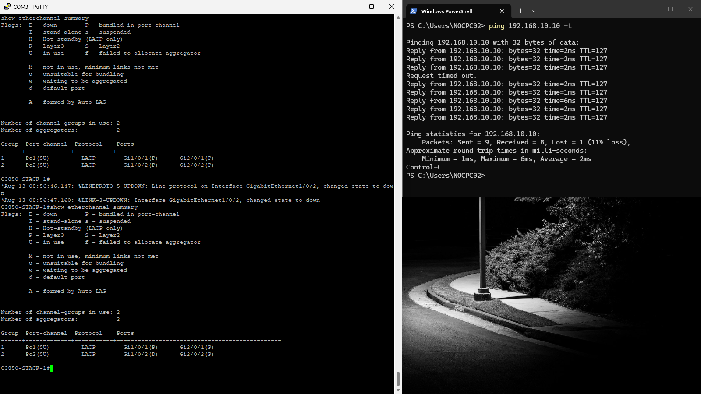

Both EtherChannel tests land on the same conclusion: losing one physical member out of two doesn't take the channel down — LACP renegotiates around it — but it isn't perfectly silent either. Both tests logged exactly one dropped ping during the transition.

### Test 3 — Full power-off of the active stack member

This is the destructive test: powering off switch 1 — the Active member (priority 15) — completely. These particular 3850 units each carry a single power supply, so pulling power to that one supply doesn't degrade the switch, it takes the whole physical unit dark. The console log captured the moment it happened: `%PLATFORM_FEP-1-FRU_PS_ACCESS: Switch 1: power supply B is not responding`, followed immediately by `FRU_PS_SIGNAL_FAULTY` — that's the switch reporting the loss of its only power source right before it went off entirely.

Three separate continuous pings were running at the same time — to `8.8.8.8`, to `192.168.20.1` (the VLAN20 gateway SVI), and to `192.168.10.10` (PC1) — and **all three kept responding without a single drop** through the entire event:

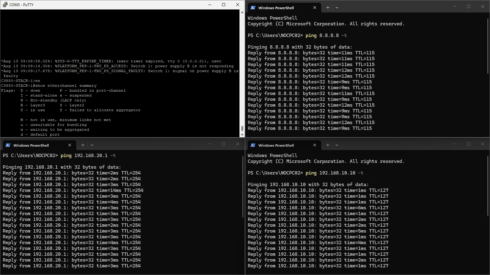

The detail worth calling out in that screenshot: the console prompt stays `C3850-STACK-1#` right through the power loss. That's not a coincidence — the hostname belongs to the stack as a logical entity, not to whichever physical box happens to be Active at the time. Switch 2 (priority 14, previously Standby) took over the Active role, and from a management standpoint the transition was invisible — same hostname, same session, no interruption to the CLI.

This is genuinely the strongest result in the whole test set: a full power loss on the Active member — not a single link, not a component fault, the entire physical switch — and three concurrent pings across different destinations didn't lose a single packet.

**One honest caveat:** zero dropped pings means the outage window (if there was one at all) was shorter than the ping interval, not necessarily that there was *zero* interruption at the microsecond level. A `ping -t` at the default one-second interval is a coarse instrument — it's good enough to say "this failover didn't cause a *user-visible* outage," which is the claim that actually matters operationally, but it can't rule out a sub-second blip between probes.

### Test 4 — StackWise ring link failure

The last test pulled the StackWise ring itself. The syslog shows both directions of the ring reporting down almost simultaneously: `Switch 2 stack port 2 is down` and `Switch 1 stack port 1 is down`. Immediately after, `show switch` still reports **switch 1 Active / switch 2 Standby, both Ready** — the roles didn't change — and a concurrent ping to `192.168.20.1` kept responding with **zero loss** the entire time:

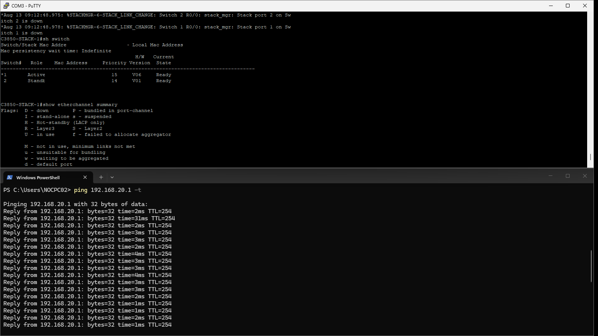

This result is worth being precise about rather than overselling: it shows that a ring interruption didn't cause a role re-election or a forwarding outage in this specific test, at this specific moment — both members' data-plane connections into Po1 and Po2 were untouched, so neither switch needed the other to keep forwarding what it was already forwarding. That's a narrower claim than Test 3's full active-member power-off above — this test only interrupted the stack's control-plane ring while both physical units stayed powered and both EtherChannels stayed fully intact.

### Resiliency test summary

| Test | Fault | Data-plane impact | Notes |
|---|---|---|---|
| 1 — Po1 uplink member | `Gi1/0/1` down | Po1 stayed `SU`; 1 ping lost of 7 | LACP renegotiated to the remaining member |
| 2 — Po2 downlink member | `Gi1/0/2` down | Po2 stayed `SU`; 1 ping lost of 9 | Same pattern, other channel |
| 3 — Active member power-off | Switch 1 (Active) loses its only PSU, goes fully dark | Zero ping loss across 3 concurrent pings | Switch 2 took over as Active; hostname/session continuity preserved |
| 4 — StackWise ring link | Both stack ports down | Zero ping loss on a concurrent ping | Active/Standby roles unchanged; control-plane ring only, both units stayed powered |

---

## What Changed vs. the FortiGate HA Lab

```text
Same:
  - Router, WAN/mgmt IP plan (172.18.2.0/24, 192.168.55.0/24)
  - VLAN10/VLAN20 subnets (192.168.10.0/24, 192.168.20.0/24)
  - L2SW1 / L2SW2 roles as transit/downstream switches

Different:
  - No FortiGate HA pair and no firewall policies anywhere in the path
  - The 3850 stack is now the Layer-3 gateway for VLAN10/VLAN20
  - L2SW1 carries VLAN 1 only — it never sees VLAN10/VLAN20
  - The Router performs NAT/PAT since there's no firewall to do it
  - Redundancy comes from StackWise (Active/Standby) plus two LACP
    EtherChannels and a stack-power ring, not a firewall HA pair
    with a heartbeat link
```

---

## What I Learned

**StackWise isn't the same redundancy model as firewall HA.** The FortiGate pair relies on a heartbeat link and explicit HA state sync; StackWise instead makes two physical switches present as one logical control plane over a dedicated ring, with priority values deciding which member is Active. Watching the syslog during stack formation made this concrete — switch 2 didn't "fail over" into the stack, it was absorbed into it, cycling every interface as it took on its new member number.

**"Redundant" doesn't always mean "silent."** Both EtherChannel member-failure tests recovered the channel automatically, but both also logged exactly one dropped ping during the transition. That's a useful, honest data point — LACP re-convergence isn't instantaneous, and a real design would want to know that one-packet number, not just "did it stay up."

**A full active-member power-off can be genuinely invisible to end users.** Going in, I expected the most disruptive test — powering off the switch holding the Active role entirely — to be the one most likely to show a dropped packet. It was the opposite: zero loss across three concurrent pings, and the console session didn't even blink, because the hostname belongs to the stack as a whole, not to whichever physical unit is Active. Switch 2 picked up the Active role and kept answering under the same identity.

**"Zero dropped pings" isn't the same as "zero downtime."** A `ping -t` at a one-second interval can only catch outages that last roughly that long or more. That doesn't undercut the active-member test's result — a failover that a one-second probe can't catch is, for almost any practical purpose, a non-event — but it's worth stating plainly rather than implying the test measured something more precise than it did.

**Not every fault reaches the same recovery mechanism.** The StackWise ring-link test and the active-member power-off test both produced zero ping loss, but for different structural reasons — the ring test never took either physical unit's data-plane ports down, so there was nothing for either switch to route around; the active-member test took an entire unit down and StackWise handled the full transition. Both landed at "zero loss," but only one of them actually exercised StackWise's failover path end to end.

**A "1 Gbps" port doesn't give you 1000 Mbps of payload.** The iperf3 numbers — consistently 930–950 Mbps per member link — were a good reminder that line rate and usable throughput aren't the same figure. Framing, headers, and ACKs are a fixed cost of the protocol stack, not a symptom of anything wrong. Knowing what "normal" overhead looks like on a healthy link is what makes it possible to actually notice when a link is underperforming for a real reason.

**VLAN 1 as a deliberately narrow transit VLAN is a useful pattern.** Keeping L2SW1 limited to VLAN 1 only — no VLAN10, no VLAN20 — meant one less thing to get wrong on the upstream side, and it made it obvious at a glance that inter-VLAN routing only happens at the stack, nowhere else.

**Encrypted traffic still tells a story — including the destination.** Going in, I assumed HTTPS traffic would only show metadata. The TLS ClientHello's SNI field turned out to name the exact site being contacted (`torproject.org`, `duckduckgo.com`) in plaintext, right there in Wireshark — a detail worth knowing for both defensive monitoring and privacy reasons. Past the handshake, though, the payload really is opaque, and all three NOC scenarios were still distinguishable purely on flow shape, duration, and byte volume.

## Interview Questions

**Q: Why does L2SW1 only carry VLAN 1 in this design, instead of trunking VLAN10/VLAN20 as well?**
A: L2SW1 sits between the router and the stack, above the point where inter-VLAN routing happens. Keeping it VLAN-1-only means it has no routing decisions to make and no user VLANs to leak upstream — it's a pure transit switch, and the blast radius of a misconfiguration there is much smaller.

**Q: What's the practical difference between StackWise redundancy and a traditional firewall HA pair?**
A: A firewall HA pair is two independent devices synchronizing state over a heartbeat link, with one explicitly Active and one explicitly Standby that has to detect a failure and take over. StackWise members share a single control plane over a dedicated ring from the start — there's a Master/Active role for management purposes, but the switching hardware in both members is already part of one logical switch, not two devices watching each other.

**Q: If Po1 shows one member down but the port-channel status is still `SU`, what does that tell you?**
A: The EtherChannel is still up and forwarding on its remaining member — LACP renegotiated around the lost link rather than dropping the whole channel. In this lab that renegotiation cost exactly one dropped ping, so it's fast but not instantaneous — worth knowing if the traffic riding that channel is latency-sensitive.

**Q: Why is NAT/PAT configured on the router instead of on the 3850 stack?**
A: The 3850 stack is doing Layer-3 inter-VLAN routing, but it isn't acting as the Internet-facing edge — the router is. NAT/PAT belongs at the point where private addressing meets the public WAN link, which in this topology is still the router's G0/0.

**Q: An iperf3 test on a 1 Gbps EtherChannel member link shows 940 Mbps instead of a full 1000 Mbps. Is that a problem?**
A: No — that's within the normal range for a healthy Gigabit link. Line rate is a Layer-1 number; actual payload throughput is always lower once you account for Ethernet framing and inter-frame gaps, IP/TCP headers, and return-path ACK traffic. Somewhere in the low-to-mid 90s as a percentage of line rate is what a good link looks like. It's only worth investigating if a link is landing noticeably below that range, or below what its neighbors on the same channel are showing.

**Q: What actually happened when the Active stack member lost power completely?**
A: Switch 2 — previously Standby — took over the Active role, and the transition was invisible from both a data-plane and a management standpoint in this test: three concurrent pings to different destinations showed zero dropped packets, and the console session kept the same `C3850-STACK-1` prompt throughout, because the hostname is a property of the stack as a logical entity, not of whichever physical unit happens to hold the Active role at a given moment.

**Q: If a test shows zero dropped pings during a failover, does that mean there was zero downtime?**
A: Not quite — it means any interruption was shorter than the ping interval being used, which in this case was one second. It's strong evidence the failover didn't cause a user-noticeable outage, but a sub-second gap between two successful pings wouldn't show up in that data. For anything more precise, you'd want a purpose-built tool sending probes at millisecond intervals, not `ping -t`.

**Q: Why can't Wireshark show you the actual page or video content being streamed, even though SPAN is mirroring the traffic?**
A: The traffic is HTTPS/TLS (and often QUIC), so the application payload is encrypted end-to-end between the client and the server. SPAN gives you a faithful copy of the packets, including the plaintext TLS ClientHello — which is why the destination hostname is visible via SNI — but everything after the handshake is encrypted, so content itself stays hidden.

**Q: What's the risk of pointing a SPAN session at a port that's also an EtherChannel member?**
A: SPAN destination ports stop doing normal switching while they're a SPAN destination — they only receive mirrored traffic. Using an EtherChannel member port as a SPAN destination would pull that link out of the channel's actual forwarding path, degrading the very redundancy the EtherChannel exists to provide.

---

## Final Checklist

```text
[x] StackWise ring up (show switch stack-ports = OK/OK)
[x] Stack shows Active/Standby correctly
[x] Po1 (L2SW1 to 3850 stack) = SU, LACP
[x] Po2 (3850 stack to L2SW2) = SU, LACP
[x] L2SW1 uses VLAN 1 only
[x] VLAN10 / VLAN20 exist on the 3850 stack and L2SW2
[x] 3850 SVIs Vlan10 / Vlan20 up, routing enabled
[x] Router has static routes to 192.168.10.0/24 and 192.168.20.0/24
[x] Router has NAT/PAT configured on G0/0
[x] NAT access-list includes 192.168.55.0/24 as well as VLAN10/VLAN20
[x] SPAN session mirrors VLAN10 to the dedicated monitoring port
[x] Wireshark receives VLAN10 traffic in real time, incl. TLS SNI
[x] Scenario 1 web browsing observed and screenshotted
[x] Scenario 2 large download observed and screenshotted
[x] Scenario 3 video streaming observed and screenshotted
[x] SPAN session removed after testing
[x] Po1 uplink member failure tested — channel stayed up, 1 ping lost
[x] Po2 downlink member failure tested — channel stayed up, 1 ping lost
[x] Full active-member power-off tested — zero ping loss across 3 concurrent probes, seamless session continuity
[x] StackWise ring link failure tested — roles held, zero ping loss
```

All four planned resiliency tests were completed. The one thing worth flagging for a future pass isn't a missing test but a measurement limit: every result above is "zero dropped pings at a one-second interval," which rules out user-visible outages but can't rule out sub-second gaps. A tighter next step would be repeating the active-member power-off test with a faster probe — continuous UDP traffic or millisecond-interval pings — to see whether there's a real, if brief, gap hiding underneath the current result.
