# FortiGate Active-Passive HA Deployment & Failover Testing

*Cisco Router + 2× L2 Switches + 2× FortiGate 300D*

Every firewall lab I'd built up to this point had a single point of failure sitting right in the middle of the network: the firewall itself. This lab was about removing that assumption. Two FortiGate 300D units, one dedicated fiber heartbeat between them, and a deliberate decision to pull cables and cut power mid-ping to see whether the promise of "automatic failover" actually held up on real hardware.

**In one sentence:** I built an Active-Passive HA cluster using two physical FortiGate 300D firewalls, connected by a dedicated fiber heartbeat, and tested two different real failure conditions against it — disconnecting the primary's WAN link, and cutting power to the primary outright — then measured exactly what broke, for how long, and why.

The two failures didn't behave the same way, and that difference is most of what this write-up is actually about.

## What I Built

Two FortiGate 300D firewalls in Active-Passive HA (FGCP), sitting behind a Cisco edge router and in front of two Layer-2 switches carrying two client VLANs. FW1 is configured with the higher HA priority (200), FW2 lower (100). The cluster exchanges heartbeat and configuration-sync traffic over a dedicated link on Port 8 — physically separate fiber, carrying no client data at all.

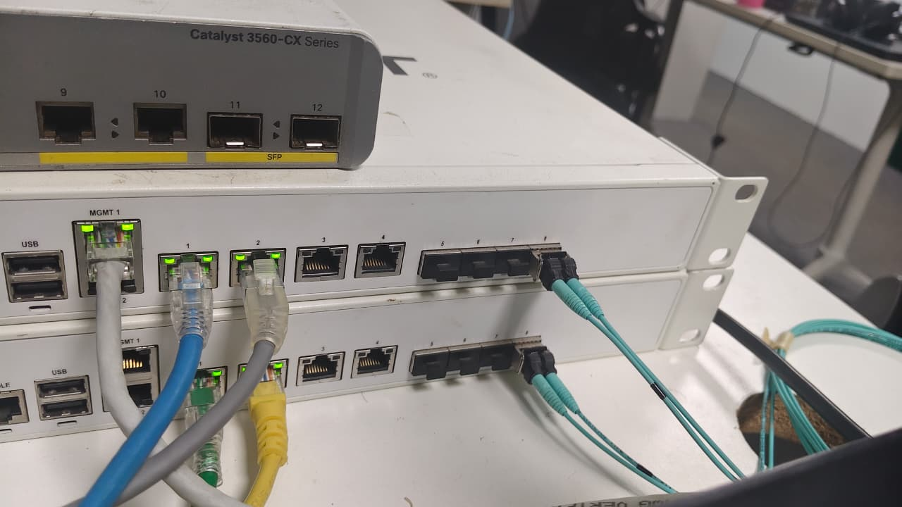

That photo is the whole concept in one image: two identical 300D units stacked, with a short fiber run connecting Port 8 to Port 8. Everything else in this write-up is about what that one link makes possible, and — just as importantly — what it *doesn't* cover on its own.

### Topology

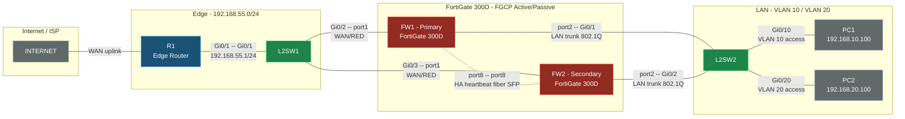
```mermaid
flowchart LR
    classDef router fill:#1a5276,stroke:#3498db,color:#fff
    classDef switch fill:#1e8449,stroke:#2ecc71,color:#fff
    classDef firewall fill:#922b21,stroke:#e74c3c,color:#fff
    classDef host fill:#616a6b,stroke:#95a5a6,color:#fff
    subgraph WAN["Internet / ISP"]
        INET["INTERNET"]:::host
    end
    subgraph Edge["Edge - 192.168.55.0/24"]
        R1["R1<br/>Edge Router"]:::router
        L2SW1["L2SW1"]:::switch
    end
    subgraph HA["FortiGate 300D - FGCP Active/Passive"]
        FW1["FW1 - Primary<br/>FortiGate 300D"]:::firewall
        FW2["FW2 - Secondary<br/>FortiGate 300D"]:::firewall
    end
    subgraph LAN["LAN - VLAN 10 / VLAN 20"]
        L2SW2["L2SW2"]:::switch
        PC1["PC1<br/>192.168.10.100"]:::host
        PC2["PC2<br/>192.168.20.100"]:::host
    end
    INET ---|"WAN uplink"| R1
    R1 ---|"Gi0/1 -- Gi0/1<br/>192.168.55.1/24"| L2SW1
    L2SW1 ---|"Gi0/2 -- port1<br/>WAN/RED"| FW1
    L2SW1 ---|"Gi0/3 -- port1<br/>WAN/RED"| FW2
    FW1 -.-|"port8 -- port8<br/>HA heartbeat fiber SFP"| FW2
    FW1 ---|"port2 -- Gi0/1<br/>LAN trunk 802.1Q"| L2SW2
    FW2 ---|"port2 -- Gi0/2<br/>LAN trunk 802.1Q"| L2SW2
    L2SW2 ---|"Gi0/10<br/>VLAN 10 access"| PC1
    L2SW2 ---|"Gi0/20<br/>VLAN 20 access"| PC2
```

The router handles ISP connectivity and NAT out to the internet. The switches do pure Layer 2 — VLAN separation and trunking, nothing routing-aware. Every routing, firewalling, DHCP, and failover decision lives on the FortiGate cluster.

## Building the Cluster

Before HA can form, both units need unique hostnames and matching HA settings. I set FW1's hostname and system time first, then configured HA mode as Active-Passive with a shared group name and password, Port 8 as the dedicated heartbeat link, and Port1/Port2 set as monitored interfaces — meaning HA separately watches link state on those data ports and can trigger failover from losing one of them, independent of whether the heartbeat itself is still alive.

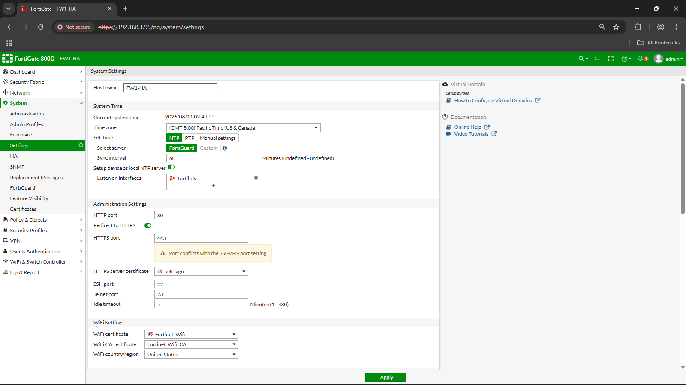

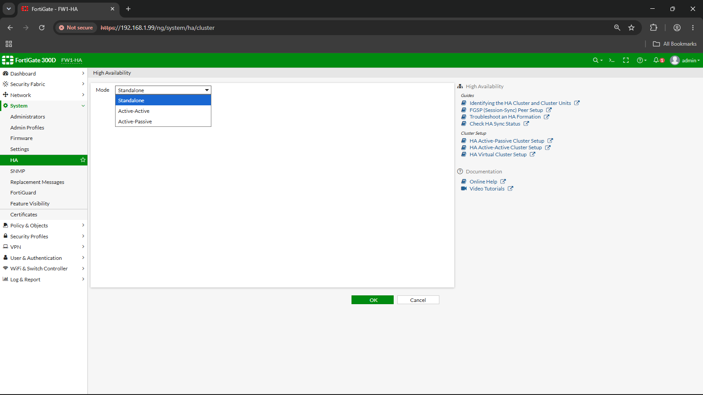

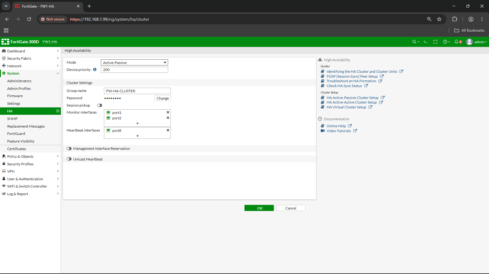

FW2 gets the same group name, same password, same heartbeat and monitor interfaces — the difference that matters is priority. FW1 is set to 200, FW2 to 100.

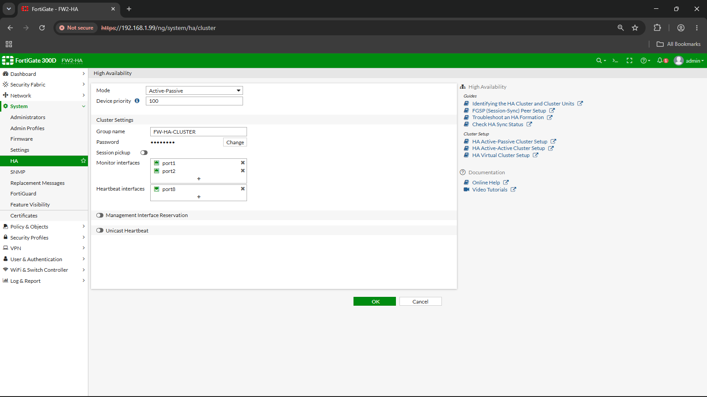

Priority isn't a simple "highest number always wins" switch — it's one factor FGCP weighs in its primary-election logic, alongside things like link/monitor status and whether override is enabled. In this cluster, override was left disabled during normal operation, so priority only decided the outcome once a genuine election was triggered — which is exactly what happened after both failover tests, and the HA status logs below state that reasoning directly rather than leaving it to assumption.

The moment both units share a group name, password, and a live heartbeat link, they stop being two separate firewalls and start operating as one cluster with two members. From here on, almost everything gets configured once, on the primary, and pushed automatically to the secondary as configuration sync.


Serial numbers are blurred throughout this write-up — the status, priority, role, and sync state are what matter here, not the individual unit identifiers.

## Routing, VLANs, and DHCP

With the cluster up, the rest of the build is ordinary FortiGate configuration — except now every change made on the primary replicates to the secondary automatically.

Port1 is the shared WAN interface, addressed manually rather than by DHCP:

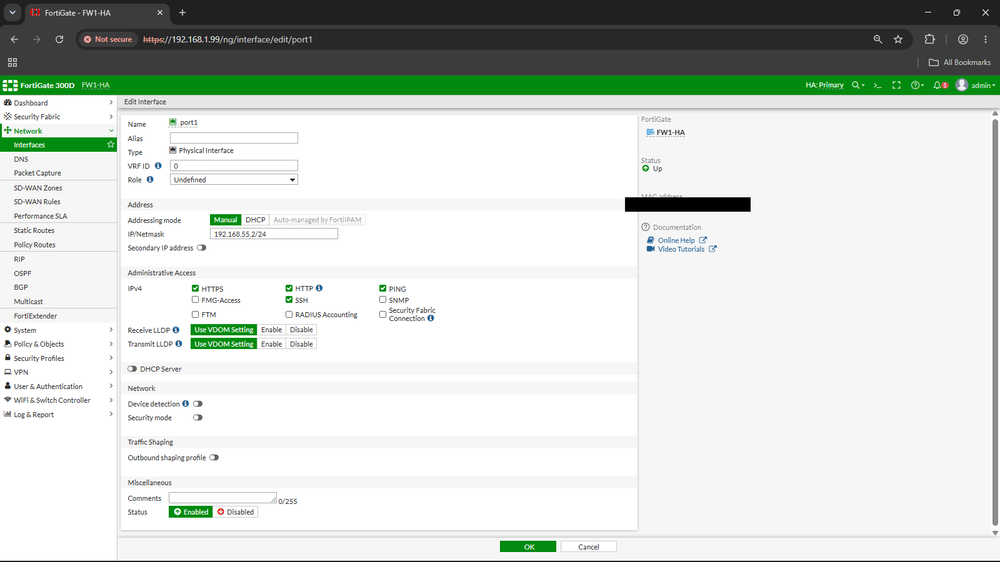

The reason is a design choice for this environment rather than an HA requirement: this lab has a fixed upstream network, and the routing, NAT, and firewall policy configuration all depend on a stable, known WAN address to be written against consistently. DHCP isn't inherently incompatible with HA, but static addressing is the clearer choice here, where the upstream topology is fixed and predictable.

A default route points everything unmatched back out through the router:

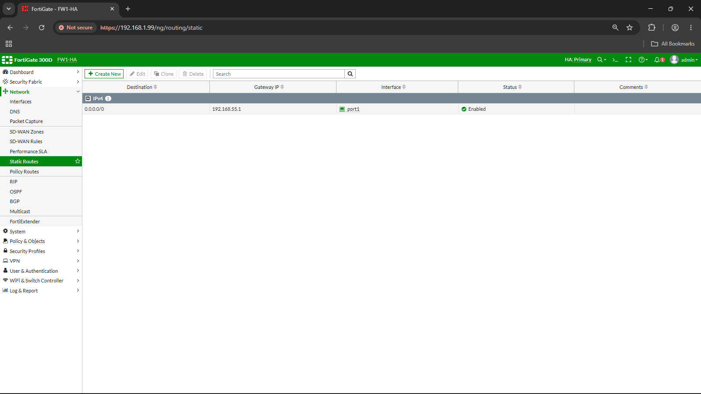

VLAN10 and VLAN20 aren't separate physical ports — they're 802.1Q subinterfaces riding the same trunk on Port2, split apart only by VLAN tag. Each gets its own gateway IP and its own DHCP scope:

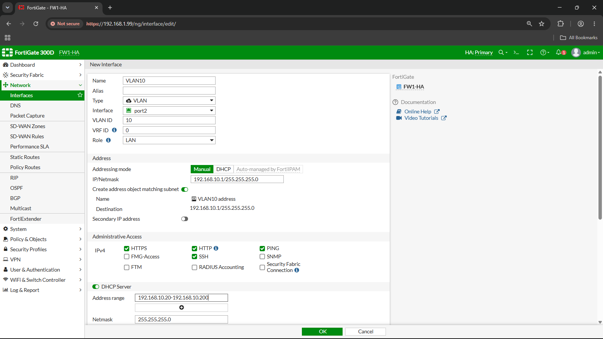

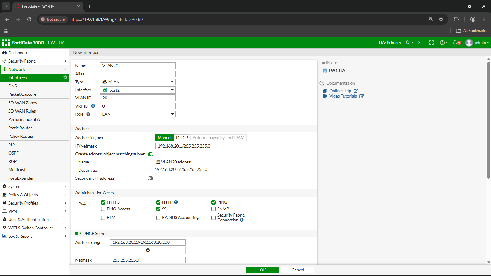

Two firewall policies allow each VLAN out to the internet through Port1, both with NAT enabled so private VLAN addresses translate to the shared WAN IP on the way out:

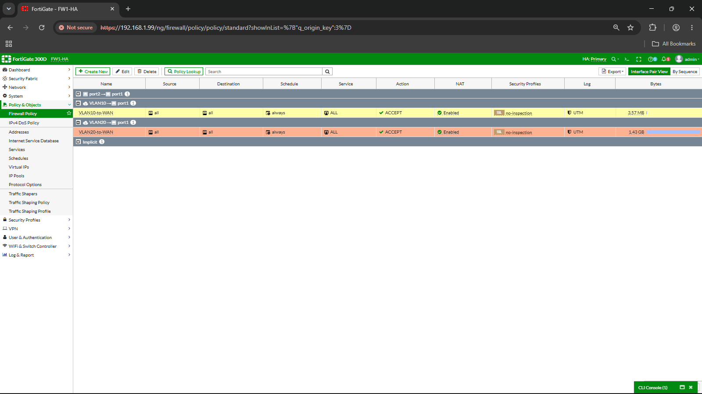

Before trusting any client to reach the internet, I tested from the FortiGate itself — both to the router and straight out to a public resolver:

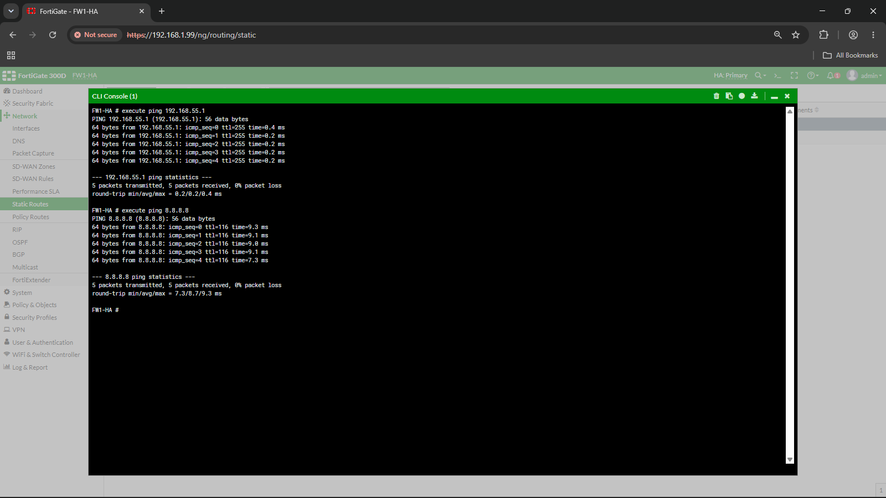

Then the clients. PC1 leased an address on VLAN10, PC2 on VLAN20, both handed out by the FortiGate itself:

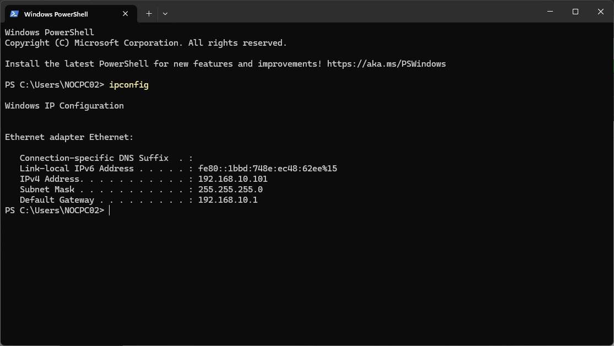

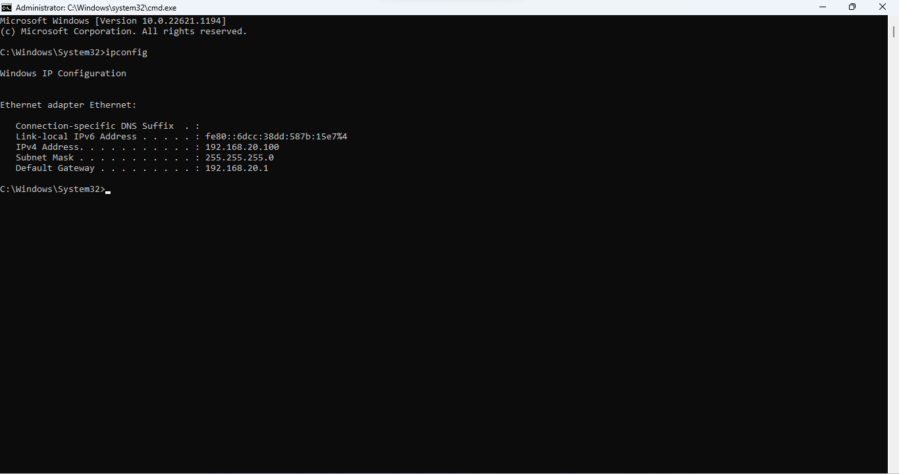

A traceroute from PC2 confirmed the whole path end to end — VLAN20 gateway, then the router, then out to the internet:


## Planes and Synchronization — What HA Is Actually Keeping in Sync

Before getting into the failover results, it's worth being precise about what "HA" was actually doing underneath the dashboard, because the two test outcomes only make sense in light of it.

**Three planes, three different jobs:**

- **Control plane (Port8, heartbeat):** This is where FGCP itself lives — heartbeat hello packets confirming each unit is alive, primary/secondary election, and *configuration* synchronization (interfaces, policies, routes, DHCP scopes). This is what the `HA Health Status`, `Cluster state change time`, and `Configuration Status: in-sync` lines in the CLI output are reporting on. It carries zero client traffic.
- **Data plane (Port1 WAN, Port2 LAN trunk):** This is where actual client traffic flows — VLAN10/20 sessions, NAT translations, everything the firewall policies act on. This is also what "monitored interfaces" watches: HA doesn't need to lose the heartbeat to trigger a failover, it can react purely to losing link on a data-plane port, which is exactly what the WAN-cable test below exercises.
- **Management plane:** Separate again — the admin GUI/CLI session used to observe all of this throughout the lab (`https://192.168.1.99`), which stays independent of both the heartbeat and the data path.

**Configuration sync vs. session sync — and why this matters for the failover results:**

`Configuration Status: in-sync`, visible throughout the CLI output below, only confirms that the two units' *configuration* — interfaces, policies, routes — matches. It says nothing about whether in-progress *sessions* (an open TCP connection, an active NAT mapping) survive a failover.

That's controlled separately, by session pickup — and in this cluster, it's explicitly disabled:

```text
ses_pickup: disable
```

`ses_pickup: disable` means this cluster does not synchronize active sessions for stateful session continuity — established TCP/UDP connections would not be preserved across a failover. That matters for real traffic, but it's a separate claim from what the failover tests below actually measure. The tests use `ping -t`, and each ICMP echo request is independent — there's no single long-lived "session" for HA to pick up in the TCP/UDP sense. So the packet loss visible in those tests is primarily evidence of the **HA transition itself** — the brief window while the surviving or rejoining unit takes over forwarding — not evidence of session pickup specifically. Worth documenting on its own regardless, since `Configuration Status: in-sync` only confirms the two units agree on *policy* — it says nothing about session continuity, which is a materially different guarantee. That gap between "ICMP recovers fast" and "a real stateful session recovers fast" didn't stay theoretical for long — see **Real-World Follow-Up** below, where testing it directly with a live call changed the picture considerably.

## Testing Failover — Twice, Two Different Ways

Watching HA status change in a browser tab is convincing enough on its own, but it doesn't tell you what a real user on the network actually experiences during a failure. So I ran two separate failure scenarios against a continuous `ping 8.8.8.8 -t` from a client, each one testing a different failure mode.

### Scenario 1 — Pulling the WAN Patch Cord

This test disconnects L2SW1's uplink toward FW1's Port1 — a data-plane link, not the HA heartbeat. The heartbeat over Port8 stayed up the entire time; what triggered failover was FW1's monitored interface (Port1) going down. That distinction matters: HA didn't need to "lose" FW1 to react here, it just needed to see one of its watched links disappear.

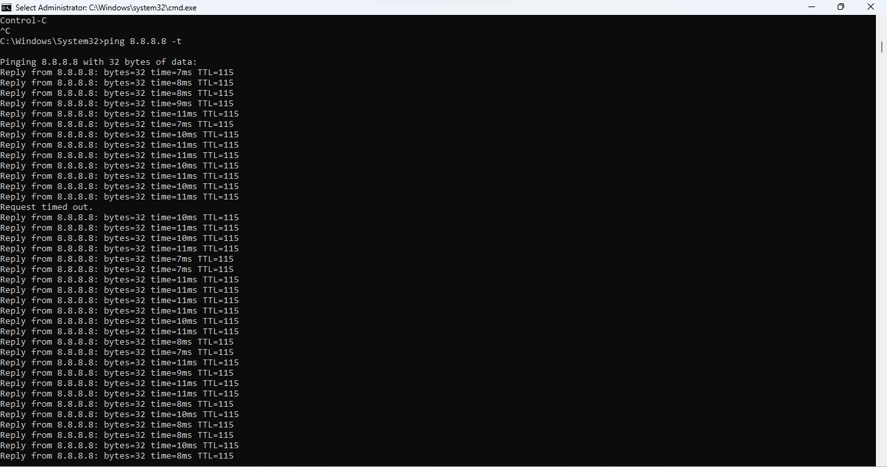

One dropped request. FW2 picked up almost immediately, because Port1 link loss on FW1 was, by itself, enough to trigger the monitored-interface failover condition.

Re-plugging the cable told a different story:

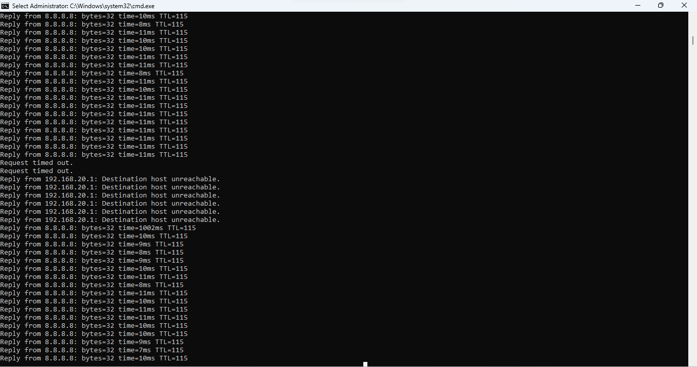

Two timeouts, then several replies of `Destination host unreachable` coming back from 192.168.20.1 — the FortiGate's own VLAN20 gateway address — before traffic recovered with one slow 1002ms reply and settled back to normal. What that confirms is narrow but solid: the gateway itself was reachable and responding, but it wasn't yet able to forward those packets onward. It's consistent with a brief window where routing/session state on that side wasn't fully ready — beyond that, the CLI output doesn't give a more specific cause, so I'm not claiming more than what the ping evidence shows.

Once things settled, FW1 had reclaimed the primary role. The cluster log states the reason explicitly rather than leaving it to assumption:

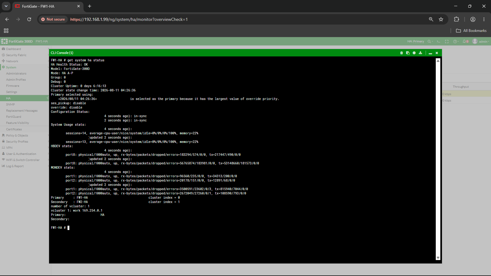

### Scenario 2 — Pulling the Power on FW1

The second test was more drastic: killing power to FW1 entirely rather than just unplugging a cable, with a continuous ping running to VLAN20's gateway instead of straight out to the internet, to isolate the FortiGate side of the path from anything the router or ISP might be doing.

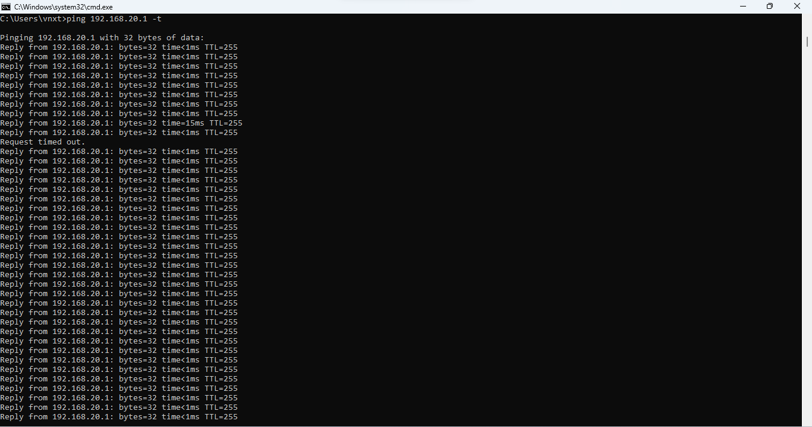

Losing FW1 completely triggered an immediate election — this time via the heartbeat itself going silent, not a monitored data link. FW2's own HA status output tells the story better than a green/red dashboard icon ever could:

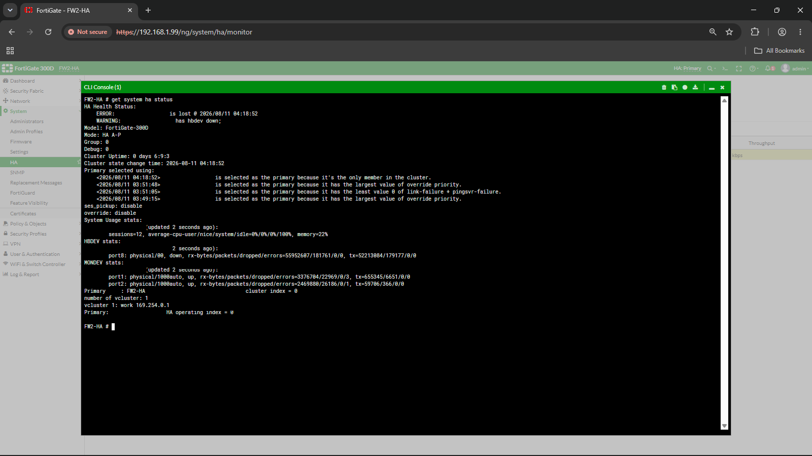

`HA Health Status: ERROR ... is lost` followed by `WARNING ... has hbdev down`, then FW2 promoting itself because it's the only member left. That's the control-plane heartbeat mechanism doing exactly what it's there for — not just noticing a data link is down, but noticing the *other unit* has gone silent entirely.

Worth being precise here about what the ping evidence actually covers for this half of the test: the failover moment itself — the instant FW1's power dropped and FW2 took over — isn't independently captured with its own packet-loss count. Screenshot 32 above is the steady baseline immediately before power was pulled; the confirmation that failover happened comes from FW2's HA status log, not from a gap in the ping output. That's a real result on its own (the heartbeat-driven election is what it's there to prove), just a different one from a measured drop count.

With FW1 gone, FW2 stayed green and primary — but FW1, once power came back, didn't rejoin instantly or cleanly. It came back and rejoined the cluster, but remained "Out of sync" until configuration synchronization completed — visible as a red status against FW2's still-green primary:


That red "Out of sync" line is the most honest screenshot in this whole lab — proof, not inference, that a cluster rejoining after real hardware failure isn't instant.

This is where the second measurable event comes from — not the failover, but the **failback**. Once FW1 finished rebooting and rejoined the cluster, it reclaimed primary (override priority 200 beats FW2's 100), and *that* transition is what the ping test actually caught:

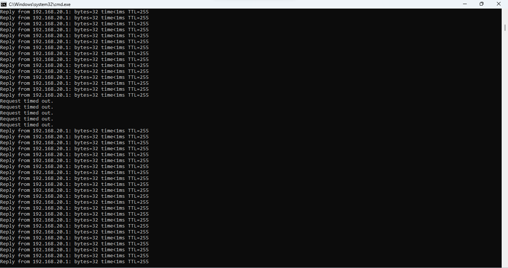

Five dropped requests here — not from FW1 going down, but from FW1 *coming back* and taking primary role away from FW2. That's a meaningfully different event from the WAN-cable test's single drop, and it's rougher for a specific reason: this is a full unit rejoining after a boot cycle and reclaiming a role it doesn't currently hold, not a live unit simply losing one monitored link. FW1 came back up with almost no uptime:

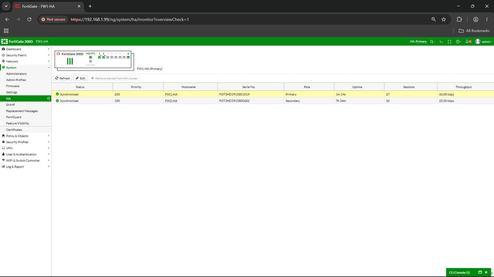

And once resynchronization finished, FW1's own `get system ha status` output confirmed it had reclaimed primary, with the reason stated directly in the cluster log rather than inferred:

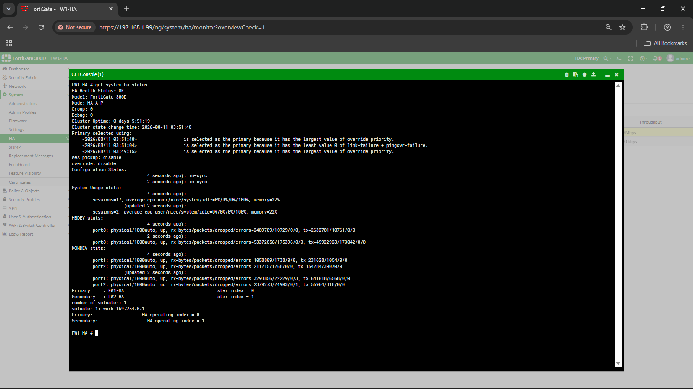

The lower-level `diagnose sys ha status` output backs this up from a different angle — the kernel's own view of which unit is primary, independent of the GUI dashboard:

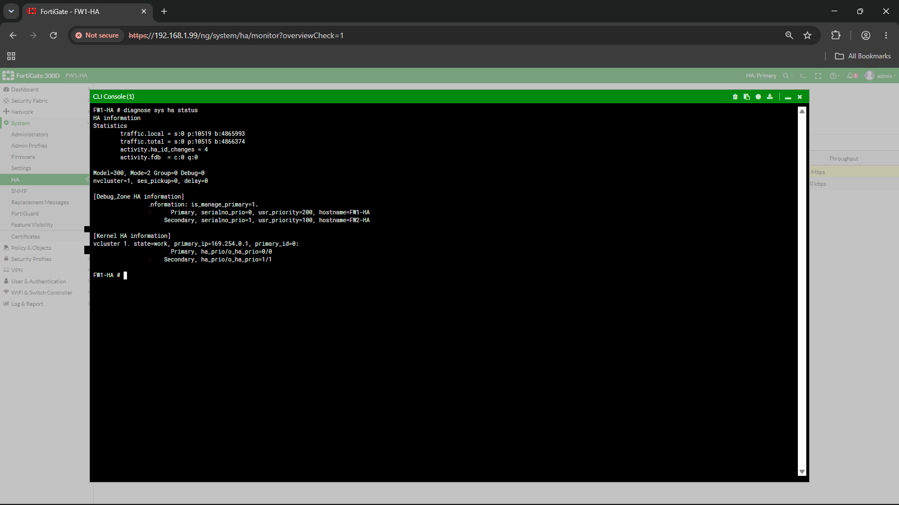

Final state, both scenarios behind us: both units green, both synchronized, FW1 back where it started.

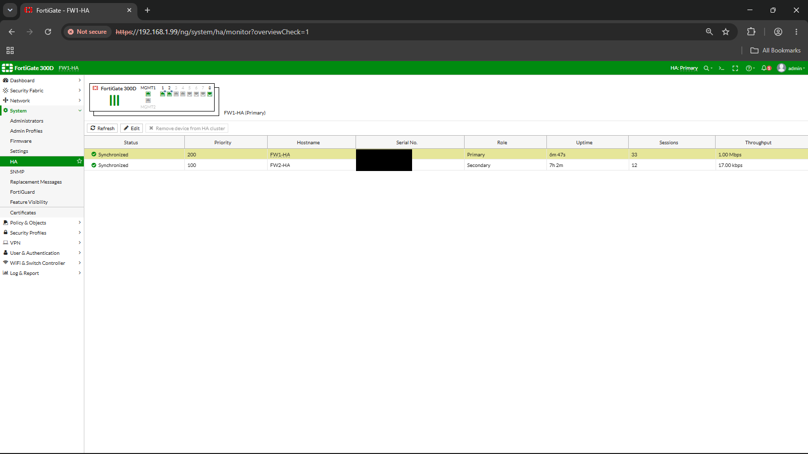

### What These Events Actually Showed

Laid out honestly, this lab didn't produce two comparable data points — it produced three distinct events, and conflating any two of them would overstate what was actually measured:

| Event | Trigger | Detected via | Client impact | Notes |
|---|---|---|---|---|
| 1. WAN link failover | Patch cord pulled from FW1's Port1 | Monitored-interface link loss (data plane) — heartbeat stayed up | 1 dropped ping | FW2 takes over almost immediately; a single link, not the whole unit, went down |
| 2. WAN link failback | Patch cord reconnected | FW1 relinks and reclaims primary | 2 timeouts + `Destination host unreachable` + 1 slow reply | Gateway was reachable throughout, just not yet forwarding |
| 3. Power-off failover | FW1 powered off | Heartbeat loss (control plane) — confirmed via FW2's HA status log, not an isolated ping-loss count | Not independently measured by ping count | The steady baseline just before the pull (screenshot 32) doesn't itself capture the transition moment |
| 4. Power-on failback | FW1 powered back on, reboots, rejoins | FW1 resyncs, reclaims primary via override priority | 5 dropped pings | This is where the "5 dropped pings" actually comes from — FW1 *reclaiming* primary, not FW1 originally going down |

The headline comparison isn't "1 dropped ping vs. 5 dropped pings for the same kind of event" — it's that **failback (a unit rejoining and reclaiming primary after a full reboot) is measurably rougher than a live unit losing one monitored link**, and that the power-off failover itself is proven by the HA status log rather than by an isolated packet-loss count in this data set. Neither test produced a *prolonged* outage — that's the point of HA — but all four transitions produced real, measurable packet loss or a logged state change, and calling any of it "no outage" would overstate what the evidence shows.

## Real-World Follow-Up — Testing a Live Microsoft Teams Call Across Failover

Everything above is honest evidence, but it has a real limitation worth naming directly: a `ping -t` isn't how anyone actually uses a network. Employees don't sit there pinging the gateway all day, and they don't need to — the question that actually matters for a redundant firewall isn't "does ICMP recover," it's "does a real, in-progress conversation survive a failover without the person on the call noticing." So I went back and tested exactly that.

With the cluster in the same state used throughout this lab — `ses_pickup: disable` — I put a Microsoft Teams call up and running across the connected PCs, then triggered the same WAN failover used earlier. The ICMP tests above had suggested a sub-second-to-a-few-second disruption. What actually happened to the Teams call was very different: it took an average of **around 20 seconds** for the call to reconnect.

That gap between "ping recovers almost instantly" and "a real call takes 20 seconds" is exactly what the earlier section predicted in theory — `ses_pickup: disable` means the secondary unit has no record of the session that was active on the primary, so a live call isn't handed off, it's dropped and has to renegotiate from scratch. ICMP never exposed that, because ICMP never had a session to lose in the first place.

Once the 20-second reconnect flagged that something was worth investigating, I went back into the HA configuration and found session pickup toggled off — consistent with everything documented above. I enabled it, re-applied the HA configuration, and re-ran the identical WAN failover test with the same Teams call running:

**Reconnect time dropped to under 2 seconds.**

That single change is the clearest evidence in this entire lab for why config sync and session sync are genuinely different guarantees, not two names for the same thing. Configuration sync was `in-sync` and instant for every test in this write-up, start to finish — and none of that mattered for how long a real call was disrupted. The setting that actually controlled the user-facing outcome was one line, off by default in this build, that the ICMP tests had no way of exposing.

| | Session pickup disabled (as configured throughout this lab) | Session pickup enabled |
|---|---|---|
| Test method | Live Microsoft Teams call, WAN failover triggered | Same — live Teams call, same failover trigger |
| Reconnect time | ~20 seconds average | Under 2 seconds |
| What this shows | Confirms the "stateless for sessions" theory from the CLI output — with real evidence, not just a config flag | Session pickup is doing exactly what it's documented to do: carrying live session state across the transition |

## What Changed Because of This

Session pickup is now enabled on this cluster, and the WAN-failover ICMP test earlier in this document reflects the original, `ses_pickup: disable` configuration this lab was built and documented under — the numbers there haven't been re-measured against the new setting, and I'm leaving them as-is rather than re-writing history. The honest way to read this document, top to bottom, is: this is what a well-built HA cluster looks like *before* session pickup is considered, and this section is what changed once a real usage pattern — not a synthetic ping — exposed why that setting matters.

## Validation Matrix

| Test | Expected Result | Actual Result | Status |
|---|---|---|---|
| HA heartbeat | Members detect each other over Port8 | Both units Synchronized | PASS |
| VLAN10 DHCP | Client receives 192.168.10.x | PC1 received .101 | PASS |
| VLAN20 DHCP | Client receives 192.168.20.x | PC2 received .100 | PASS |
| VLAN10 → Internet | NAT + policy permits traffic | Successful | PASS |
| VLAN20 → Internet | NAT + policy permits traffic | Successful | PASS |
| FW1 WAN link failover | FW2 becomes primary | 1 packet lost | PASS |
| FW1 WAN link failback | FW1 reclaims primary | 2 timeouts + unreachable, then recovery | PASS |
| FW1 power-off failover | FW2 becomes primary | Confirmed via FW2 HA status log (heartbeat lost) — no isolated ping-loss count captured | PASS |
| FW1 power-on failback | FW1 resyncs and reclaims primary | 5 packets lost | PASS |
| Live Teams call across WAN failover — session pickup disabled | Brief, low-impact reconnect | ~20 seconds to reconnect | FAIL (informative — confirmed stateless session behavior) |
| Live Teams call across WAN failover — session pickup enabled | Fast, low-impact reconnect | Under 2 seconds | PASS |

## What I Learned

HA isn't really about eliminating downtime — it's about controlling what kind of downtime you get, how long it lasts, and how visible its recovery is. The biggest thing I had to correct in my own thinking while writing this up was collapsing "FW1 fails" and "FW1 comes back" into a single measurement — they're different transitions, triggered differently, and only one of them (the return) actually left a clean packet-loss number in this data set. A monitored-interface failure and a full-unit failure are detected on different planes entirely, and a failback after a full reboot is a rougher event than a live unit losing one link, simply because there's more state to rebuild before the returning unit can be trusted again. Watching `Destination host unreachable` appear mid-recovery, or seeing a rejoining unit sit visibly red and "Out of sync," told me more about how FortiGate HA actually works than a green checkmark on a calm day ever could. And `ses_pickup: disable` in the CLI output taught me to keep two claims separate rather than merging them: the ICMP packet loss in these tests is evidence of the HA transition itself, while session pickup is a distinct guarantee that only matters for stateful protocols like TCP — conflating the two would have been an easy, and wrong, shortcut.

The lesson that actually landed hardest, though, came after I stopped trusting ICMP as a stand-in for real usage. Nobody pings a gateway all day — but people do sit on calls — and testing an actual Teams call across the same failover turned a theoretical 15-word CLI setting into a measured 20-second business problem, then back into a 2-second non-event once session pickup was enabled. That's the difference between documenting a feature and validating one.

## Interview Questions

**Q1. What's the actual difference between the HA heartbeat link and the monitored interfaces?**
The heartbeat (Port8 here) is a dedicated control-plane link the two units use to exchange state and confirm each other is alive, plus sync configuration — it carries no client traffic. Monitored interfaces are separate: they're data-plane ports (Port1, Port2) that HA also watches independently, so losing link on a production interface can trigger failover even if the heartbeat is perfectly healthy. This lab's WAN-cable test specifically exercised the monitored-interface path; the power-cord test exercised the heartbeat path.

**Q2. How does FGCP decide which unit becomes primary?**
It's not simply "whichever unit has the higher priority number is always primary" — priority is one input into the election, alongside link/monitor status and override configuration. In this lab, override was disabled during normal running, so priority only decided the outcome once an actual election was triggered by a failure. The evidence for that is direct: both HA status logs explicitly state FW1 was "selected as the primary because it has the largest value of override priority" once it rejoined healthy. The broader lesson isn't "remember that higher priority wins" — it's that FGCP elects a primary based on several election factors together, and the right habit is to check what the cluster's own logs say actually decided it in a given case, rather than assuming the rule from memory.

**Q3. Why did the power-cord test show 5 dropped pings against the WAN-cable test's 1?**
It's important to be precise about what those two numbers actually measure, because they're not the same kind of event. The WAN-cable test's 1 dropped ping is the *failover* — FW2 taking over after FW1's link dropped. The power-cord test's 5 dropped pings are the *failback* — FW1 rejoining and reclaiming primary after its reboot, not the original moment FW1 lost power. That power-off failover is real and confirmed (FW2's HA status log shows the heartbeat loss and self-promotion directly), but this data set doesn't include an isolated ping-loss count for that specific moment. The fair comparison, then, isn't "link failure vs. power failure" — it's that a *failback* after a full reboot is measurably rougher than a live unit losing one monitored link, because the returning unit has more state to rebuild before it's trusted with primary again.

**Q4. What does "Out of sync" actually mean when a unit rejoins the cluster?**
It means the rejoining unit is present and communicating over the heartbeat, but its configuration hasn't yet been confirmed to match the rest of the cluster. It's a safety state — the cluster won't treat a device as a full member again until configuration sync is confirmed, which protects against a stale or partially-recovered unit taking over traffic prematurely.

**Q5. Was this cluster's failover stateful or stateless — and does it actually matter?**
Originally stateless for session continuity: `ses_pickup: disable` in the CLI output confirmed session pickup wasn't enabled, so active sessions on the primary weren't mirrored to the secondary in real time. Configuration sync (interfaces, policies, routes) is a separate mechanism and was working correctly throughout — `Configuration Status: in-sync` — but that only means the two units agree on *policy*, not that in-flight connections survived the handoff. Whether that distinction actually matters was answered directly rather than left as theory: a live Microsoft Teams call across the same WAN failover took roughly 20 seconds to reconnect with session pickup off, and dropped to under 2 seconds once it was enabled. Config sync alone never would have predicted that gap — it took testing a real stateful session to expose it.

**Q6. Why is Port1 addressed manually instead of by DHCP on an HA pair?**
I used a static WAN address because this lab has a fixed upstream network, and the firewall's routing, NAT, and policy configuration all depend on a stable, known WAN address to be written against. DHCP isn't inherently incompatible with HA — but static addressing is the clearer, more predictable choice for a controlled lab environment like this one, where the upstream topology doesn't change.

**Q7. Why isn't a continuous ping enough to validate HA failover for a production network?**
Because ICMP doesn't have session state to lose, so it can't reveal anything about session pickup one way or the other — a ping will look fine on a stateless cluster and a stateful one alike. In this lab that gap wasn't hypothetical: the ICMP tests suggested a fast, low-impact recovery, but a live Teams call across the identical failover took roughly 20 seconds to reconnect with session pickup disabled. Validating HA for a real environment means testing the kind of traffic that environment actually depends on — voice, video, or long-lived TCP sessions — not just confirming that the gateway answers pings again quickly.

---

## Appendix: Troubleshooting Notes (Unrelated to This HA Build)

Something I ran into while iterating on interface/VLAN layout during a separate FortiGate session, worth documenting on its own since it isn't part of the HA story above.

### Greyed-Out Delete Option on FortiGate Interfaces

When managing interfaces or VLANs in FortiOS, the **Delete** option can appear greyed out and unclickable. This isn't a bug — FortiOS uses strict reference tracking to stop you from accidentally deleting an object that something else in the configuration still depends on, which would otherwise break traffic silently.

**Step 1 — Identify active configuration dependencies**

Go to **Network → Interfaces**, find the row for the interface or VLAN in question, and scroll all the way right to the **Ref.** (Reference) column. Any number greater than 0 means the interface is still in use somewhere and can't be deleted yet.

**Step 2 — Trace and clear the references**

Click the number in the **Ref.** column to open the Object Reference popup. This lists every active configuration item bound to that interface — commonly firewall policies using it as ingress or egress, DHCP servers or scopes tied directly to it, static or dynamic routes pointing out through it, address objects pinned to that interface's zone, or security profiles and VPN tunnels/listeners attached to it. Each entry in the popup links directly to that configuration item, so you can jump straight to it and either delete it or reassign it to a different interface.

**Step 3 — Verify and complete removal**

Back on **Network → Interfaces**, confirm the Ref. count for the target interface now reads 0. Only then does Delete become active — right-click the row, or select it and choose Delete from the menu.

**One more thing worth knowing:** if the interface in question is set up as a one-arm sniffer, its addressing mode has to be changed back to **Manual** before deletion (or before most other changes) will actually take effect — a one-arm sniffer interface behaves differently under the hood, and leaving it in that mode is a common reason changes seem to silently fail even after the reference count reaches zero.
