# FortiGate 300D U-Turn (Hairpin) NAT with Windows IIS

*FortiGate 300D + Windows IIS + one WAN-side client + one LAN client*

This lab started with a simple problem. The IIS server worked on its private address, and a client on the WAN-side lab network could reach it through a FortiGate virtual IP. A client on the same LAN as the server could not use that same virtual IP.

**In one sentence:** I published a Windows IIS server through `172.18.2.11:80`, captured the failed request from an internal client, added the FortiGate hairpin policies, and repeated the same request successfully.

The useful part of the lab is the sequence. IIS was tested first, direct LAN access was proven next, external VIP access was checked separately, and only then was the internal VIP path changed. That kept a web-server problem from being mistaken for a NAT problem.

## What I Built

The FortiGate connects a WAN-side lab network, `172.18.2.0/28`, to a software-switched LAN, `192.168.18.0/24`. The IIS server and internal client share that LAN. The server uses `192.168.18.100`, while the client uses `192.168.18.10`.

The FortiGate VIP `VIP_IIS_HTTP` publishes the server as `172.18.2.11` on TCP port 80. A separate WAN-side PC at `172.18.2.5` proves that the VIP works before hairpin NAT enters the picture.

### Topology

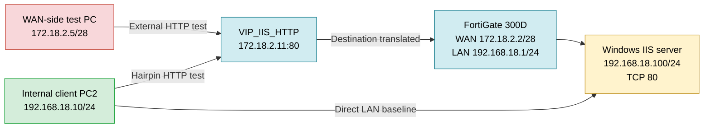

The orange path from the WAN-side PC and the green path from PC2 use the same VIP, but they enter the firewall from different interfaces. That difference is why external success did not automatically guarantee internal success.

## Addressing Plan

| Role | Address | Evidence |
|---|---|---|
| FortiGate WAN, `port1` | `172.18.2.2/28` | Interface summary |
| Published HTTP VIP | `172.18.2.11:80` | Address object and VIP configuration |
| WAN-side test PC | `172.18.2.5/28`, gateway `172.18.2.1` | Client `ipconfig` |
| FortiGate `LAN_INTERFACE` | `192.168.18.1/24` | Software-switch configuration |
| IIS server | `192.168.18.100/24`, gateway `192.168.18.1` | Server `ipconfig` |
| Internal client PC2 | `192.168.18.10/24`, gateway `192.168.18.1` | CLI and adapter details |

## Building and Proving the IIS Server

I enabled IIS with the management console and the common HTTP features needed to serve static content.

The server was then given a static LAN address. The captured configuration shows `192.168.18.100/24` with `192.168.18.1` as its default gateway.

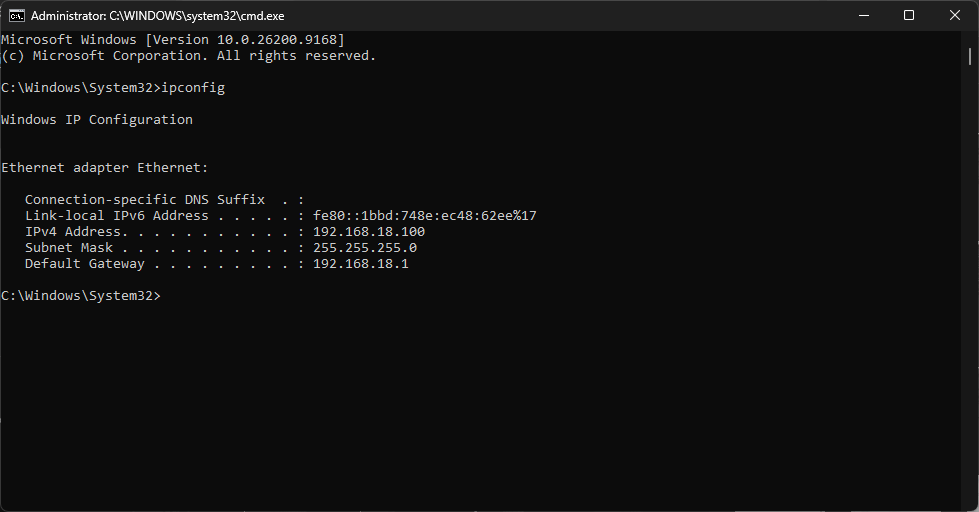

Before replacing any content, I opened the server by its LAN address and received the default IIS page. This established that IIS was installed and answering HTTP requests on `192.168.18.100`.

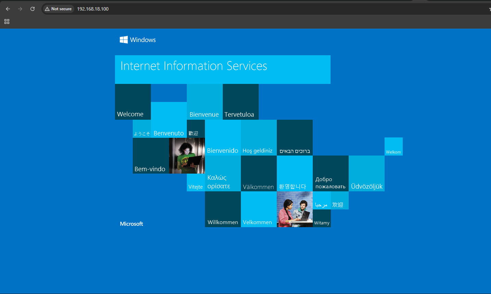

I then replaced the default content with a small lab page that displays the IIS address, the requested address, and a test label. The page loaded locally through `localhost`.

The label on this page is a visual aid selected by the URL query string. It helps distinguish test runs, but it does not prove the packet path by itself.

## FortiGate Interfaces and LAN Software Switch

The interface view shows the two networks used by the lab. `WAN (port1)` owns `172.18.2.2/28`. `LAN_INTERFACE (lan)` owns `192.168.18.1/24` and contains `port3` and `port4`.

The software-switch editor confirms that both LAN ports share one Layer-2 segment. This matters because PC2 and the IIS server sit in the same IP subnet, even though the request targets a WAN-side address.

## Objects, VIP, and External Publication

I created a host object for the outside address used by the HTTP VIP.

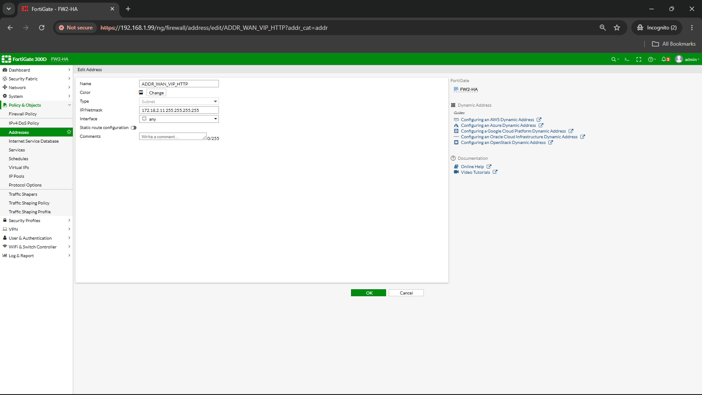

The WAN-side test PC was restricted to its own `/32` object on `WAN (port1)`.

The internal source object covers the complete `192.168.18.0/24` LAN and is tied to `LAN_INTERFACE`.

`VIP_IIS_HTTP` maps `172.18.2.11:80` to `192.168.18.100:80`. Port forwarding is limited to TCP port 80.

The WAN-to-LAN policy accepts HTTP from `EX PC` on `WAN (port1)` to `VIP_IIS_HTTP` on `LAN_INTERFACE`. Its displayed hit count confirms that the rule had carried traffic.

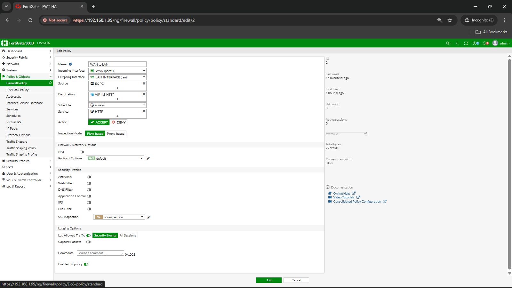

## External VIP Validation

The external test was intentionally completed before adding the hairpin rules. That separated the ordinary VIP path from the internal U-turn path.

The WAN-side PC used `172.18.2.5/28` with gateway `172.18.2.1`.

From that PC, the browser opened `http://172.18.2.11/?test=external` and received the IIS page hosted at `192.168.18.100`.

A separate TCP test reached the same address on port 80. The output records source address `172.18.2.5` and `TcpTestSucceeded: True`.

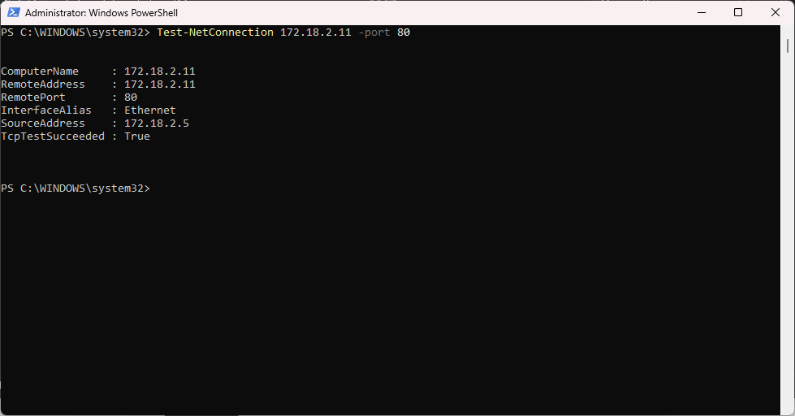

Together, the browser result, TCP result, VIP configuration, and policy hit count show that the server was reachable through the VIP from the WAN-side lab network.

## Direct LAN Baseline

PC2 was configured as `192.168.18.10/24` with the FortiGate at `192.168.18.1` as its gateway.

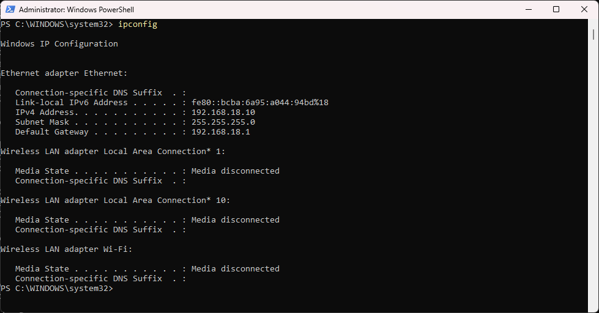

The adapter detail view confirms the same static address and also shows that DHCP was disabled.

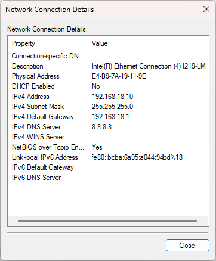

Before testing the VIP, I checked the direct path from PC2 to the IIS server. All four ICMP requests returned with no loss, and the TCP port 80 check succeeded.

The browser then loaded the custom page from `http://192.168.18.100/?test=direct`.

This baseline matters. It shows that PC2 could reach the server and that IIS could answer before the hairpin path was changed.

## Before Hairpin NAT

With direct LAN access and external VIP access already working, PC2 tried the external address `172.18.2.11`.

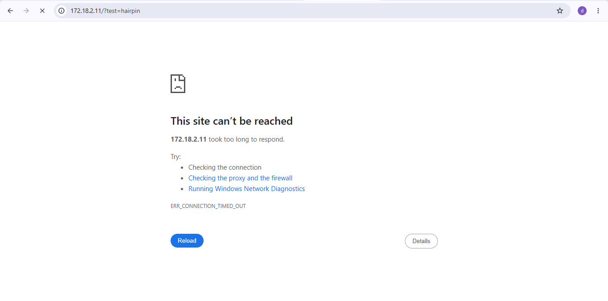

Chrome returned `ERR_CONNECTION_TIMED_OUT`. The same IIS server was already reachable directly and through the VIP from the WAN-side PC, so this failure was specific to the internal path toward the outside address.

## Adding the Hairpin Policies

The first policy was built from `LAN_INTERFACE` toward `WAN (port1)`. It matches the LAN subnet to the regular `ADDR_WAN_VIP_HTTP` object, allows HTTP, and enables source NAT using the outgoing-interface address.

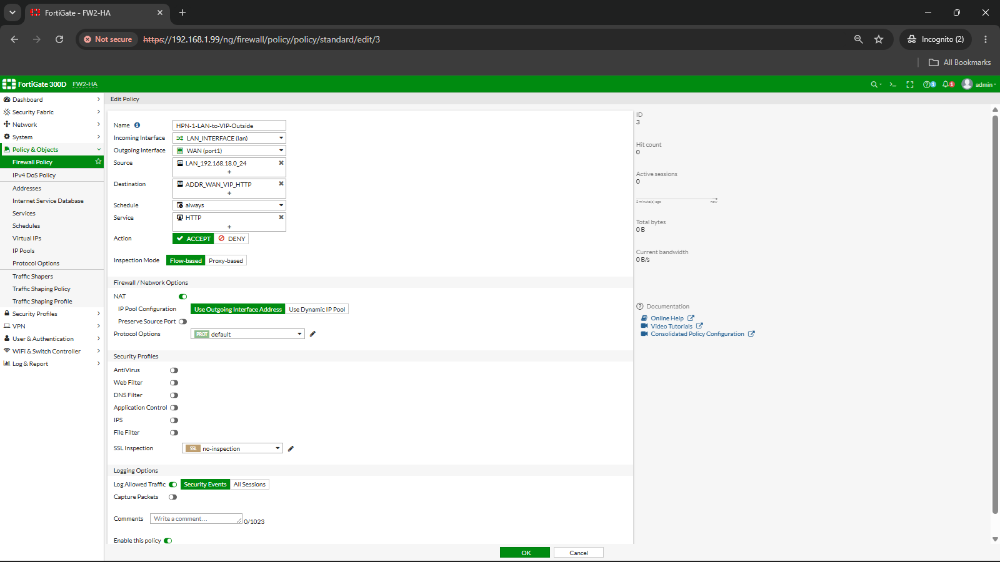

The second policy handles the same-interface path from `LAN_INTERFACE` back to `LAN_INTERFACE`. It uses `VIP_IIS_HTTP` as the destination and allows HTTP.

The policy summary is more informative than the configuration screens alone. After the successful test, `HPN-2-LAN-to-IIS-VIP` shows traffic and `1.92 kB`, while `HPN-1-LAN-to-VIP-Outside` still shows `0 B`.

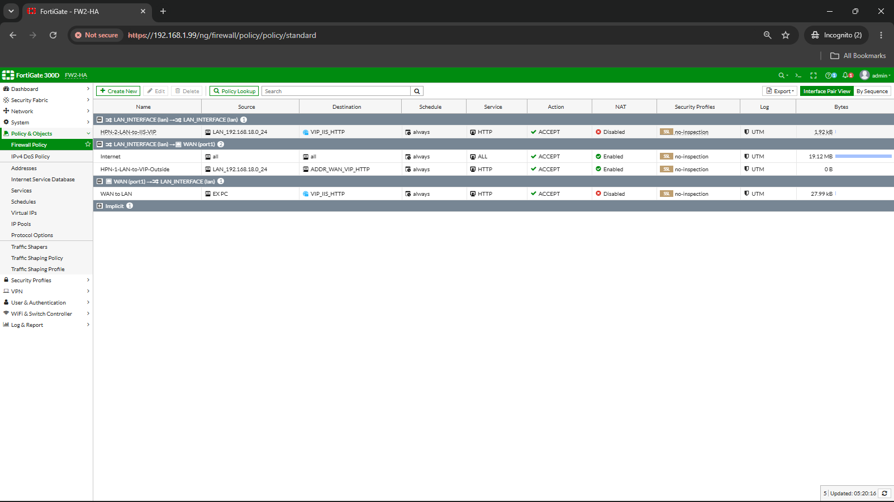

That result means the successful request matched the LAN-to-LAN VIP rule. The policy screenshots do not prove that both hairpin rules participated in the same session. The endpoint packet captures later in this write-up provide the stronger translation evidence.

## After Hairpin NAT

I repeated the same internal browser request to `http://172.18.2.11/?test=hairpin`. This time the IIS page loaded successfully.

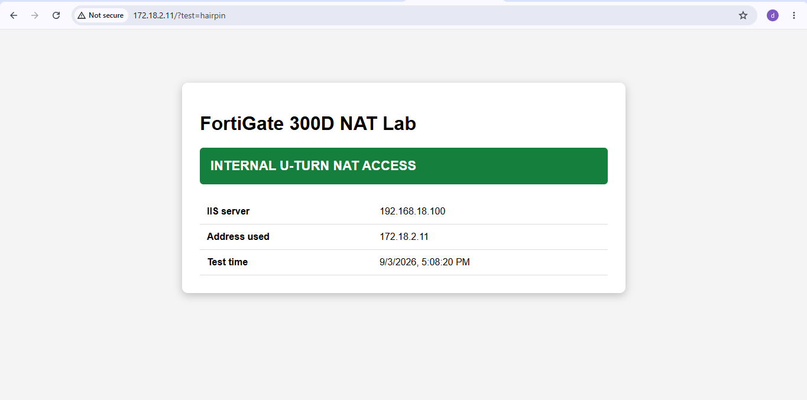

The address bar still shows `172.18.2.11`, while the page identifies the server as `192.168.18.100`. Combined with the increased counter on `HPN-2-LAN-to-IIS-VIP`, this proves that the internal client reached the IIS application through the FortiGate VIP after the same-interface policy was added.

## Packet Capture Analysis

The browser tests show the user-visible result. The Wireshark captures show what happened to the TCP conversation on each side of the path. I captured the direct, external VIP, failed pre-hairpin, and successful post-hairpin tests separately.

### Direct LAN Traffic

On PC2, Wireshark records a complete TCP and HTTP exchange between `192.168.18.10:61437` and `192.168.18.100:80`. The trace includes the three-way handshake, `GET / HTTP/1.1`, the server response, and normal connection closure.

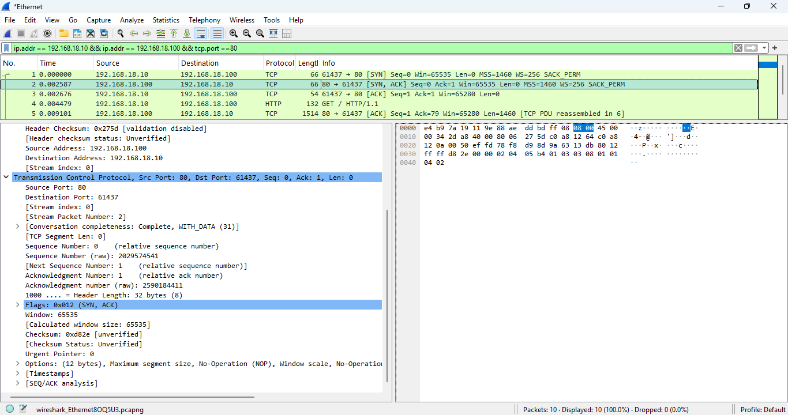

The IIS-side capture shows the same addresses and source port `61437`. It also records `HTTP/1.1 200 OK`, confirming that the server returned the requested page. No IP address translation is visible in either endpoint capture during this direct test.

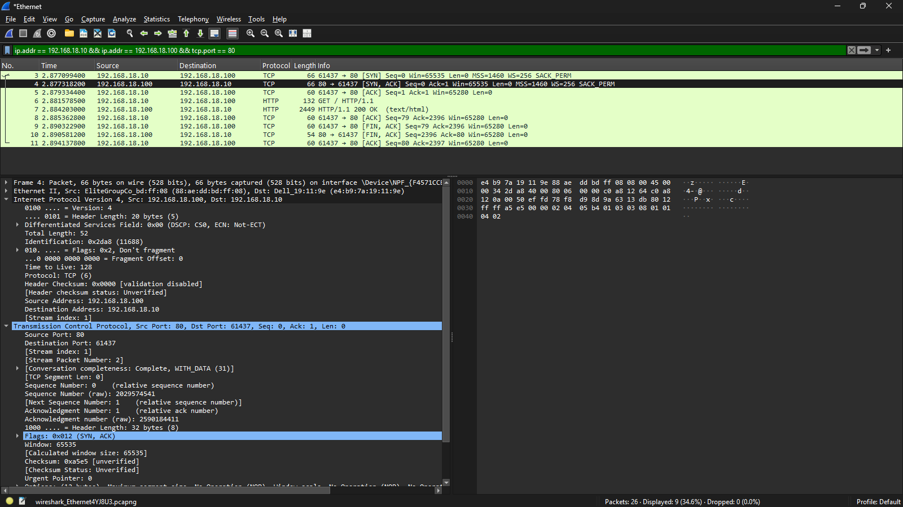

### External VIP Translation

The WAN-side PC sees the connection exactly as an external client should. It sends a TCP SYN from `172.18.2.5:55240` to the VIP at `172.18.2.11:80`, receives the SYN-ACK from `172.18.2.11`, and completes the HTTP request.

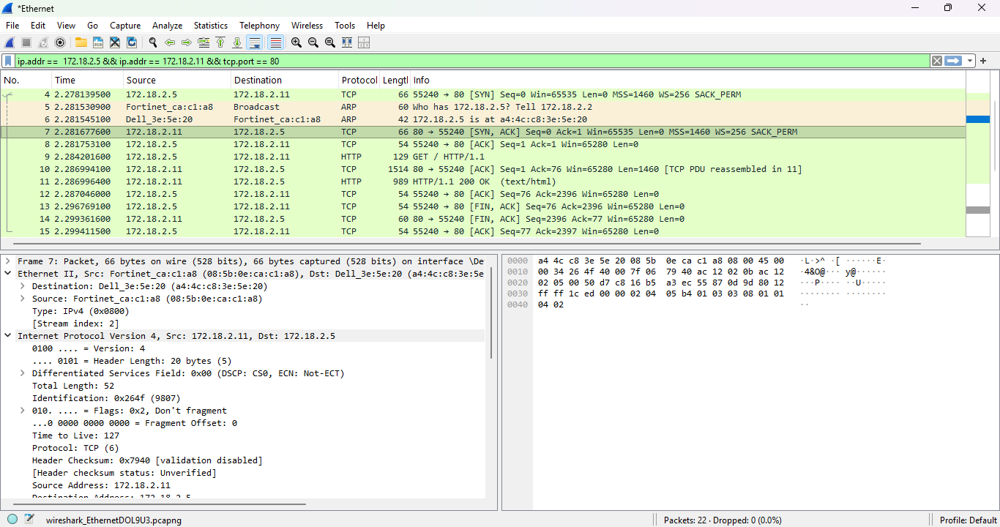

The IIS server sees the other side of that same flow. The source port remains `55240`, but the destination is now `192.168.18.100:80`. The server replies from its private address to `172.18.2.5` and returns `HTTP/1.1 200 OK`.

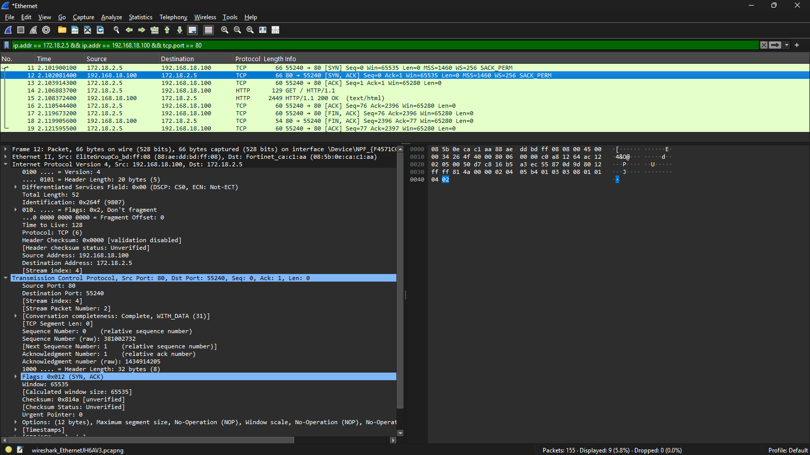

Matching client address `172.18.2.5` and source port `55240` across both captures ties them to the same connection. The selected SYN-ACK also keeps IP identification value `0x264f`. Its TTL is `128` at the IIS capture and `127` at the external capture, which is consistent with one routed hop through the FortiGate. The outside capture shows `172.18.2.11`, while the server capture shows `192.168.18.100`. This is direct evidence of destination NAT on the request and the corresponding reverse translation on the reply.

### Failed Internal VIP Attempt

Before the hairpin policy was available, PC2 sent a SYN from `192.168.18.10:59942` to `172.18.2.11:80`. Wireshark records the original SYN followed by four retransmissions. No SYN-ACK or reset appears in the filtered view.

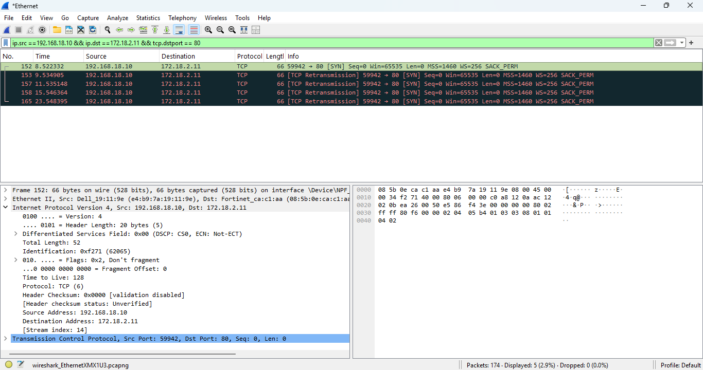

This sharpens the earlier browser timeout. The client was generating the request, but the TCP handshake never completed.

### Successful Hairpin Session

After the policy change, PC2 sees a complete TCP session from `192.168.18.10:58666` to the VIP at `172.18.2.11:80`. The capture contains the handshake, HTTP request, `HTTP/1.1 200 OK`, and a clean connection close.

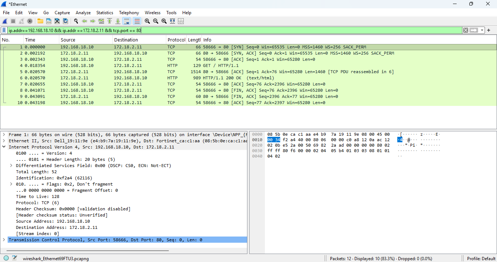

At the IIS server, the matching session uses the same client port `58666`, but the server sees the source as the FortiGate LAN address `192.168.18.1` and the destination as `192.168.18.100:80`.

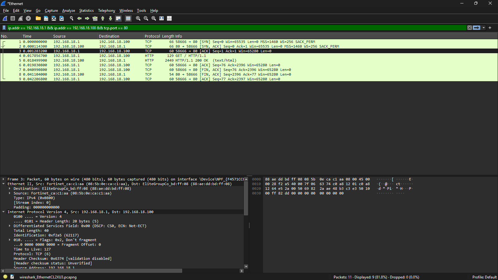

The paired captures show both translations:

| Capture point | Request seen | Reply seen |
|---|---|---|
| PC2 | `192.168.18.10:58666` to `172.18.2.11:80` | `172.18.2.11:80` to `192.168.18.10:58666` |
| IIS server | `192.168.18.1:58666` to `192.168.18.100:80` | `192.168.18.100:80` to `192.168.18.1:58666` |

The destination changes from the VIP to the real IIS address, which proves DNAT. The source changes from PC2 to the FortiGate LAN address, which proves SNAT. The matching source port `58666` and HTTP sequence connect the two capture views to the same successful hairpin session.

## What the Evidence Shows

| Check | Result | What it proves |
|---|---|---|
| IIS features enabled | PASS | Required IIS components were installed |
| IIS default page on `192.168.18.100` | PASS | IIS answered HTTP on the server LAN address |
| Custom page through `localhost` | PASS | The custom site loaded locally |
| Direct PC2 ping to `192.168.18.100` | PASS, 0% loss | Basic same-subnet reachability worked |
| Direct PC2 TCP port 80 test | PASS | IIS accepted HTTP connections from the LAN |
| Direct PC2 browser test | PASS | The application page loaded without NAT |
| External PC TCP test to `172.18.2.11:80` | PASS | The VIP accepted HTTP from the WAN-side client |
| External PC browser test through VIP | PASS | The published IIS page loaded externally |
| Internal VIP test before hairpin policy | FAIL, timeout | The existing rules did not complete the internal VIP path |
| Internal VIP test after policy change | PASS | PC2 loaded the IIS page through `172.18.2.11` |
| Final hairpin policy counters | `HPN-2`: 3 hits, `HPN-1`: 0 hits | The captured success matched the LAN-to-LAN VIP policy |
| Before-hairpin TCP capture | FAIL, SYN plus four retransmissions | PC2 transmitted the request but received no TCP response |
| After-hairpin paired captures | PASS, HTTP 200 OK | DNAT changed `172.18.2.11` to `192.168.18.100`, while SNAT changed `192.168.18.10` to `192.168.18.1` |

## Before and After

| Path | Before the hairpin policies | After the hairpin policies |
|---|---|---|
| IIS local page | Working | Working |
| Direct PC2 to `192.168.18.100` | Working | No change was required |
| WAN-side PC to `172.18.2.11` | Working | No change was required |
| PC2 to `172.18.2.11` | Timed out | IIS page loaded successfully |

The clean comparison is not simply "NAT off" against "NAT on." The ordinary WAN-to-LAN VIP already worked. What changed was the policy path available to a client entering and leaving through the same LAN interface.

## What I Learned

A working VIP from outside does not prove that the same address works from inside. The destination can be identical while the firewall sees a different incoming interface, route decision, and policy match.

The test order did most of the troubleshooting work. Local IIS success removed the web service from suspicion. Direct LAN success removed basic switching and Windows Firewall from suspicion. External VIP success removed the VIP mapping and WAN-to-LAN policy from suspicion. The failed internal request then had a much smaller search area.

The final counter view also changed how I read the configuration. Two policies existed, but only the LAN-to-LAN VIP policy showed hits for the captured test. A configuration screenshot shows intent. A counter shows which rule the firewall used. The paired packet captures then show the actual address changes, including SNAT to `192.168.18.1` on the server-facing side.

## Interview Questions

**Q1. What is hairpin NAT in this lab?**

It lets PC2 on `192.168.18.0/24` reach an IIS server on that same LAN by requesting the server's WAN-side VIP, `172.18.2.11`, instead of its private address.

**Q2. Why test the VIP from a WAN-side PC first?**

That proves the VIP, TCP port mapping, IIS server, and WAN-to-LAN policy work before troubleshooting the internal path. Without that test, a broken VIP could look like a hairpin problem.

**Q3. What proves the final request used the hairpin policy?**

The internal browser loaded the page through `172.18.2.11`, and the final policy summary shows hits and bytes on `HPN-2-LAN-to-IIS-VIP`. The paired Wireshark captures use the same source port `58666` and show the client-side and server-side address tuples. The LAN-to-WAN hairpin rule stayed at zero bytes in the policy view.

**Q4. Does the green page banner prove NAT translation?**

No. The query string selects that banner. The address bar, FortiGate policy counter, VIP configuration, and paired packet captures are stronger evidence of the real path. The captures show both the client-facing VIP addresses and the server-facing translated addresses.

**Q5. Why use TCP port 80 tests instead of pinging the VIP?**

The VIP forwards HTTP on TCP port 80. ICMP is a different protocol and may not match that port-forwarding rule, so a ping result does not validate the published web service.

---

> This lab used unencrypted HTTP on an isolated test network. The screenshots document the completed lab behavior, not a production publishing design.
