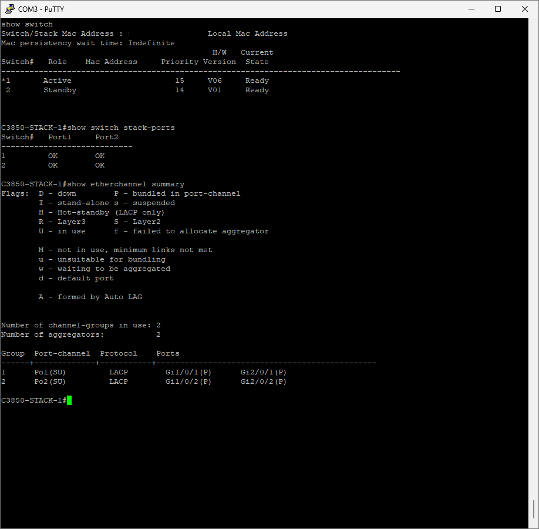
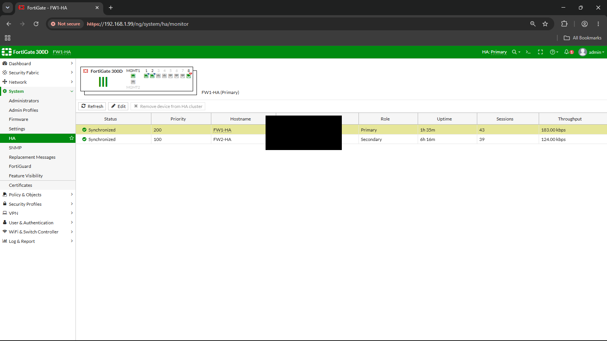
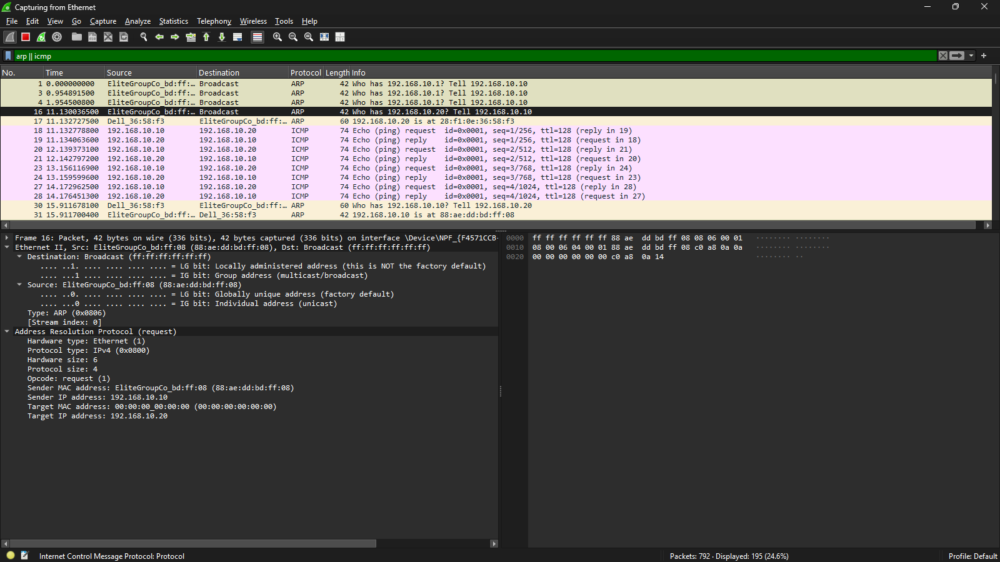
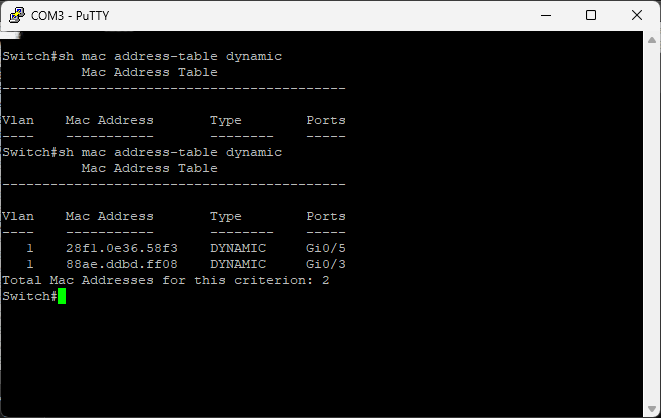
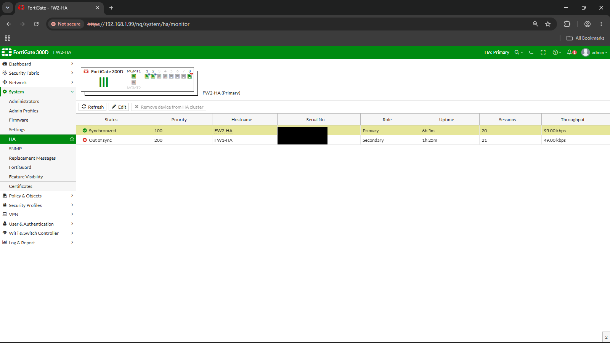

# Network & Infrastructure Engineering Portfolio

Hands-on infrastructure, virtualisation, Windows Server, networking, firewalls, and troubleshooting labs built during enterprise training at **Vatanix Technologies, Trichy**.

**Georgin Shaju** | BTech CSE | Diploma in Network Engineering (NACTET)
📧 georginparackal@gmail.com | 🔗 [LinkedIn](https://www.linkedin.com/in/georginshaju)

---

## What's Actually in Here

Most of this training happened the way IT training usually does — simulators first, concepts second, hardware whenever it was available. This repo tries not to blur that distinction. Packet Tracer labs are labelled as Packet Tracer labs. Real hardware labs say which physical device was on the bench, and they say so because the failure modes are different — a simulator doesn't drop a NAT translation silently or leave a port err-disabled after a bad cable, and a couple of the labs below only exist because something like that actually happened.

- VMware ESXi 8.0 deployment on a physical HPE ProLiant DL360 Gen9 enterprise server
- Windows Server 2019 administration — Active Directory, DNS, DHCP, Group Policy, OU/User management
- Cisco switching and routing in Packet Tracer — VLANs, SSH, Spanning Tree Protocol, Inter-VLAN Routing (SVI and Router-on-a-Stick), Static Routing
- Cisco switching and routing on real hardware — a Cisco 1921 ISR router and Catalyst 3560-CX Layer 3 switch, console cable and all, covering NAT, SSH hardening, VLANs, DHCP, and an inter-VLAN ACL security policy
- Layer 3 switching redundancy on real hardware — two Catalyst 3850s in a StackWise stack acting as the L3 gateway, with dual LACP EtherChannels, SPAN-based NOC traffic monitoring, and four real failover tests including a full active-member power-off
- Firewall and UTM appliances on real hardware — Endian Firewall Community and a FortiGate 300D NGFW, covering zone-based segmentation, firewall policy, proxying, and web filtering
- Firewall redundancy on real hardware — two FortiGate 300D units in an Active-Passive HA cluster, tested against real WAN-link and full-power failures rather than just configured and left alone
- Wireless on real hardware — a Cisco Aironet 1815 Mobility Express AP built from a factory reset, covering the console day-0 wizard, employee WLAN, and a guest network with captive portal redirect
- Protocol analysis on live traffic — Wireshark captures of ARP resolution, ICMP TTL behaviour, the TCP three-way handshake, DNS over UDP, and Cisco switch MAC address learning, watched packet-by-packet rather than read about
- Structured incident troubleshooting — 5 detailed case studies plus a quick-reference guide spanning hardware, OS, networking, AD, and Cisco topics

---

##  Lab Environment Note

This portfolio spans three separate environments, not one continuous setup:

- **Physical hardware** — VMware ESXi installed bare-metal on a real **HPE ProLiant DL360 Gen9** server, accessed via iLO. Covers initial hypervisor install and VM deployment only.
- **Native Windows Server machine** — Active Directory through Group Policy was first completed on a separate physical machine, booted directly into Windows Server (not virtualized).
- **VirtualBox** — the same AD-through-GPO scope was repeated here for additional practice. This is the round documented with screenshots in this repository.

Separately, the Cisco Real Hardware, firewall, HA cluster, wireless, and protocol analysis labs below were built on their own dedicated physical devices — a router, switches, firewall appliances, an access point, and a live-captured switch/PC pair — outside of any of the three environments above.

---

## Projects

| # | Project | Description | Status |
|---|---|---|---|
| 1 | [Windows Server & ESXi Lab](Windows_Server/) | 6 labs — ESXi setup · AD DS · DNS · DHCP · GPO · OU & User Management | ✅ Complete |
| 2 | [Cisco Networking Labs](Cisco_Labs/) | 5 labs (Packet Tracer) — VLANs/SSH · STP · Inter-VLAN Routing (SVI + ROAS) · Static Routing | ✅ Complete |
| 3 | [Cisco Real Hardware](Cisco_Real_Hardware/) | 2 volumes — Cisco 1921 ISR router baseline, Catalyst 3560-CX VLANs/DHCP/ACL security | ✅ Complete |
| 4 | [Cisco 3850 StackWise Lab](Cisco_3850_StackWise_Lab/) | Real-hardware Catalyst 3850 StackWise pair as L3 gateway — dual LACP EtherChannels, SPAN-based NOC monitoring, 4 live failover tests incl. full active-member power-off | ✅ Complete |
| 5 | [Endian Firewall Lab](Endian_Firewall_Lab/) | Real-hardware UTM firewall — RED/GREEN segmentation, rule ordering, proxy, web filtering | ✅ Complete |
| 6 | [FortiGate 300D Hardware Lab](FortiGate-300D-Hardware-Lab/) | Real-hardware NGFW — GUI-based interfaces, static routing, firewall policy with NAT, DHCP | ✅ Complete |
| 7 | [FortiGate Active-Passive HA Deployment & Failover Testing](FortiGate_Active-Passive-HA-Failover/) | 2× FortiGate 300D Active-Passive HA cluster — dedicated heartbeat, WAN-link and power failure testing with validation matrix | ✅ Complete |
| 8 | [Cisco Aironet 1815 Wireless Lab](Cisco_Aironet_1815_Lab/) | Real-hardware AP — factory reset, day-0 wizard, employee WLAN, guest network with captive portal redirect | ✅ Complete |
| 9 | [Wireshark Traffic Analysis](Wireshark_Traffic_Analysis/) | 6 live packet-capture labs — ARP resolution · ICMP TTL · TCP handshake · DNS/UDP · switch MAC learning | ✅ Complete |
| 10 | [Troubleshooting Cases](Troubleshooting_Cases/) | 5 detailed incident case studies + quick-reference guide covering the full training journey | ✅ Complete |

---

## Windows Server Labs

| Lab | Topic | Key Skills Demonstrated |
|-----|-------|--------------------------|
| [01](Windows_Server/01_ESXi_Server_Setup/) | ESXi & VM Deployment | Bare-metal ESXi · iLO · VMXNET3 · VMware Tools · POST diagnostics |
| [02](Windows_Server/02_Active_Directory_Domain_Setup/) | Active Directory & Domain Controller | AD DS · DC promotion · forest · domain join |
| [03](Windows_Server/03_DNS_Configuration/) | DNS Server Configuration | Forward/reverse zones · A records · PTR records · nslookup verification |
| [04](Windows_Server/04_DHCP_Configuration/) | DHCP Server Configuration | IPv4 scope · scope options · server authorization · lease verification |
| [05](Windows_Server/05_Group_Policy_Objects/) | Group Policy Objects | Logon banner · wallpaper · password policy · security filtering |
| [06](Windows_Server/06_OU_Users_Groups_Management/) | OUs, Users & Groups | OU design · user creation · security groups · ADUC · domain join verification |

---

## Cisco Networking Labs (Packet Tracer)

| Lab | Topic | Key Skills Demonstrated |
|-----|-------|--------------------------|
| [01](Cisco_Labs/01_Basic_Switch_VLAN_SSH/) | Basic Switch Config, VLANs & SSH | Hostname · enable secret · VLANs · SVI · Telnet → SSH migration · RSA key |
| [02](Cisco_Labs/02_Spanning_Tree_Protocol/) | Spanning Tree Protocol | Root Bridge election · port roles · BLK→FWD failover · PortFast · BPDU Guard |
| [03](Cisco_Labs/03_Inter_VLAN_Routing_SVI/) | Inter-VLAN Routing — SVI | Layer-3 switch · SVI · trunking · `ip routing` · multi-switch routing |
| [04](Cisco_Labs/04_Inter_VLAN_Routing_ROS/) | Inter-VLAN Routing — Router-on-a-Stick | Router subinterfaces · 802.1Q encapsulation · ROAS vs SVI |
| [05](Cisco_Labs/05_Static_Routing/) | Static Routing | `ip route` · next-hop configuration · wrong subnet mask troubleshooting |

---

## Cisco Real Hardware

Packet Tracer is where the concepts above were learned. This is where they got tested against a physical Cisco 1921 ISR router and Catalyst 3560-CX Layer 3 switch — console cable plugged in, PuTTY open on COM4, real upstream internet connectivity that either worked or didn't.

**[Vol 01 — Router Baseline](Cisco_Real_Hardware/Vol_01_Router_Baseline/)**
Factory-reset 1921 built into a working internet gateway — WAN/LAN interfaces, NAT overload, SSH with a 2048-bit RSA key, Telnet, a live PC getting internet through it.

**[Vol 02 — Enterprise Switch: VLANs, DHCP, ACL Security](Cisco_Real_Hardware/Vol_02_Enterprise_Switch/)**
A Catalyst 3560-CX takes over everything internal — four VLANs, inter-VLAN routing via SVIs, DHCP per department, an extended ACL policy isolating them from each other, and Layer 2 hardening (port security, DHCP snooping, DAI, BPDU Guard, storm control). Two real build issues and a subtle ACL-testing pitfall are documented in full, including a [dedicated troubleshooting write-up](Cisco_Real_Hardware/Vol_02_Enterprise_Switch/ACL_Troubleshooting.md).

---

## Cisco 3850 StackWise Lab

**[Cisco 3850 StackWise Real-Device Lab](Cisco_3850_StackWise_Lab/)**
Two Catalyst 3850s cabled into a StackWise ring and put in place of a firewall as the Layer-3 gateway for two user VLANs, with the router carrying NAT/PAT since nothing downstream does firewalling anymore. Covers StackWise stack formation and priority election, dual LACP EtherChannels (one uplink to the router side, one downlink to the access switch), a deliberately narrow VLAN 1 transit design, and a SPAN port feeding a Wireshark station set up to watch VLAN10 traffic the way a small NOC would — including the fact that a TLS ClientHello's SNI field names the destination in plaintext even before any decryption.

Four real resiliency tests were run against the finished build rather than just documented as configuration: an uplink EtherChannel member failure, a downlink EtherChannel member failure, a full power-off of the Active stack member, and a StackWise ring link failure — each with a "before" baseline, the fault introduced, and an "after" check against live pings. The active-member power-off is the standout result: the whole physical unit went dark, and three concurrent pings across different destinations didn't lose a single packet, with the console session carrying the same hostname straight through the transition.

---

## Firewall & UTM — Real Hardware

Two firewall appliances, two very different interaction models — one almost entirely CLI/console-driven at the point of recovery, the other entirely GUI-based from power-on to policy.

**[Endian Firewall Community 3.3.2](Endian_Firewall_Lab/)**
Installed on a repurposed PC (Intel i3, 8GB RAM, dual Intel NICs for RED/GREEN), configured as a gateway between a lab router and a client laptop. Covers the installer, a real GUI-unreachable snag recovered through the console Network Configuration Wizard, outbound firewall rule ordering, HTTP proxy, and web filtering with category blocking scoped to a specific client.

**[FortiGate 300D](FortiGate-300D-Hardware-Lab/)**
A next-gen firewall configured entirely through the browser — LAN/WAN interface roles, a default static route, a firewall policy bundling access control and NAT together, and DHCP switched on for the internal segment. Written up as a direct comparison to the router-based CLI work above: same underlying concepts, different interface.

---

## FortiGate Active-Passive HA Deployment & Failover Testing

**[FortiGate Active-Passive HA Deployment & Failover Testing](FortiGate_Active-Passive-HA-Failover/)**
Two FortiGate 300D units in Active-Passive HA (FGCP), joined by a dedicated fiber heartbeat and sitting behind a Cisco edge router and two VLAN-segmented switches. The single-firewall labs above all shared one weakness — the firewall itself was a single point of failure — and this lab exists specifically to remove that assumption and then test whether the fix actually holds.

Rather than configuring HA and calling it done, this one runs two real failure scenarios against a continuous ping: pulling the primary's WAN patch cord (a monitored data-plane link going down, heartbeat unaffected), and cutting power to the primary outright (the heartbeat itself going silent). The write-up separates failover from failback as four distinct, honestly-measured events rather than two, breaks down which FortiGate plane — control, data, or management — each mechanism actually lives on, and closes with a validation matrix and a `ses_pickup: disable` finding that reframes what "seamless" failover does and doesn't mean here.

---

## Wireless — Real Hardware

**[Cisco Aironet 1815 Mobility Express](Cisco_Aironet_1815_Lab/)**
A Cisco Aironet 1815 brought up from a genuine factory reset, PoE-powered off the same switch used in the Cisco Real Hardware labs, and placed straight on the main lab network with no VLAN segmentation. Covers the console day-0 setup wizard, first GUI login, an employee WLAN, and a guest WLAN with a captive portal that redirects authenticated guests to a real landing page. Includes a still-open troubleshooting thread on a guest client losing access to the management GUI after switching back to the trusted SSID.

---

## Protocol Analysis — Wireshark

**[Wireshark Traffic Analysis](Wireshark_Traffic_Analysis/)** *(with Pragadeesh)*
Six focused experiments watching the protocols above actually happen on the wire instead of on a whiteboard: an ARP broadcast resolving a MAC address before a single ping goes out, ICMP reply TTLs used to infer hop count across two destinations, the full TCP three-way handshake captured right before an HTTPS session starts, a DNS query and response riding UDP with no handshake at all, a side-by-side TCP vs UDP comparison, and a live Cisco switch MAC address table going from empty to populated the moment traffic starts flowing.

---

## Troubleshooting Cases

5 detailed incident write-ups in NOC ticket format, drawn from real faults
diagnosed and resolved across the labs above, plus a [quick-reference
guide](Troubleshooting_Cases/Common_Troubleshooting_Scenarios.md) covering
common scenarios from hardware fundamentals through Cisco routing.

| Case | Incident | Severity |
|------|----------|----------|
| [INC-001](Troubleshooting_Cases/INC-001_DNS_Reverse_Lookup_Failure.md) | DNS Reverse Lookup Failure — Missing PTR Record | P3 |
| [INC-002](Troubleshooting_Cases/INC-002_DHCP_APIPA_Authorization_Failure.md) | Client Receiving APIPA Address — DHCP Not Authorized | P2 |
| [INC-003](Troubleshooting_Cases/INC-003_VLAN_Missing_From_Trunk_Database.md) | Cross-Switch VLAN Unreachable — Missing VLAN in Database | P2 |
| [INC-004](Troubleshooting_Cases/INC-004_Wrong_Subnet_Mask_Static_Route.md) | One-Way Connectivity Failure — Wrong Subnet Mask on Static Route | P2 |
| [INC-005](Troubleshooting_Cases/INC-005_Port_Err_Disabled_BPDU_Guard.md) | Access Port Err-Disabled — BPDU Guard Triggered | P3 |

---

## Lab in Action

### Physical Server — HPE ProLiant DL360 Gen9

> Front panel with ProLiant badge and status LEDs

> Internal view — dual CPU heatsinks, RAM slots, hot-swap fans

---

### VMware ESXi 8.0 — Bare-Metal Hypervisor

> ESXi boot screen — 2x Xeon E5-2680 v4, 31.9 GiB recognised on physical server

> POST diagnostics — confirms iLO 4 IP and a real DIMM memory fault found and documented

> ESXi Host Client dashboard — VMs running, version 8.0 Update 3 confirmed

> Datastore — 2.06 TB VMFS6 storage configured

---

### Cisco — Spanning Tree Protocol Failover

> Root Bridge election confirmed, then live failover tested by shutting the primary uplink

---

### Real Hardware — ACL Isolation Verified on the Catalyst 3560-CX

> Inter-VLAN ACL policy tested from real end-hosts across every VLAN pair

---

### Perimeter Firewall Redundancy — Failback Mid-Recovery

> FW2 stays green and Primary while FW1 rejoins visibly red and "Out of sync"

---

## Skills

| Category | Tools & Technologies |
|---|---|
| **Virtualisation** | VMware ESXi 8.0, vSphere Host Client, VM deployment |
| **Server Hardware** | HPE ProLiant DL360 Gen9, iLO 4, hardware RAID |
| **Windows Server** | Windows Server 2019, AD DS, DNS, DHCP, GPO, Domain Controller |
| **Cisco Switching & Routing** | VLANs, SVI, SSH, STP, Router-on-a-Stick, Static Routing, Extended ACLs |
| **Cisco Real Hardware** | Cisco 1921 ISR, Catalyst 3560-CX, NAT overload, DHCP snooping, DAI, port security |
| **Cisco StackWise & EtherChannel** | Catalyst 3850 StackWise stacking, LACP EtherChannel, SPAN traffic mirroring, VLAN1 transit design, stack-power ring |
| **Firewalls / UTM** | Endian Firewall Community, FortiGate/FortiOS, zone-based segmentation, HTTP proxy, web filtering |
| **High Availability** | FortiGate FGCP Active-Passive clustering, heartbeat/monitor interfaces, override priority election, config sync vs. session pickup |
| **Wireless** | Cisco Aironet 1815 (Mobility Express), WLAN/SSID configuration, WPA2-Personal, guest networking, captive portal |
| **Protocol Analysis** | Wireshark, ARP resolution, ICMP/TTL, TCP three-way handshake, DNS over UDP, switch MAC learning |
| **Networking Fundamentals** | TCP/IP, OSI Model, Subnetting, Ethernet, Structured Cabling |
| **Troubleshooting** | OSI layer-by-layer methodology, Windows Server, Cisco CLI, firewall GUIs |
| **Tools** | Cisco Packet Tracer, VirtualBox, PuTTY, Wireshark, draw.io |

---

## Key Lessons Learned

- Hardware troubleshooting starts at Layer 1 — always verify physical connections and POST diagnostics first
- Port identification matters — iLO and standard NIC ports look identical; the POST screen's iLO IP display is the fastest way to confirm which is which
- DNS misconfiguration breaks many Windows services — reverse lookup zones are not created automatically and must be added manually
- A DHCP server must be authorized in Active Directory before it will lease addresses — running the service alone is not sufficient
- VLANs must exist in the local VLAN database on every switch carrying their traffic — a trunk being "up" doesn't guarantee every VLAN is passing
- Static routing requires a correct route on every router in both directions — one wrong subnet mask anywhere breaks the path
- STP runs automatically on Cisco switches — always manually set the Root Bridge in production rather than relying on MAC address election
- PortFast and BPDU Guard together let access ports skip STP delay safely, while still protecting against unauthorized switch connections
- Group Policy requires `gpupdate /force` and a restart to apply Computer Configuration settings reliably
- Adding a new subnet behind a NAT router means the NAT ACL needs updating too — nothing warns you when it's incomplete, and the symptom (DHCP working, no internet) looks identical to several other faults
- An extended ACL's implicit `deny ip any any` is invisible but always there — forgetting a trailing `permit` silently kills traffic that was never meant to be blocked
- CLI and GUI firewalls are the same concepts wearing different skins — interface roles, static routes, and policy/NAT bundling transfer directly from router CLI work to a browser-based NGFW
- A captive portal's self-signed certificate warning on a guest network isn't a fault — it's expected for an internal virtual gateway address unless a trusted certificate has been installed separately
- Client-tracking features like Local Profiling on a guest WLAN aren't free — they can leave a client tagged in ways that affect its access even after it reconnects to a trusted network, which is worth testing for before relying on a guest/employee split for real isolation
- A device doesn't need an IP-to-MAC mapping handed to it — it broadcasts an ARP request the moment it needs one, and a switch builds its own MAC address table the same passive way, just by watching source addresses go by
- HA "failover" and "failback" are not the same event and shouldn't be measured as if they were — a live unit losing one monitored link recovers faster than a unit rejoining after a full reboot, because the second case has real state to rebuild before it can be trusted with primary again
- Config sync and session sync are two different guarantees on a FortiGate HA cluster — `Configuration Status: in-sync` only means policy matches between units, not that in-flight sessions would survive a failover; that second guarantee is controlled separately by session pickup
- A StackWise stack's hostname belongs to the stack as a logical entity, not to whichever physical unit currently holds the Active role — powering off the Active member entirely didn't drop the console session, because the Standby member took over Active and kept answering under the same identity
- "Zero dropped pings" during a failover test isn't the same claim as "zero downtime" — a `ping -t` at a one-second interval only rules out outages roughly that long or longer, so it's honest evidence against a user-visible outage, not proof of a perfectly instantaneous transition

---

> 🔧 Built during a 60-Day IT Network & Hardware Training Journal, now continuing through a follow-on 45-Day Advanced Training Program at Vatanix Technologies, Trichy. Real hardware, real labs, real documentation — updated regularly.
